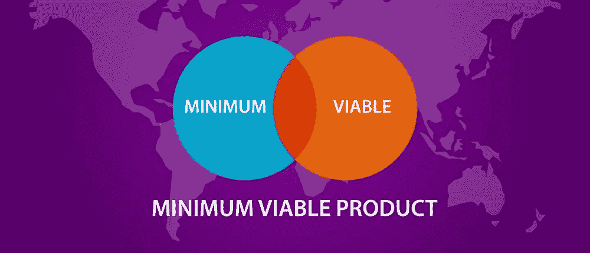
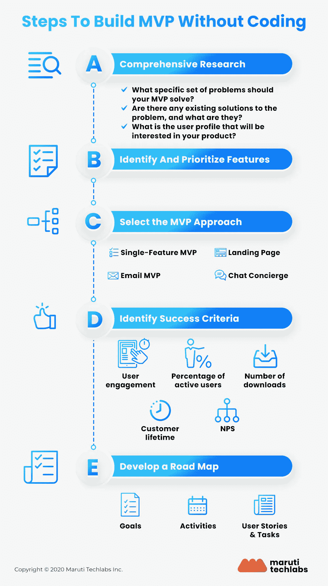

# 如何构建无代码 MVP 的详细指南

> 原文：<https://medium.com/geekculture/how-to-build-a-no-code-mvp-dfdabefdcbd5?source=collection_archive---------4----------------------->

有一个绝妙的创业想法，但不确定是否会成功？开发一个最小可行的产品，帮助你验证你的想法。如果有效，那就去开发吧。如果没有，出于某种原因，那么你可以重新设计你的概念。无代码 MVP 是改进产品开发和成长为成功企业的最佳方式。

# 什么是 MVP？

这是你为了更好地理解你的受众而构建的产品的基本版本。它有助于观众了解产品以及对产品的期望。另一方面，它帮助企业认识到产品的实际价值及其可行性。

没有编码知识怎么开发一个产品？如果你也有类似的问题，那就不用担心了。几个在线可用的[低代码平台](https://marutitech.com/best-low-code-platforms/?utm_source=medium&utm_medium=content_promotion&utm_campaign=No-Code_MVP)帮助发布第一阶段产品，无需任何外部帮助。

您从 MVP 开发中评估三件事情:

*   你的用户准备好产品了吗？他们会对使用你的解决方案感兴趣吗？
*   产品的扩展范围是什么？
*   你从无代码 MVP 的用户那里获得了足够的洞察力来投资一个成熟的解决方案吗？

这个想法是通过将概念转化为可用的解决方案来评估它。它会帮助你了解产品创意的未来。

# 理解无代码 MVP

你是一个没有编码知识的企业主吗？一个无代码 MVP 将让你开始产品开发，而不需要雇佣专家。

*   **没有专家随行**:有了这些工具，你就不需要依赖精通编码的工程师或开发人员。所以，在你投入实际的产品开发之前，你要深入了解最终用户。你知道他们想要什么，他们如何使用这样的产品并改进概念。它加速了发布，而没有进入编码的复杂性。
*   **产品需求**:MVP 可以让你快速启动产品的预告图。这个想法是为了了解市场，以及是否需要这样的产品。如果人们在产品发布前注册，你知道人们正在寻找这样的解决方案。

# 真实世界的 MVP 用例

1.  [**Airbnb**](https://www.airbnb.co.in/)

Airbnb 的第一版是一个简单的单页网站。这个网站上没有选项或支付页面。这仅仅是为了了解该产品是否有用户。这也帮助他们在发布会结束时赢得了三个客户和 240 美元。然而，他们在发布我们现在看到的 Airbnb 网站之前经历了几个版本。

Airbnb 告诉你，MVP 是知道你的想法是否可行的最佳方式。但是，MVP 不可能是你的最终产品。在发布最终解决方案之前，您必须处理版本。

[**2。Dropbox**](https://www.dropbox.com/)

出于寻找可访问的存储空间的个人需求，Dropbox 创始人 Drew Houston 创建了一个低代码 MVP。这个想法得到了终端用户的认可，他们很乐意加入。然而，休斯顿有两个问题——找到合适的联合创始人，以及用复杂的编码完成最终版本。

他们还发布了展示产品工作原理的演示视频。最终，休斯顿找到了他的联合创始人，并加快了开发进程。

从 Dropbox，你可以了解到创造一个 MVP 是不够的；你也需要好好推广。演示视频有助于 MVP 推广，最终带来了良好的用户基础。

# MVP 开发周期

要发布一个成功的 MVP，你要遵循这四个阶段。它有助于确保产品平稳无缝地发布。

1.  **将产品概念化:**定义产品理念和你在开发过程中要达到的目标。这个阶段将包括了解竞争对手在做什么，以及你的企业创造这个概念的可行性如何。
2.  **描绘用户的旅程:**了解你的客户，描绘他们从确定需求到购买产品的旅程。如果你开始研究 MVP，使它对用户友好，那将是最好的。
3.  **推出已定义的功能:**确定用户的痛点，并包括符合其要求的功能。当产品符合你的需求时，你就会创造价值。
4.  **调整以匹配反馈:**一旦用户开始使用它，你将洞察到缺少什么。开始整合反馈以获得最佳效果。

# 构建无代码 MVP 的详细指南

如果你正在采用无代码的方法来构建你的 MVP，这个循序渐进的指南将有助于减轻这个任务。

1.  **综合研究**

全面的研究确定了所有现有的解决方案，完成了彻底的营销理解，并总结了你的竞争对手在做什么。它采用市场适应的方法来决定你的产品是否是用户所需要的。这是一个三个问题的方法，你将采取完成探索。

*   **你发现了哪些问题？**

在你建立 MVP 之前，你会遇到目标市场面临的问题。不可能全部解决。这就是为什么你会研究找出你需要解决的问题。瞄准需要解决的棘手问题。

*   **市场上有哪些解决方案？**

你不是第一个处理这些问题的人。其他企业已经找到了一些解决问题的方法。完整的竞争分析可以帮助你了解你的竞争对手提供什么产品。

*   谁是你的 MVP 的目标人物？

仅仅知道目标市场是不够的；你还需要了解买家的角色。这将有助于将受众范围缩小到对解决方案感兴趣的个人。这将有助于创造一个具体的和精心制作的产品。

**2。对功能进行优先排序**

在 MVP 的[低代码或无代码开发](https://marutitech.com/low-code-no-code-development/)的情况下，你应该有你想包含在产品中的特性。设计 MVP 的目的是发现人们是否对你的产品感兴趣。然而，你会浪费大量的时间和精力去创造一个成熟的产品。

这就是为什么，在为你的产品解决方案定义了所有的特性之后，确定那些你认为有助于 MVP 目标的特性。优先考虑你认为在第一个版本中会出现的功能。

*   总是包含能够解决用户问题的特性
*   不要添加太多的功能，因为这会导致复杂性
*   尽快推出第一个版本

**3。确定成功指标**

一旦你为你的概念启动了无代码 MVP，衡量成功是很重要的。你需要知道你是否能实现这个想法，或者，你需要创造一个新的想法。

*   **用户参与度**:参与产品的用户数量和在页面上花费的总时间将决定他们的兴趣。这将有助于评估产品对受众是否可行。
*   **净推广分数**:这个分数会告诉你用户是否觉得产品有帮助。它将帮助您调查解决方案的有效性。
*   **总下载量**:这是一个明确的指标，你可以从下载这个创意的总人数中评估这个创意。
*   **客户生命周期**:用户在删除应用程序之前在其上花费的总时间将有助于确定其有用性。

**4。定义蓝图**

一旦你整合了反馈并评估了你的想法，就该为最终产品做计划了。如果你有一个精心制作的合适的蓝图来展示产品的未来范围，这将会有所帮助。

*   产品的目标非常重要，因为它会告诉你为什么要开发这个产品。
*   任务和用户将如何使用应用程序将决定成功的故事。

展示所有的难点，以及这些特性如何通过详细的开发路线图来帮助克服它们。

# 选择你的无代码 MVP 方法

从一开始就为你的产品找到合适的无代码 MVP 方法会让事情变得更容易。

1.  ***原型机进场***

这个想法是创造一个可以帮助你理解目标市场需求的第一版产品。你将把你的概念转换成原型，看看人们的反应。这将有助于你了解人们是否愿意接受这个想法。通过这种方法，你的想法可以用最少的努力传达给最多的人。

这种方法的几个例子包括演示视频和调查。如果人们注册了这个过程，他们肯定会使用你的产品。

**2*。单特征方法***

你可以创建一个单一功能的无代码 MVP，它将帮助你认识到人们是否在寻找这样的解决方案，而不是添加所有功能并推出一个成熟的产品，然后眼睁睁地看着它失败。您将展示应用程序的核心功能。如果人们都在船上，你可以开始创造实际的产品。

***3。*众筹方式**

你可以从销售创意开始，而不是从创造产品开始。为概念创建一个众筹页面。告诉用户你打算创造什么。当人们开始投资你的产品时，你就会知道有客户在等着你的解决方案。先卖后做的想法总是有助于筹集项目所需的资金。

***4。*登陆页面方法**

登录页面提供了对产品的全面了解。它讲述了产品如何使用，功能，是什么让它脱颖而出，以及为什么用户会喜欢它。

*   突出产品的 USP
*   分享所有必要的知识
*   描述产品将提供的解决方案

登录页面详细介绍了该产品的工作原理。您可以添加一个 CTA，将用户带到页面末尾的注册页面。如果他们喜欢，他们会注册成为你产品的测试用户。

***5。*邮件方式**

如果你想让你的想法得到验证，电子邮件方法是一个很好的主意。你可以在电子邮件中详细说明你产品的一切。你可以要求人们注册成为测试用户。它会帮助你评估这个概念。它还节省了创建产品、添加特性和发布的大量时间。

***⑥。*聊天礼宾方式**

如果您想在开始研究概念之前收集数据，这种方法效果最好。它允许你与你的潜在客户聊天，了解他们的问题，并决定他们是否会喜欢你提供的产品。当你有足够多的数据可以分析时，就可以更好地了解你的用户。

# 无代码方法的好处

*   它帮助你用最少的投资和努力创造一个最小的可行的产品。您可以从与无代码 MVP 交互的用户那里获得更多，这加速了实际的产品开发。
*   通过更好的用户交互更快的反馈允许您删除对解决方案来说似乎不必要的功能。
*   通过整合反馈，轻松推出新版本。它允许你与客户保持联系，评估产品想法。
*   没有哪种编码能让你摆脱为项目雇佣另一个人的麻烦。它节省了时间和成本。一旦你准备好了概念评估，你就可以聘请专家了。

# 无代码方法的局限性

每种方法都有其局限性。你不能为所有的想法和情况创建一个无代码的 MVP。让我们讨论一下使用这种方法时会遇到的障碍。

*   这是一项持续的技术，与用户联系并寻求他们对产品想法的反馈。
*   您需要在整合用户提供的反馈后发布快速迭代。如果你想给出一个令人印象深刻的解决方案，保持消息灵通是至关重要的。
*   引入一个功能是不够的；你需要根据用户的要求来改变它。值得注意的是，它不能用于企业级的大规模项目。

# 构建无代码 MVP 时要避免的错误

*   **创造一个完整的产品**

你正在创造一个最小可行的产品。你必须在这一点上评估这个概念。大多数企业主试图通过增加所有可能的功能来制造一个完整的产品。他们希望第一次就达到完美。

这是一种错误的方法。介绍产品，它的功能，并集中在一个单一的功能。这将有助于你意识到是否有产品的早期采用者。一旦你有了详细的见解，就开始研究产品。

*   **忽略反馈系统**

您正在创建无代码 MVP 以获得用户洞察。为了更快的迭代，可视化反馈并结合一个定义好的系统是很重要的。您需要用户数据来改进您的产品并扩大其范围。当您启动 MVP 时，您已经准备好更好地了解您的客户并确定他们的需求。

*   **产品愿景不明**

在您启动无代码 MVP 之前，您应该对您想要如何定位和扩展产品有一个清晰的愿景。一旦无代码 MVP 成功了，你将继续添加新的特性。在下一阶段丧失产品愿景会导致潜在客户和现有客户的流失。它还会导致大规模的产品故障。

# 结论

在推出产品之前，测试你的视力是很重要的。使用无代码来改进你的想法，洞察你的目标受众的需求，并建立一个高性能的产品。

你不需要一个专家来开始一个 MVP。如果你有一些在线工具，一个清晰的产品愿景和 MVP 目标，这将会有所帮助。准备好启动快速迭代，这可以帮助您挖掘产品的潜力并获得更多机会。

如果你对以 DIY 的方式构建一个无代码 MVP 不太有信心，你可以将开发外包给我们的专家。在马鲁蒂技术实验室，我们将您的想法转化为可行的 MVP。点击这里与我们[联系，将您的愿景变为现实。](https://marutitech.com/contact-us/?utm_source=medium&utm_medium=content_promotion&utm_campaign=No-Code_MVP)

点击阅读完整博客[。](https://marutitech.com/build-your-mvp-without-code/)