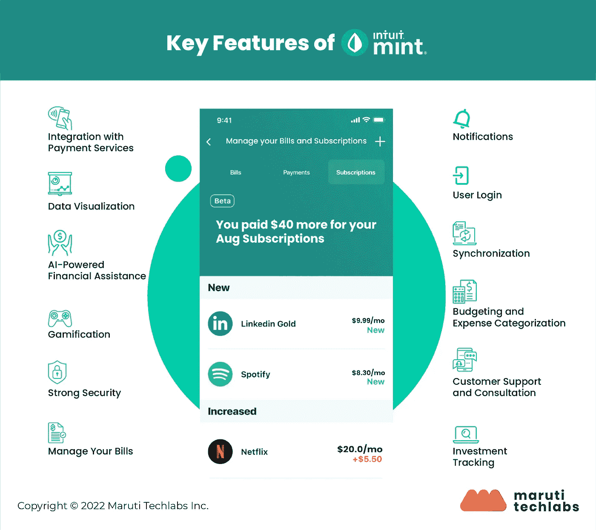

# Mint 等个人理财应用的 8 大基本特性

> 原文：<https://medium.com/geekculture/how-to-build-a-personal-budgeting-app-like-mint-a-complete-guide-f9c5a0edf41c?source=collection_archive---------8----------------------->

无需亲自去银行或存款点就能进行在线交易，这使得应用程序开发非常有利可图。根据研究，从 2020 年到 2021 年，个人理财应用的活跃用户数量攀升了 150%以上。

像 Mint 这样的应用程序对于寻找高收入潜在客户的企业来说是一个很好的选择。

Mint 在苹果应用商店和 Google Play 的个人理财应用中排名第一；它已被下载超过 1000 万次，平均评分为 4.8 分(5 颗星)。Mint 的服务大部分是免费的，但他们通过客户推荐计划、广告和出售客户数据获得大量收入。

如果你正在寻找创造下一个大的个人财务应用程序，那么你来对地方了。这份全面的指南将帮助你了解从头开始开发像 Mint 这样的金融应用程序需要什么。我们涵盖了构建 Mint 等成功应用的制胜策略、功能、定价结构、技术堆栈等。

# 个人理财应用的 8 大基本特性

为了帮助你开发一个易于使用的个人理财应用程序，让你控制自己的财务，这里有一些你在开发 Mint 这样的应用程序时应该考虑的关键功能:

**1。与支付服务整合**

人们经常拥有多个银行账户和信用卡。因此，带着这么多杂物，很难找到你需要的东西。将这些账户链接到预算应用程序，有助于他们在一个地方管理自己的钱，并让他们对自己的财务状况有一个全面的了解。

**2。数据可视化**

一款有效的预算 app 需要清晰准确的用户界面。惊人的数据可视化是帮助用户更好地掌握信息并做出更明智的财务决策的关键。它可以通过使用有吸引力的图表、信息图和仪表板来帮助用户更好地掌握信息和管理财务。

**3。人工智能金融援助**

确保你的预算应用程序像 Mint 一样配备人工智能，这样它才能从其他资金和支出监控工具中脱颖而出。

因此，在开发 Mint 这样的应用程序时使用人工智能算法可以帮助您评估收集的数据，并将其转化为可操作的见解，帮助用户根据他们的储蓄目标调整他们的支出。它可以计算出用户可以安全地存多少钱，应用程序会自动存入这笔钱。

此外，人工智能算法可以帮助用户分析他们的财务习惯，并自动对交易进行分类，以更好地告知他们如何优化成本。人工智能个性化的预算应用程序，通过为已经拥有的订阅提供折扣，并对即将到来的账单提出建议，以避免超支，节省机会等。

**4。游戏化**

像 Mint 这样的预算应用程序中的游戏化功能可以提高用户参与度，并鼓励用户更频繁地与应用程序互动。您可以包括积分系统定义的目标、奖励和里程碑等方面，以保持用户参与并帮助他们更有效地实现他们的储蓄目标。

**5。强大的安全性**

在开发类似 Mint 的财务应用程序时，该应用程序可以直接访问用户的所有财务账户，因此确保高级别的安全性以保护敏感信息至关重要。人们必须使用现代技术来保护应用基础设施免受数据泄露和僵尸攻击。作为一个想设计新应用的人，建议你学习 GDPR 和 ISO 270001，这是保证用户在线安全的重要措施。您的应用应该构建在提供高端加密的云基础设施上。

**6。管理您的账单**

因为我们都有各种各样的账单需要支付，所以有时很可能会错过最后期限。一个不容错过的优势是像 Mint 这样的金融应用程序，它会在你错过之前提醒你支付账单和款项。

**7。通知**

在您的预算应用中实现通知功能可以让您的用户掌握自己的财务状况，获得关于即将到来的账单、截止日期和里程碑的通知，并通知他们任何可能对他们有帮助的事情。

**8。用户登录**

首先，用户必须注册一个 Mint finance 应用程序，并提供他们的详细信息。注册后，用户可以同步他们的帐户，并跟踪他们的费用。在注册过程中实施双因素身份验证或唯一代码生成系统以保护用户的重要信息是至关重要的。

**阅读全文:** [**如何开发像 Mint 这样的个人理财 App:一步一步的指导**](https://marutitech.com/guide-to-build-a-personal-budgeting-app-like-mint/?utm_source=content+promotion+medium&utm_medium=referral&utm_campaign=app-like-mint) 。