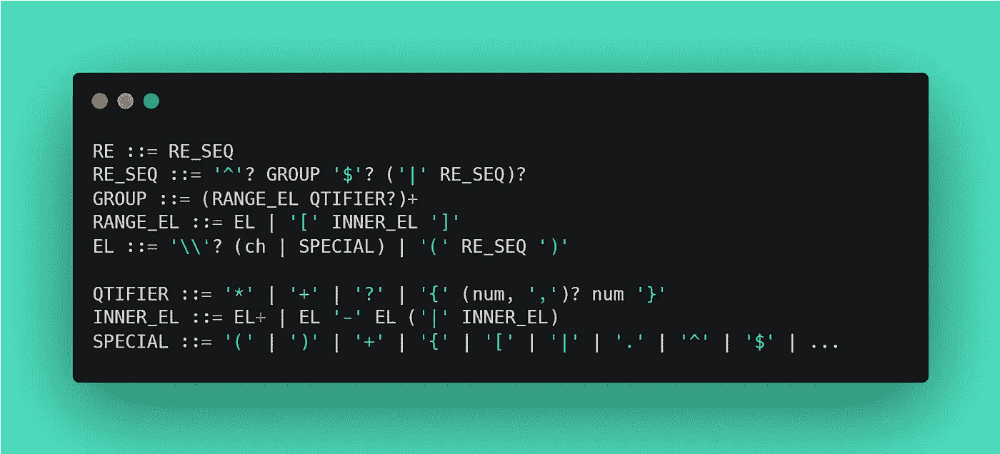
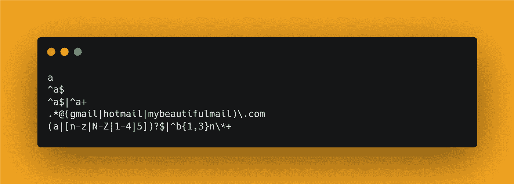

# 如何用 Python 构建正则表达式引擎

> 原文：<https://medium.com/geekculture/how-to-build-a-regex-engine-in-python-part-1-the-grammar-d3cc91cc1784?source=collection_archive---------11----------------------->

## 第一部分:语法。构建一个包含所有主要特性的正则表达式引擎。

Photo by [Kevin Horvat](https://unsplash.com/@hidd3n?utm_source=unsplash&utm_medium=referral&utm_content=creditCopyText) on [Unsplash](https://unsplash.com/@l_felletti/likes?utm_source=unsplash&utm_medium=referral&utm_content=creditCopyText)

在这一系列文章中，我们将遵循用 Python 构建 RegEx 引擎的步骤。我在众多选择中选择了 Python，原因如下:

1.  它与 Linux 命令行集成得很好
2.  因为是的。

在某种程度上，我发现 Python 是“不那么冗长的 Java 版本”和“不那么混乱的 JavaScript 版本”，这是我考虑过的另外两个选择。

在对我发火之前，请让我解释一下。
在开始这个项目之前，我不知道事情应该如何做，如何编码各种模块，等等。我不得不自己解决所有的事情。

而且，当我不知道具体怎么做的时候，我发现 JS 有点太混乱了，它只是一种感觉，而不是普遍真理，我发现用 Java 我可以更好地组织我的想法。

但是，由于我不喜欢 Java 在某些方面的冗长和局限性，但是我想要类，并且我喜欢作为一等公民拥有函数，Python 对我来说似乎是完美的结合。

无论如何，现在是时候从项目本身开始了。

# 我们需要什么

要将字符串与我们意愿的正则表达式进行匹配，我们需要完成几个步骤:

1.  **理解**这个正则表达式
2.  为它创建一个**内部表示**(这样我们可以看到传递的字符串是否与之匹配)
3.  使用我们构建的内部表示，将字符串与正则表达式进行匹配。

为了完成*的前两步，*我们需要两个组件:

*   一个 **Lexer** (或 scanner)来解析令牌中的正则表达式(“单词”，通用的“信息片段”)。作为一个例子，在句子“我很美，非常美”中，每个单词(“我”，“我”，…)是“单词”类型的标记，逗号是“标点”类型的标记
*   一个**解析器**，它按顺序读取所有的标记并“理解”它们，同时构建正则表达式的内部表示(这将是一棵树，称为抽象语法树，对朋友来说是 AST)。

为了完成*第三步，*我们需要构建一个组件，该组件能够将解析器构建的 AST 和一个字符串作为输入，并访问树以将树的每一片叶子与字符串的某一部分匹配(还有更多，我们将在后面讨论)。
这个组件被命名为:

*   **发动机**。

# 路线图

现在，我们知道了需要编码的模块，让我们构建一个路线图:

1.  *定义我们想要识别的*正则表达式*语法*
2.  *建造 lexer*
3.  *构建解析器*
4.  *制造发动机*
5.  ***享受*** 。

# 语法

现在是讨论我们想要认识的**语法**的时候了。

我假设你知道什么是正式语法，并且你理解 *EBNF* 符号，如果没有，*不要惊慌*，谷歌一下。

我们将识别的正则表达式语法如下:

The grammar.

顶级制作 *RE ::= RE_SEQ* 确实没用，但是有没有是因为我在项目早期的一个版本里用过，后来懒得去掉了。不管怎样，我保证这是完全无害的，并且在执行过程中只需要几行代码和一次堆栈调用。

## 语法解释

所描述的语法将能够实现的特征如下:

因此，有效的正则表达式是:

Examples of recognized regexes.

# 结论

你可以在这里浏览最终结果[的代码。](https://github.com/lorenzofelletti/pyregex)

我认为这对于第一部分已经足够了，在本系列的下一篇文章中会有更多内容。

在下一篇文章的*中，我们将设置环境并开始编码，从 lexer 开始。*

回头见！我希望你喜欢这篇文章！

如果你有不明白的地方，需要一些提示，请随时回复。我很乐意回答你。

## 以下文章

 [## 如何用 Python 构建正则表达式引擎

### 第二部分:Lexer

python .平原英语. io](https://python.plainenglish.io/how-to-build-a-regex-engine-in-python-part-2-the-lexer-f22d0cfe961c)  [## 如何用 Python 构建正则表达式引擎

### 第 2.1 部分:Python 字符串

python .平原英语. io](https://python.plainenglish.io/how-to-build-a-regex-engine-in-python-c06472bdb2f9)  [## 如何用 Python 构建正则表达式引擎

### 第 3 部分:TDRDP

python .平原英语. io](https://python.plainenglish.io/how-to-build-a-regex-engine-in-python-535bef84d1f7)  [## 如何用 Python 构建正则表达式引擎

### 第 4 部分:AST

python .平原英语. io](https://python.plainenglish.io/how-to-build-a-regex-engine-in-python-d687de633270)  [## 如何用 Python 构建正则表达式引擎

### 第 5 部分:解析器结论

python .平原英语. io](https://python.plainenglish.io/how-to-build-a-regex-engine-in-python-6150341dfc17)  [## 如何用 Python 构建正则表达式引擎

### 第 6 部分:发动机

python .平原英语. io](https://python.plainenglish.io/how-to-build-a-regex-engine-in-python-55fde6bccffa)  [## 如何用 Python 构建正则表达式引擎

### 第 7 部分:回溯系统

python .平原英语. io](https://python.plainenglish.io/how-to-build-a-regex-engine-in-python-860a3083d7eb) 

*链接到回购:*[*GitHub—lorenzofelletti/pyregex*](https://github.com/lorenzofelletti/pyregex)