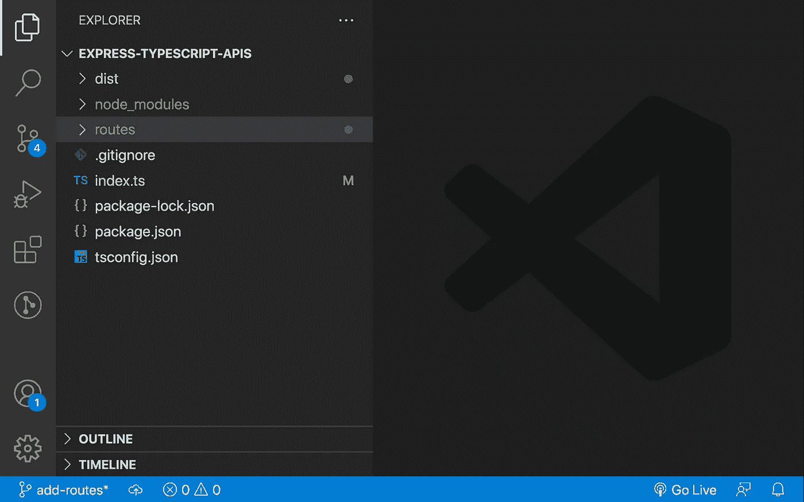
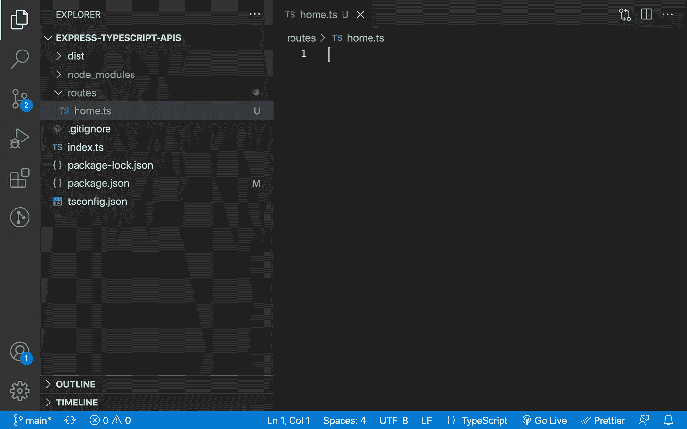
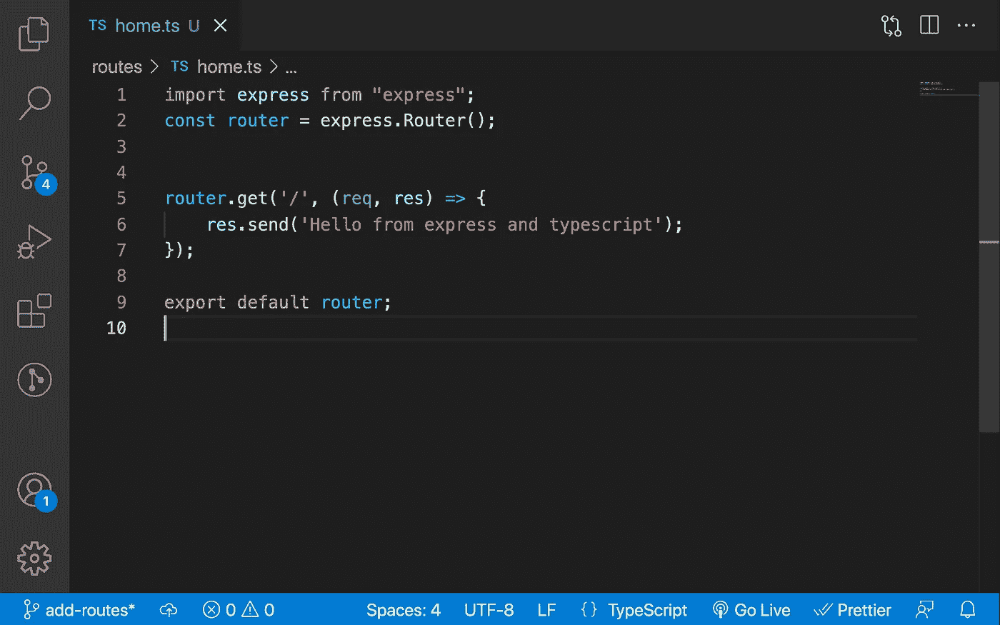
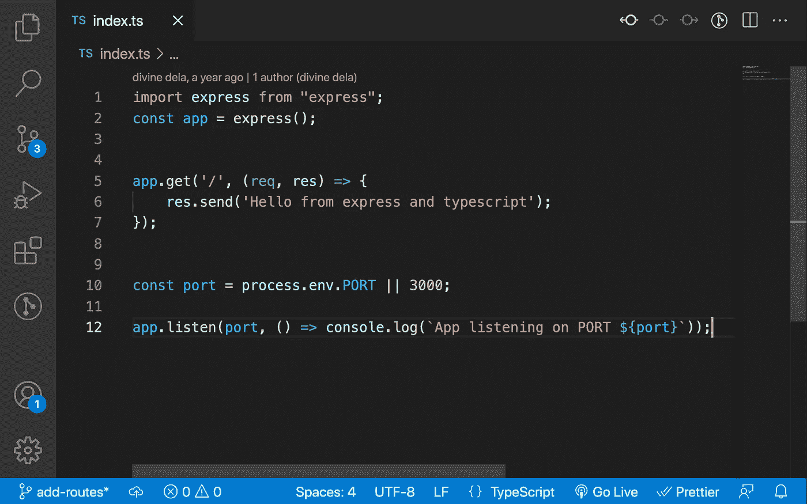
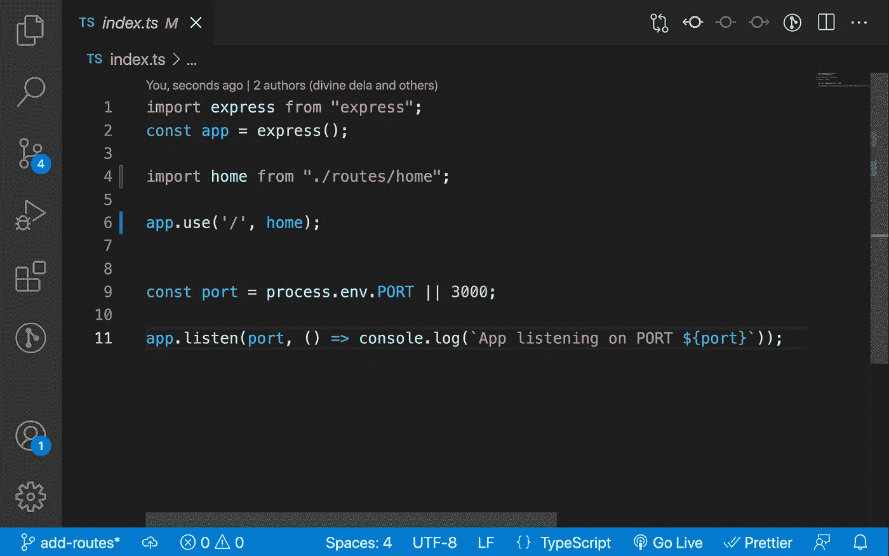
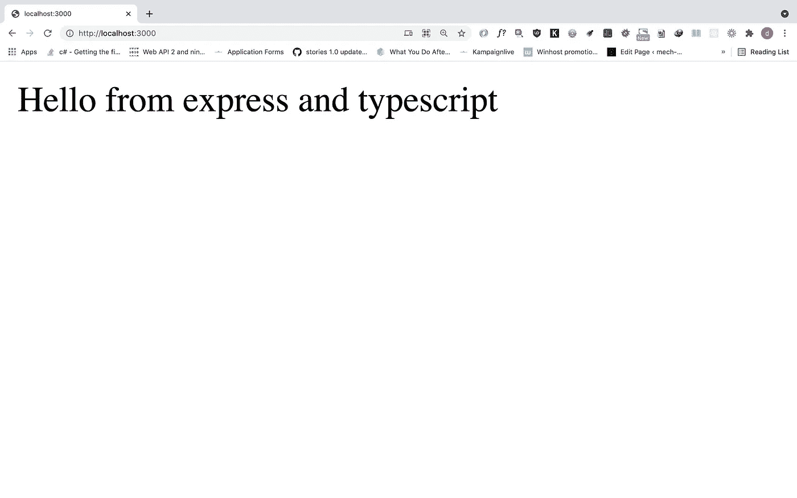
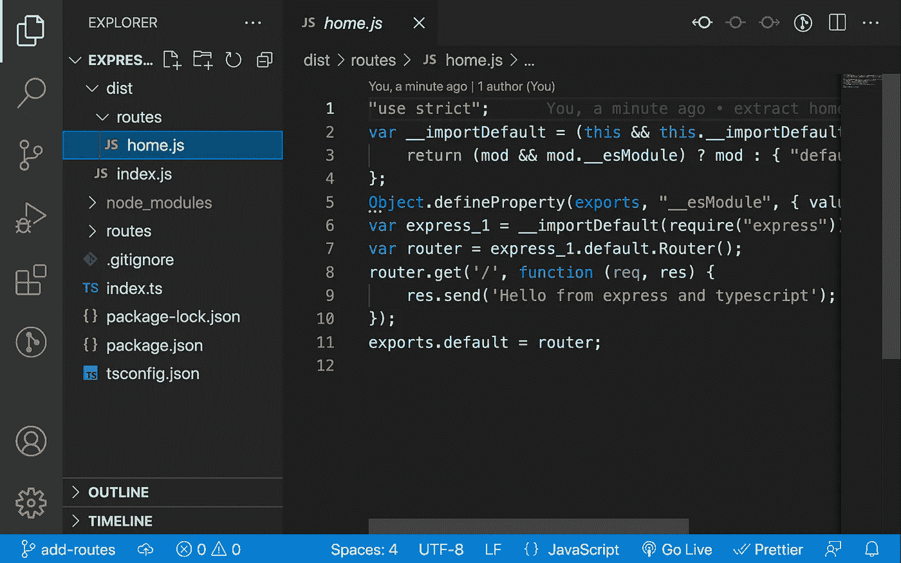

# 如何用 Express JS 和 Typescript 构建 REST API 第二部分(组织路线)

> 原文：<https://medium.com/geekculture/how-to-build-a-rest-api-with-express-js-and-typescript-part-ii-organising-routes-ee293eeb16eb?source=collection_archive---------0----------------------->


Photo by [James Harrison](https://unsplash.com/@jstrippa?utm_source=unsplash&utm_medium=referral&utm_content=creditCopyText) on [Unsplash](https://unsplash.com/s/photos/code?utm_source=unsplash&utm_medium=referral&utm_content=creditCopyText)

在本系列的第一部分中，我讨论了如何用 Typescript 建立一个 Express JS REST API 项目。在那篇文章的结尾，我们创建了我们的 *home* route，并且能够在浏览器中测试我们的端点。

在这篇文章中，我将讨论如何组织我们的路线，以获得更清晰的代码，并使项目更容易维护。

**先决条件**

您需要对使用 Express framework for Node JS 开发 REST API 有一个基本的了解。

如果你已经阅读了这篇文章的第一部分，它也会更容易理解。

**步骤 1:创建路线文件夹**

打开 *vs 代码*中的文件夹，创建一个新文件夹保存我们的路由文件。我喜欢把这个文件夹放在我项目的*根目录*下，和 *index.ts* 文件在同一层。我们将这个文件夹命名为 *routes* 。



Add routes folder

**第二步:添加我们的第一条路线(home.ts)**

在 routes 文件夹中创建新的 typescript 文件。这个文件将包含我们回家路线的代码。我们将把这个文件叫做 *home.ts.*



Create file for the home route

**步骤 3:添加回家路线的代码**

我们将添加回家路线的代码，如下图所示



add home route in home.ts

将 *home.ts* route 文件中的代码(如上所示)与我们之前在 *index.ts* (如下所示)中编写的代码进行比较，你会发现很多相似之处。



index.ts file

在*route . ts*的*线 1* 上，我们导入了快递，就像我们在 *index.ts* 上做的一样。

在*行 2* 然而*、*不是调用 ***express()、*** 而是调用 ***express。Router()*** 并将它赋给一个变量，我称之为 *router* ***。*** 在*第 5 行*的 *home.ts* 还有，你会注意到我没有使用 *app.get()* ，而是使用了 *router.get()。*

在 *home.ts* 的*第 9* 行，我们对在 *home.ts.* 的第 2 行创建的*路由器*进行*默认*导出，这将使我们的路由器可见地被导入到这个模块( *homet.ts)之外。*

**第四步:在 index.ts 中导入回家路线**



Import home route in index.ts

通过在 *home.ts* 中导出路线，我们能够在另一个模块中导入它。我们在索引*ts*的*第 4* 行将路线导入为 *home* ，现在我们可以删除在 *index.ts* 中用于 home 路线的代码，并将其替换为在*第 6 行截图中的代码。*

**第四步:测试路线**

我们现在准备测试代码。正如我们在本文的第[部分](/swlh/build-a-rest-api-with-express-js-and-typescript-dc2c8da89c52)中所做的，我们将通过从终端运行以下脚本来运行 package.json 中的开发脚本

```
npm run dev
```

然后，您可以在浏览器中访问下面的 URL

```
[http://localhost:3000/](http://localhost:3000/)
```

你应该会在屏幕上看到一个类似下面截图中的文本



result of running npm run dev script

您还应该看到在 *dist* 文件夹中创建了一个新文件夹 *routes* 。当你打开这个文件夹时，你会看到一个新文件， *home.js* ，它的代码类似于下面的代码



您可以继续向您的路线添加更多的终点，或者在*路线*文件夹中创建新路线。

您可以在这个 github 库的 *add-routes* 分支上找到完整的代码:

```
[ht](https://github.com/divinedela/express-typescript-apis/tree/add-routes)[https://github.com/divinedela/express-typescript-apis/tree/add-routes](https://github.com/divinedela/express-typescript-apis/tree/add-routes)
```

您也可以在这里找到本文的第一部分:

```
[https://medium.com/swlh/build-a-rest-api-with-express-js-and-typescript-dc2c8da89c52](/swlh/build-a-rest-api-with-express-js-and-typescript-dc2c8da89c52)
```