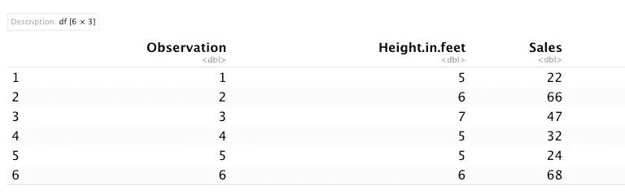
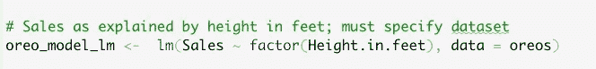
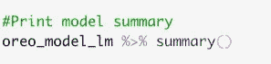
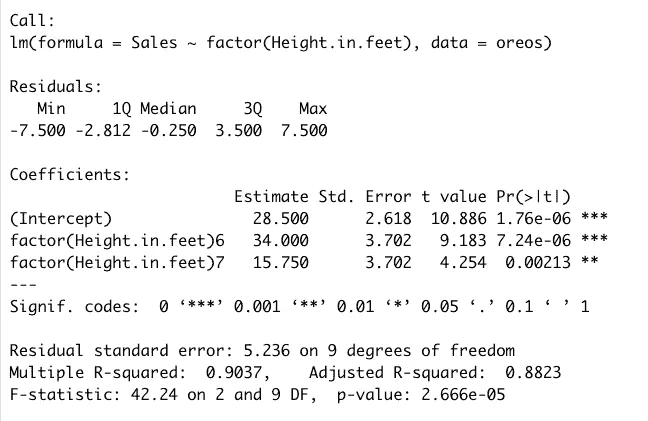
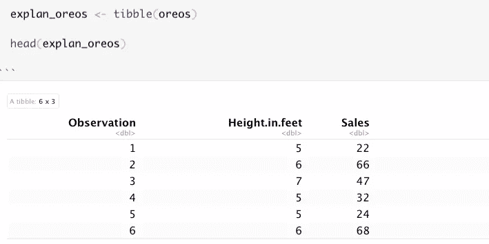
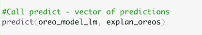
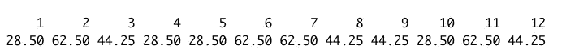
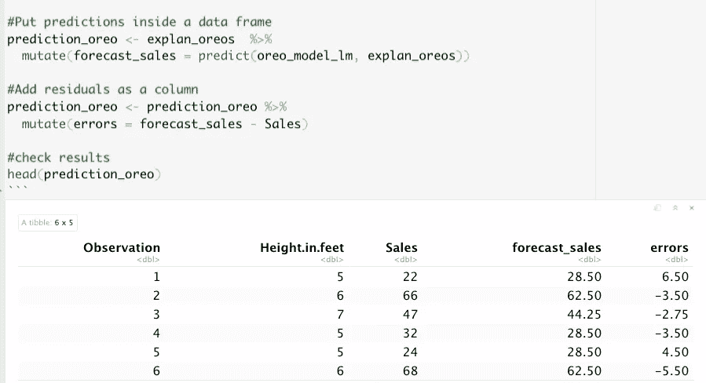
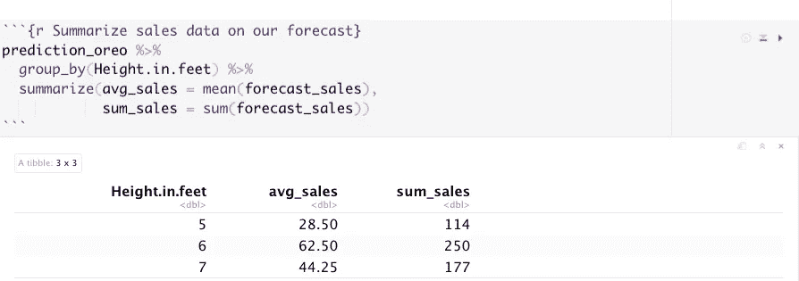

# 如何在 R 中建立销售预测

> 原文：<https://medium.com/geekculture/how-to-build-a-sales-forecast-in-r-dafabb03a076?source=collection_archive---------6----------------------->

我们能使用线性回归来优化超市产品的日常销售吗？

我们将使用线性回归来确定货架位置对[奥利奥](https://www.wiley.com/en-al/Marketing+Analytics%3A+Data+Driven+Techniques+with+Microsoft+Excel-p-9781118373439)销量的影响。这个数据集来自 Wayne L. Winston 的[营销分析:使用 Microsoft Excel 的数据驱动技术](https://www.amazon.com/Marketing-Analytics-Data-Driven-Techniques-Microsoft/dp/111837343X)。第 10 章是关于预测的。如果你是一个分析任何类型的营销数据的分析师，你真的应该看看他的书！我将复制最初在 Excel 中完成的预测练习，但是在 r。

我们的奥利奥数据集有 3 列:
1。观察编号
2。高度单位为英尺
3。销售

Inspect Oreos dataset

我们用 lm 函数建立我们的线性回归模型。我们只有一个因变量(销售额)和一个自变量(身高.英寸.英尺)。我们将假设销售是以单位数为单位的。我们将把身高作为一个因素变量，这是一种分类变量。这将影响我们如何解释回归模型的输出。我们忽略第一列(观察)来构建我们的模型。

Build linear regression model

我们调用模型上的 summary 函数并解释输出。

Print model summary

Model output

**截距**
截距是所有自变量(x)都为零时因变量(y)的值。在这种情况下，由于我们只有一个分类变量作为预测变量，截距就是货架高度为 5 英尺的奥利奥销售额的平均值(截距上的参照组)。

**系数**我们的两个系数都是正的，表明销售额是正的。

在 5 英尺的高度，销售是 28.5 单位，所有其他变量保持在同一水平。现在我们根据 5 英尺货架位置(在我们的截距上)来解释 6 英尺和 7 英尺的高度系数。

在 6 英尺处，销售增加到 34 个单位(增加了 5 个)，但是在 7 英尺处，销售减少到 15.75 个单位(减少了 12.75 个单位)。

总之，在销售方面，6 英尺是奥利奥更好的货架高度。

**P 值**
我们两个系数的 P 值都是< .05。我们的两个系数都是统计显著的，如有效代码所示。6 英尺三颗星，7 英尺两颗星。

我们的回归模型可以解释奥利奥单位销售额中大约 90%的变化。对于只有一个预测因子(独立变量)的模型来说，这是一个非常高的 r 平方。在这种情况下，要小心行事。

**预测**
我们可以根据货架高度用这个输出来预测奥利奥的销量吗？是的，我们可以！我们简单地使用预测函数。

首先，我们创建一个解释变量的数据框架(在这种情况下是 tibble)。我们将使用我们的原始数据集。

Create data frame for our explanatory data

然后我们调用预测函数，第一个参数是我们的模型输出，第二个参数是我们的解释数据。

Create predictions using predict function

我们最终得到的是我们销售预测的向量。

Vector of our sales predictions

然后，我们将把预测销售额和误差列添加到解释性数据框中，并保存到一个名为 prediction_oreo 的新对象中。

回归是一个有误差的过程，基于估计的回归模型，我们可以计算实际观察到的 Y 值(销售)和从我们的回归模型预测的值(预测 _ 销售)之间的差异。这些差异被称为残差，因此我们还将为我们的残差添加一列，称为误差。然后，我们打印结果。

Prediction data frame

最后，我们将根据货架位置变量(高度.英寸.英尺)总结我们的预测数据分组。

A summary of our forecasted data

我们的预测表明，为了最大限度地销售我们的产品，我们应该确保他们位于 6 英尺。

**重述**

1.我们使用线性回归来探讨奥利奥销售额和货架高度之间的关系。
2。我们建立了一个数据框架，根据货架高度来预测销售。
3。我们得出结论，货架高度对销售有影响，6 英尺的货架销售最佳。

完整代码可以在这里找到: [Github。](https://github.com/bonheurgirl/Machine-Learning-R/blob/master/8.Sales%20Forecast%20Model%20-%20Linear%20Regression.Rmd)