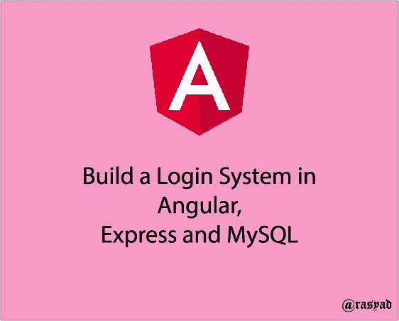

# 用 Angular，Express 和 MySQL 搭建一个登录系统

> 原文：<https://medium.com/geekculture/how-to-build-a-simple-login-in-angular-express-mysql-2c98cad532fd?source=collection_archive---------0----------------------->

# 介绍

在这篇文章中，我们将使用 Angular 和 Express 构建一个简单的登录系统，并使用 JSON Web Token (JWT)完成用户认证。我们开始吧！

# 安装和设置

首先，确保你的机器上已经安装了 [NodeJs](https://nodejs.org/en/) 。之后，在您的…中运行以下命令