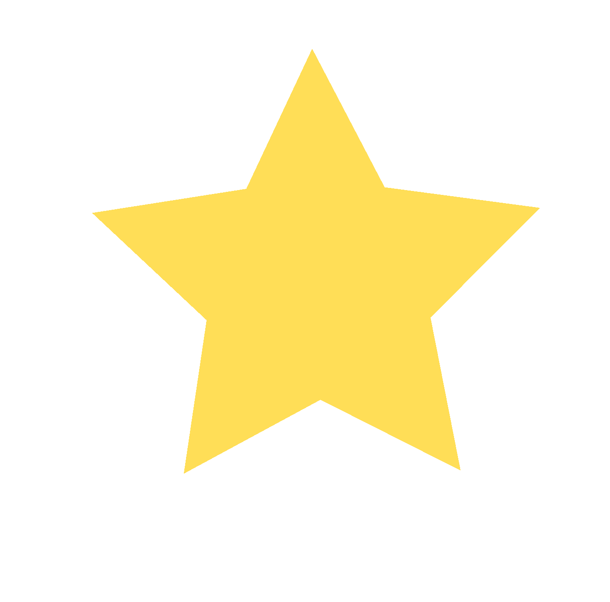
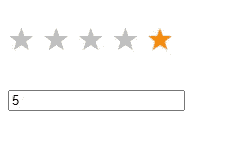
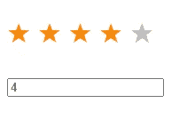
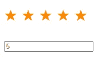
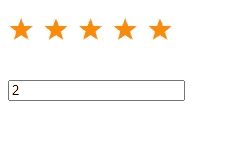
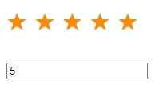
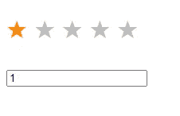

# 如何建立一个简单的星级系统

> 原文：<https://medium.com/geekculture/how-to-build-a-simple-star-rating-system-abcbb5117365?source=collection_archive---------2----------------------->

你有提供有趣的产品、文章或服务吗？

添加客户评级系统可以帮助您确定客户是否真的喜欢您的文章、服务或产品，并且您可以将他们的负面评论作为改进您服务的动力。

今天，我将向您展示如何使用 HTML、CSS 和 JavaScript 创建一个简单的星级评定，到本文结束时，您将能够链接您的后端逻辑来保存评级。

# 我们开始吧

我将从创建 HTML 标记开始，并在 CSS 中声明一些规则，以便我们将重点放在 JavaScript 代码上。

让我们创建一个包含 5 颗星的星级容器。我们还将设置一个属性和一个类来帮助我们识别每一颗星星。

目前你只会看到一个空白页。让我们宣布一些 CSS 规则来增加我们的星级。

让我们预览一下我们的代码。

empty stars

目前，我们有空的星星，当你点击任何星星时都不会执行任何操作，因为我们还没有添加 javascript 代码。让我们现在就这样做吧。

# JavaScript 代码

我们将使用 my-star 类查询所有元素，遍历每个元素，并附加一个 click 事件，该事件将输出 **data-star** 的值。

该值将是用户选择的星形元素。

在我们重新加载页面之前，让我们创建一个 input 元素，它将存储用户点击的星号的值。

所以当你重新加载并点击一颗星星时，你会看到你点击的星星的值。这之所以成为可能，是因为我们给恒星元素附加了一个属性 **data-star** ，这将使我们能够识别每颗恒星。

看着代码，我可以说我们已经完成了我们的小项目，但是我们再补充一点。

## 还有一点

通常情况下，如果你点击两颗以上的星星，前面的*星星*将会激活**(即它们应该使用**的 is-active** 类)，而后面的*星星*将会显示它们的默认颜色，如下图所示。**

我们可以通过检查星的当前值来实现这一点，然后创建 2 个循环，其中一个循环将在前面的星上设置 **is-active 类，并在后面的星**上取消设置 is-active 类。

## 第一个循环(包括在内)

如果我们运行这段代码，我们会看到它接近完美

这是我选择 5 颗星的结果

现在有一个问题。

当我点击 2 颗星的时候，后面的星应该已经删除了这个类，前面的星应该已经保留了这个类，但事实并非如此，因为后面的星仍然保留了这个类。

这将调用第二个循环，它将递增并检查随后的星是否包含类 is-class 并删除它。

## 第二个循环(包括在内)

应该可以了。

现在，如果我们选择 5 颗星，所有前面的星元素将包含 is-active 类

如果我们选择 1 颗星，所有后续的星元素将不包含 is-active 类

所以我可以说现在已经很完美了。

使用 CSS 可以很容易地实现这一点，但是我今天的文章是关于它在 JavaScript 中的实现。

我目前正在测试一个 SAAS 应用程序，我为你的网站、公司或企业收集客户评论，并帮助你管理它们。我用这段代码收集评级，并用 PHP 在后端处理它。

[点击此处查看 give meastar(GMAS)](https://givemeastar.com/)