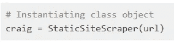
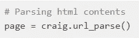
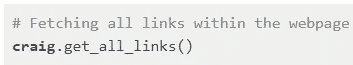
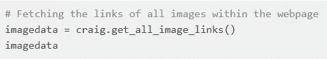
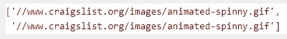
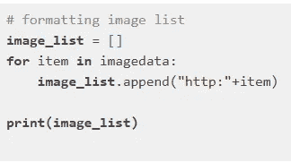
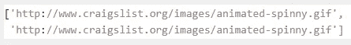
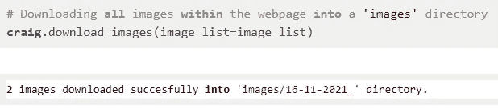

# 如何使用 Beautifulsoup 构建一个简单的 Web 刮刀

> 原文：<https://medium.com/geekculture/how-to-build-a-simple-web-scraper-using-beautifulsoup-2f2f0f97dc47?source=collection_archive---------15----------------------->

## 使用 Beautifulsoup 和 Python 构建 web scraper 的分步指南。


Photo by [Ilya Pavlov](https://unsplash.com/@ilyapavlov?utm_source=medium&utm_medium=referral) on [Unsplash](https://unsplash.com?utm_source=medium&utm_medium=referral)

# 介绍

数据收集是数据科学项目中定义和分析问题之后的主要步骤之一。虽然有多种收集数据的方法，但在本文中，我们将重点关注 web 抓取技术，以便为我们的数据科学项目收集数据。

构建一个通用的 web 刮刀既不可行也不可取。每一个网页刮刀都应该为特定的情况而制造，并且应该根据要刮的网页的变化而修改。

在本文中，我们将重点介绍如何使用 Beautifulsoup 和 Requests 库创建一个简单的 web scraper 类，它可以抓取任何静态网页(默认情况下是链接和图像)。当然，我们也将尝试抓取静态网页。

# 定义步骤

我们将利用面向对象的 python 从头开始创建这个刮刀。

让我们列出构建这个刮刀所需的功能

**1。解析 URL 的方法**

此方法应该创建一个自定义对象，该对象可用于访问给定页面上的任何 web 元素。

**2。一种从网页中获取所有链接的方法**

**3。一种从网页中获取所有图片链接的方法**

**4。一种从图像链接下载图像到当前目录的方法。**

现在我们已经列出了这个刮刀的核心功能，让我们一步一步地构建刮刀。

# 建造铲运机

让我们创建 scraper 类并定义我们的方法。我们将把这个刮刀命名为“静态刮刀”。

```
**class** **StaticSiteScraper**:
    **def** **__init__**(self):
        **pass**

    *# A method for parsing the url*
    **def** **url_parse**(self):
        **pass**

    *# A method for fetching all links from the webpage*
    **def** **get_all_links**(self):
        **pass**

    *# A method for fetching all image links from the webpage*
    **def** **get_all_image_links**(self):
        **pass**

    *# A method for downloading images from the image links*
    **def** **download_images**(self):
        **pass**
```

# 1.获取 HTML 页面内容

让我们定义获取 HTML 页面的函数。

我们将使用请求库从 URL 获取 HTML 内容，并将其存储在一个名为 data 的变量中。

```
data **=** requests.get(url).text
```

然后，我们将创建一个 soup 对象，将这个 HTML 内容解析成可读的文本格式。

```
soup **=** bs(data, parser)
```

最后我们的函数将返回这个 soup 对象。

综上所述，我们有:

```
**def** **url_parse**():
    **data** **=** requests.**get**(url).text
    soup **=** bs(**data**, parser)
    **return** soup
```

创建的 soup 对象可以用来访问解析后的 HTML 内容中的任何元素。

例如，我们可以使用以下内容访问网页的标题文本:

```
**soup**.title.text
```

类似地，您可以使用 soup 对象来访问您需要的任何元素。

现在我们有了 soup 对象，我们可以使用这个对象来创建从解析的 HTML 内容中获取所有链接和图像的方法。

# 2.获取所有链接

让我们首先定义一个列表，用于存储我们使用方法收集的所有链接。这个列表将是我们方法的输出。

我们知道链接存储在 HTML 页面的标签中。

因此，要访问链接，我们需要首先访问标记，可以使用:

```
**soup**.find_all('a')
```

这将获取解析后的 HTML 内容中所有标签的列表。

现在，我们必须遍历列表中的每个元素，并从“href”属性中提取链接。然后，我们将把收集到的链接存储在我们之前定义的列表中。

```
**for** tag **in** a_tags:
    items **=** str(tag).**split**(" ")

    **for** item **in** items:
        **if** 'href' **in** item:
            link_item **=** item.**split**("=")[1].**split**("\"")[1]
            **if** 'http' **in** link_item **or** 'www' **in** link_item:
                links.append(link_item)
```

综上所述，我们有:

```
**def** **get_all_links**():
    links**=**[]

    a_tags **=** soup.find_all('a')

    **for** tag **in** a_tags:
        items **=** str(tag).**split**(" ")
        **for** item **in** items:
            **if** 'href' **in** item:
                link_item **=** item.**split**("=")[1].**split**("\"")[1]
                **if** 'http' **in** link_item **or** 'www' **in** link_item:
                    links.append(link_item)
    **return** links
```

# 3.获取所有图像链接

这一步与上一步完全相似，在上一步中，我们从解析的内容中收集了所有链接。

这里唯一的区别是，我们在这里使用了标签，而不是标签。此外，我们使用“src”属性而不是“href”来访问图像链接。

```
**def** **get_all_image_links**():
    img_links**=**[]

    img_tags **=** soup.find_all('img')
    **for** tag **in** img_tags:
        items **=** str(tag).**split**(" ")
        **for** item **in** items:
            **if** 'src' **in** item:
                link_item **=** item.**split**("=")[1].**split**("\"")[1]
                **if** 'http' **in** link_item **or** 'www' **in** link_item:
                    img_links.append(link_item)
    **return** img_links
```

# 4.下载图像

现在，我们已经有了所有的图片链接，我们现在将从这些链接下载所有的图片，并将它们存储在我们的本地目录中。为此，我们将把图像列表作为参数传递给这个方法。

我们将首先创建一个 date_ 变量，以“dd-mm-yyyy”格式存储当前日期。

```
**day** **=** datetime.date.today().**day**
**month** **=** datetime.date.today().**month**
**year** **=** datetime.date.today().**year**

date_ **=** str(**day**)**+**"-"**+**str(**month**)**+**"-"**+**str(**year**)**+**"_"
```

在创建存储图像的新目录之前，我们将检查当前工作目录中是否存在“images”目录。

如果没有找到，我们将创建一个新的“图像”目录。在“images”目录中，我们将创建一个以当前日期为名称的新目录来存储图像。

```
**if** 'images' **not** **in** os.listdir():
        os.mkdir("images")
        os.chdir("images")

    os.mkdir(date_)
    os.chdir(date_)
```

现在，我们将初始化一个图像编号变量来命名图像。我们可以访问<alt>标签来从 URL 中获取图像名称，但是有时候，图像没有别名。因此，为了保持图像名称的统一，我们将对图像进行编号。</alt>

```
img_no **=** 1
```

接下来，我们将遍历图像链接，获取图像并将它们存储在本地目录中。

```
**for** **link** **in** image_list:
    img_response **=** requests.**get**(**link**)

    img_format **=** link.**split**(".")[**-**1]

    filename **=** "img" **+** str(img_no) **+** "." **+** img_format

    **with** **open**(filename, "wb+") **as** f:
        f.**write**(img_response.content)
    img_no **+=** 1
```

综上所述，我们有:

```
**def** **download_images**(image_list):
    **day** **=** datetime.date.today().**day**
    **month** **=** datetime.date.today().**month**
    **year** **=** datetime.date.today().**year**

    date_ **=** str(**day**)**+**"-"**+**str(**month**)**+**"-"**+**str(**year**)**+**"_"

    **if** 'images' **not** **in** os.listdir():
        os.mkdir("images")
        os.chdir("images")

    os.mkdir(date_)
    os.chdir(date_)

    img_no **=** 1

    **for** link **in** image_list:
        img_response **=** requests.get(link)

        img_format **=** link.split(".")[**-**1]

        filename **=** "img" **+** str(img_no) **+** "." **+** img_format

        **with** **open**(filename, "wb+") **as** f:
            f.write(img_response.content)
        img_no **+=** 1
```

现在，我们已经定义了所有的方法，我们将把它们放在一起创建我们的 StaticSiteScraper 类。我不打算在这里深究，因为这是不言自明的。

# 实现我们的静态刮刀

最后，我们创建了 scraper 类。

现在是时候测试我们的 StaticSiteScraper 了。为此，我现在转到 craigslist.org 的纽约房地产页面。

从页面获取 URL

URL = " https://new York . craigslist . org/d/real-estate/search/rea "

使用我们的 StaticSiteScraper 创建一个 **craig** 对象



创建一个**页面对象**，如果需要的话，它可以用来访问这个页面中的任何其他 HTML 元素。



现在，我们将访问该网页中的所有链接。



类似地，我们现在将获取网页上所有图片的链接。



我们的输出是:



在开始下载所有图像之前，请确保检查以下内容:

**1。如果我们能够获取图像链接**

我这么说的原因是因为几乎所有的网站都在一个

标签中发布它们的图片，也许在标签中的更多标签中。因此，很难一次获取所有图像。

这里，您将不得不使用我们之前创建的**页面对象**来更深入地挖掘您可以找到图像链接的标签。从那里，你必须获取每张图片并把它存储到一个列表中。

**2。如果图像链接格式正确**

大多数情况下，图像链接的格式可能不正确，在将它们传递给函数之前，我们可能需要以正确的格式重新排列它们。



现在我们的输出看起来像这样:



至此，我们已经创建了一个 web scraper，它可以获取给定 URL 的所有静态内容。

最后，我希望你喜欢它。关注我以获取更多可操作的内容，并随时发布您的宝贵反馈和建议。

[](/@retinpkumar) [## Retin P Kumar 培养基

### 阅读 Retin P Kumar 在媒体上的文章。我是一名来自印度的有抱负的数据科学家和机器学习爱好者…

medium.com](/@retinpkumar)