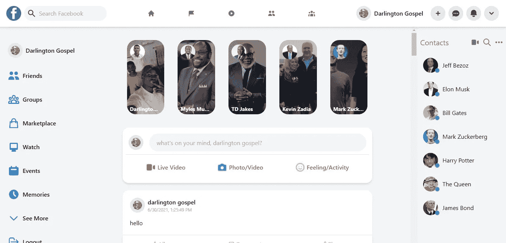
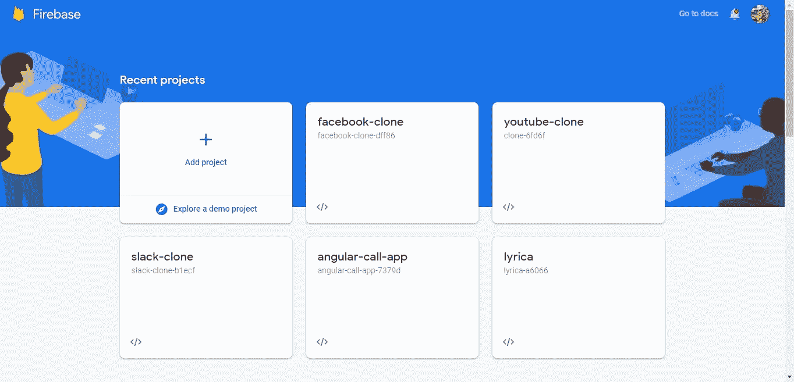
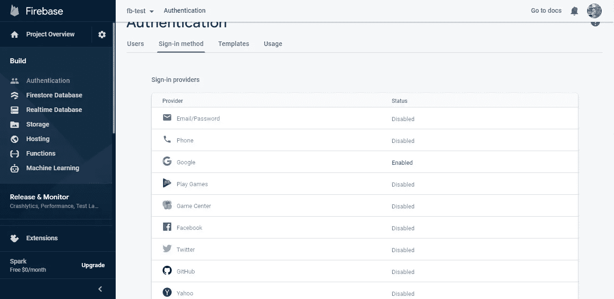
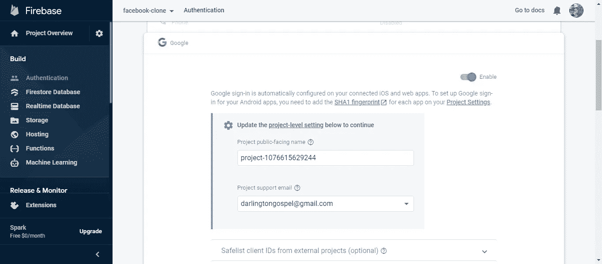
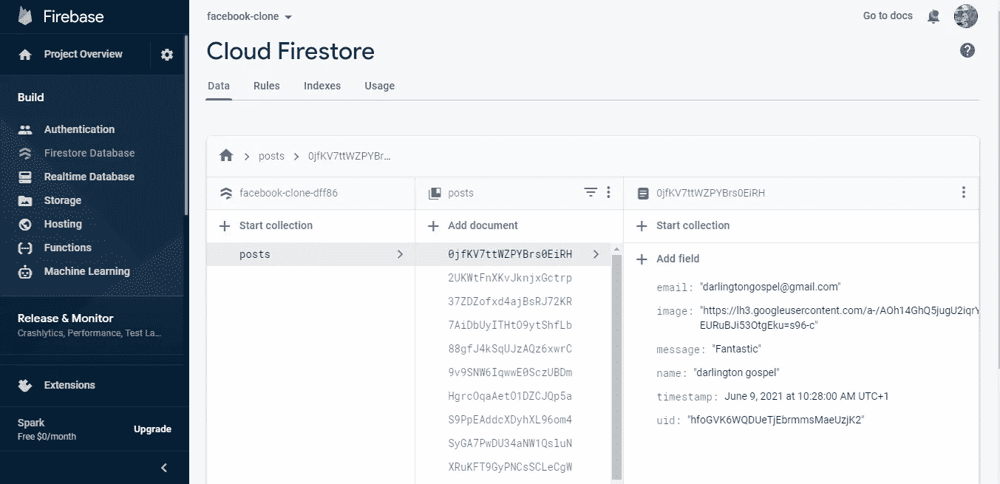
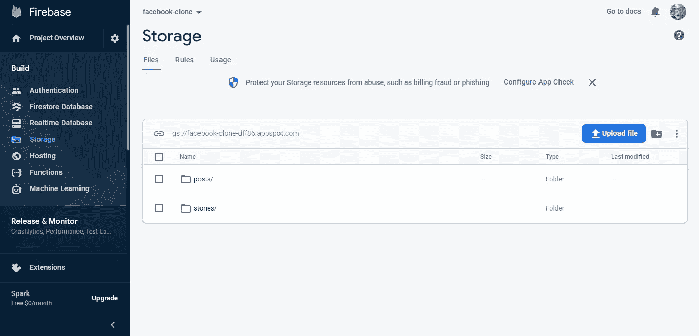
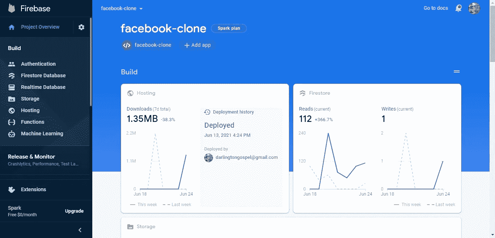
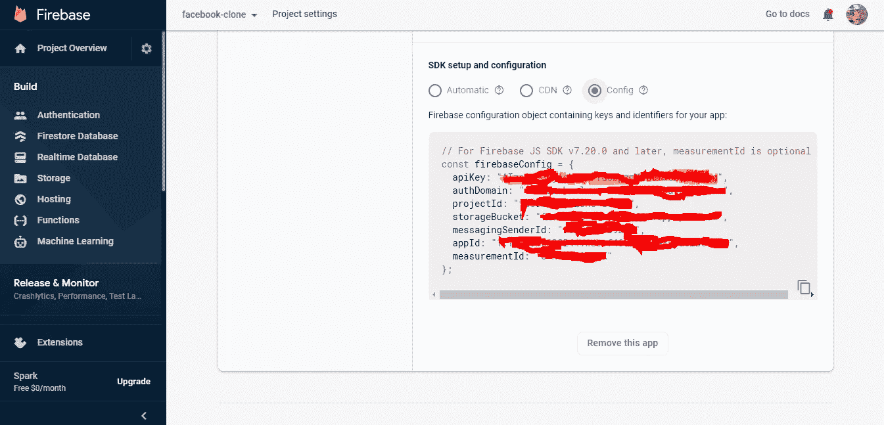
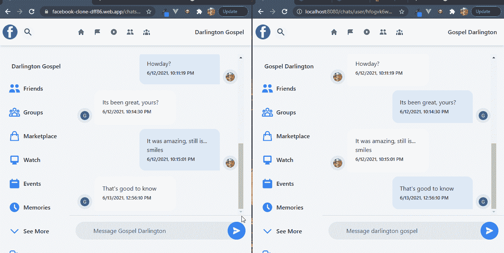

# 如何用 VueJs(脸书克隆)建立一个社交网站

> 原文：<https://medium.com/geekculture/how-to-build-a-social-networking-site-with-vuejs-facebook-clone-c70d747a3205?source=collection_archive---------8----------------------->

你将要建造的东西。[演示](https://facebook-clone-dff86.web.app/)，Git 回购[这里](https://github.com/Daltonic/facebook-clone)。

Facebook Clone

# 介绍

在过去的几年里，应用程序和网络开发取得了长足的进步。我们每天都会使用很多社交媒体网站，包括脸书、Twitter、WhatsApp、LinkedIn 和 Instagram。使用最广泛的功能之一是实时聊天。使用[comet chat](https://www.cometchat.com/)communication s SDK 和 [Firebase](https://console.firebase.google.com/) 后端服务，您将学习如何用最少的努力构建互联网上最好的社交网站之一。

按照步骤构建一个脸书克隆，允许用户添加类似脸书的帖子、故事等等。本教程将使用 [VueJs](https://vuejs.org/) 、Firebase 和 CometChat 来构建一个脸书克隆体，并带有一点 [tailwind 的](https://tailwindcss.com/) CSS。

# 先决条件

要遵循本教程，您必须对第三版 [VueJs](https://vuejs.org/) 的一般使用有一定程度的了解。这将帮助你提高对本教程的理解。

# 安装应用程序依赖项

首先，您需要在您的机器上安装 NodeJs 你可以去他们的[网站](https://nodejs.org/)看看。

其次，您需要使用下面的命令在您的计算机上安装 React-CLI。

`npm install -g @vue/cli`

接下来，创建一个名为 **facebook-clone** 的新项目，并添加 vue-router 作为预安装依赖项。

`vue create facebook-clone`

现在，使用下面的说明为我们的项目安装这些必要的依赖项。

# 安装和配置顺风 CSS

要在项目中正确安装 tailwind CSS，请运行以下代码。

`npm install -D tailwindcss@npm:@tailwindcss/postcss7-compat @tailwindcss/postcss7-compat postcss@^7 autoprefixer@^9`

接下来，生成 Tailwind 并发布 CSS 配置文件。

`npx tailwindcss init -p`

这将在您的根目录下创建两个文件:tailwind.config.js 和 postcss . config . js。tail wind 配置文件是您为应用程序添加定制和主题的位置。它也是告诉 tailwind 搜索页面和组件的路径的地方。按以下方式配置它们:

`// tailwind.congig.js`

`module.exports = {`

`node: 'jit',`

`purge: ['./index.html', './src/**/*.{vue,js,ts,jsx,tsx}'],`

`darkMode: false, *// or 'media' or 'class'*`

`theme: {`

`extend: {},`

`},`

`variants: {`

`extend: {},`

`},`

`plugins: [],`

`}`

`// postcss.config.js`

`module.exports = {`

`plugins: {`

`tailwindcss: {},`

`autoprefixer: {},`

`},`

`}`

在 src 目录中创建一个名为 index.css 的文件，并粘贴以下代码:

`*@tailwind* base;`

`*@tailwind* components;`

`*@tailwind* utilities;`

`*@layer* components {`

`.icon {`

`@apply hidden xl:inline-flex p-2 h-10 w-10 bg-gray-200 rounded-full text-gray-700 cursor-pointer hover:bg-gray-300;`

`}`

`.inputIcon {`

`@apply flex items-center space-x-1 hover:bg-gray-200 rounded-full flex-grow justify-center p-2 rounded-xl cursor-pointer;`

`}`

`}`

最后，在条目 JavaScript 文件(main.js)中导入条目 CSS 文件:

`// main.js`

`*import* { createApp } *from* 'vue'`

`*import* App *from* './App.vue'`

`*import* router *from* './router'`

`*import* './index.css' // There you go`

现在我们已经完成了安装，让我们继续构建我们的 **facebook 克隆**应用解决方案。

# 正在安装 CometChat SDK

1.  前往 [CometChat](https://app.cometchat.com/signup) Pro 并创建一个帐户。
2.  从[仪表盘](https://app.cometchat.com/apps)中，添加一个名为**“Facebook-clone”**的新应用。
3.  从列表中选择这个新添加的应用程序。
4.  从快速入门中复制 APP_ID、REGION 和 AUTH_KEY，稍后会用到它们。
5.  另外，从 API & Auth Key 选项卡中复制 REST_API_KEY。
6.  导航到用户选项卡，删除所有默认用户和组，保持干净 ***(非常重要)*** 。
7.  在项目的 ***src*** 目录下创建一个 **"app.config.js"** 。
8.  在下一个标题中输入您从 CometChat 和 Firebase 获得的**密钥**。
9.  运行以下命令安装 **CometChat SDK** 。

`npm install @cometchat-pro/chat@2.3.0 --save`

# 应用程序配置文件

下面的设置详细说明了为这个项目配置 **app.config.js** 文件的格式。

`const firebaseConfig = {`

`apiKey: 'xxx-xxx-xxx-xxx-xxx-xxx-xxx-xxx',`

`authDomain: 'xxx-xxx-xxx-xxx-xxx-xxx-xxx',`

`databaseURL: 'xxx-xxx-xxx-xxx-xxx-xxx-xxx-xxx-xxx',`

`projectId: 'xxx-xxx-xxx',`

`storageBucket: 'xxx-xxx-xxx-xxx-xxx',`

`messagingSenderId: 'xxx-xxx-xxx',`

`appId: 'xxx-xxx-xxx-xxx-xxx-xxx-xxx-xxx',`

`measurementId: 'xxx-xxx-xxx',`

`},`

`const cometChatConfig = {`

`APP_ID: 'xxx-xxx-xxx',`

`AUTH_KEY: 'xxx-xxx-xxx-xxx-xxx-xxx-xxx-xxx',`

`REST_KEY: 'xxx-xxx-xxx-xxx-xxx-xxx-xxx-xxx',`

`APP_REGION: 'xx',`

`}`

`*export* { firebaseConfig, cometChatConfig }`

警告:“REST_KEY 不应该暴露在前端应用程序中。它应该只是服务器端环境的一部分。但是，在这里它是用于演示目的”。

# 设置 Firebase 项目

要启动一个新项目，请转到 Firebase，创建一个新项目，并启用 Google 认证服务。你需要一个 Gmail 帐户才能开始使用 Firebase。

Firebase Apps

Firebase 从许多来源提供认证支持。例如，社交认证、电话号码、正常的电子邮件和密码方法。因为我们在本教程中使用 Google 身份验证方法，所以这种技术在默认情况下是禁用的。

单击项目的 authentication 选项卡下的 sign-in method，您应该会看到 Firebase 目前支持的提供程序。

Firebase Auth Services

接下来，单击 Google provider 上的编辑图标并启用它。

Firebase Google Auth Service

接下来，您激活 firestore 服务，因为我们的应用程序会将所有帖子存储在一个数据库中。

Firebase Firestore

接下来，您还应该激活存储服务，应用程序上的所有图像都将存储在 firebase 存储桶中。

Firebase Storage Service

接下来，您必须转到 Firebase 项目并注册您的应用程序。选择“添加应用程序”选项，并在项目概述页面上选择 web 作为平台。

Firebase Project Overview

一旦您完成了应用程序的注册，您的应用程序凭据将显示在屏幕上。请注意第二个脚本标记，因为我们将很快在应用程序中使用它。

接下来，您必须将配置文件复制到我们应用程序的项目设置中。您可以访问此页面，方法是转到项目概述、您创建的脚本标记，然后向下滚动到 SDK 设置并复制到私有位置。这个以后会有用的。见下图。

Firebase SDK Configurations

恭喜你！现在您已经完成了安装，让我们做一些配置。

# 应用程序配置文件

下面的设置详细说明了为这个项目配置 **app.config.js** 文件的格式。

`const firebaseConfig = {`

`apiKey: 'xxx-xxx-xxx-xxx-xxx-xxx-xxx-xxx',`

`authDomain: 'xxx-xxx-xxx-xxx-xxx-xxx-xxx',`

`databaseURL: 'xxx-xxx-xxx-xxx-xxx-xxx-xxx-xxx-xxx',`

`projectId: 'xxx-xxx-xxx',`

`storageBucket: 'xxx-xxx-xxx-xxx-xxx',`

`messagingSenderId: 'xxx-xxx-xxx',`

`appId: 'xxx-xxx-xxx-xxx-xxx-xxx-xxx-xxx',`

`measurementId: 'xxx-xxx-xxx',`

`}`

`const COMETCHAT_CONSTANTS = {`

`APP_ID: 'xxx-xxx-xxx',`

`AUTH_KEY: 'xxx-xxx-xxx-xxx-xxx-xxx-xxx-xxx',`

`REST_KEY: 'xxx-xxx-xxx-xxx-xxx-xxx-xxx-xxx',`

`APP_REGION: 'xx',`

`}`

`*export* { firebaseConfig, COMETCHAT_CONSTANTS }`

警告:“REST_KEY 不应该暴露在前端应用程序中。它应该只是服务器端环境的一部分。但是，在这里它是用于演示目的”。

# 配置 CometChat SDK

在项目结构中，打开 main.js & index.css 文件并粘贴下面的代码。

下面的代码在你的应用程序启动前初始化 CometChat。index.js 条目文件使用您的 CometChat API 凭证。 **app.config.js** 文件还包含您的 Firebase 配置变量文件。请不要在 **GitHub** 上分享你的密钥。

此外，main.js 文件不仅仅引导您的应用程序，它还负责确保未经身份验证的用户被定向到登录页面进行身份验证。

# 配置 Firebase 文件

该文件负责与 Firebase 身份验证和数据库服务进行交互。此外，它为我们的 google 认证服务提供商做好了准备，使我们能够登录 google。

# 项目结构

下图显示了项目结构。在继续之前，请确保您看到了文件夹排列。

Code Editor Project Setup

现在，让我们制作项目的其余组件，如上图所示。

# 路由器文件

路由器文件包含所有相关代码，这些代码将用户导航到应用程序的不同部分。请参见下面的代码。

# 应用程序组件

App 组件负责使用 ***main.js*** 文件中 ***Auth-Guard*** 的服务来动态呈现我们的组件。Auth-Guard 确保只有经过身份验证的用户才被允许访问我们的应用程序，从而为我们的应用程序提供安全性。

# 登录组件

该组件负责使用 Firebase google 身份验证服务对我们的用户进行身份验证。它接受用户凭证，并根据他是否是我们应用程序的新用户，让他注册或登录。查看下面的故障代码，观察我们的应用程序如何与 **CometChat SDK** 交互。

Login Component

# 墙景

这是所有奇迹发生的地方。该组件包含其他子组件，如**主标题、侧栏、提要、小部件等**。

虽然听起来很直观，但在下图中可以很好地观察到上述子组件。

The Wall Page

观察下面的代码，了解它们是如何与顺风 CSS 粘合在一起的。

接下来，让我们看看支持我们的应用程序的各种子组件。

# 子组件

以下是较小组件的列表，它们的代码片段，以及它们在我们的应用程序中的角色。

*   接触
*   饲料
*   朋友请求
*   组
*   组请求
*   输入箱
*   主标题
*   消息
*   邮政
*   邮件
*   补充报道
*   侧箭头
*   故事
*   故事卡
*   用户
*   小部件

让我们详细看看这些组件的单个功能。

**Widget &联系人组件**

Contact & Widget Components

这些组件负责呈现用户的联系人列表。小部件本身的响应能力很强，体现了登录用户的所有联系人。为了更好地了解幕后发生的事情，请看下面的代码片段。

请确保按照代码预览中的顺序复制该项目。让我们继续下一个子组件。

**帖子&帖子组件**

Post and Posts Components

这些组件负责呈现带有或不带有图像的经过梳理的用户帖子。post 组件在 post 组件中重复使用。下面的代码块负责产生上面的接口。

**故事&故事卡组件**

StoryCard and Stories Components

这些组件旨在展示我们的脸书故事。使用故事卡组件，故事组件以响应的方式呈现当前用户的故事。下面是负责上图的代码。

**输入框组件**

Input Box Component

输入框组件负责将新帖子发布到我们的平台上，不管有没有图片。在幕后，输入框组件利用我们的 Firebase 帐户的存储和数据库服务来处理应用程序中的所有帖子。以下是规范发布后流程的代码。

**进给组件**

The Feed Component

该组件包含上述所有子组件，包括故事、输入框和帖子组件。这些组件都是与顺风 CSS 一起设计的。下面的代码包含组件结构和设计。

**主标题组件**

The MainHeader Component

这个组件负责应用程序的导航结构，包括基本的图标和链接，比如主页、朋友、群组、头像、聊天、通知等等。在下面的块中是负责这个组件的代码结构。

**侧边栏&侧边栏行组件**

The Sidebar and SidebarRow Components

这些组件负责呈现应用程序的导航结构。有关组件的结构和操作，请参见下面的代码片段。

**组请求组件**

The Group Request Component

group requests 组件负责在我们的平台上创建和列出可用的组。一旦使用私有或公共参数创建了一个组，我们的应用程序就可以很好地将它呈现到视图中。在幕后，这里使用 CometChat SDK 来创建和获取我们平台上的组列表。下面是负责此行为的代码片段。

**朋友请求组件**

The Friend Request Component

类似于组请求组件的操作模式，朋友请求组件列出了我们平台上的可用用户。此外，该组件让用户有机会向我们平台上的其他用户发送好友请求。下面的代码片段更好地说明了这一点。

**群，用户，&消息组件**

The Message Component

这些组件负责我们应用程序的聊天功能。群组组件适合群组聊天，而用户组件允许一对一的聊天。消息组件是一个可重用的组件，负责在聊天界面中呈现消息。下面是负责其操作的代码块。

# 用户视图

用户视图负责显示我们平台内的用户数量，以及一个漂亮的**“添加为好友”**蓝色按钮。它还将用户导航到聊天视图。

The Users View

浏览下面的代码，看看所有的组件是如何被 tailwind CSS 组合在一起的。

# 组视图

与用户视图几乎一样，Groups 组件负责创建和呈现我们平台中所有可用的组。此外，它还确保其他用户无法访问私有组。观察下面的图像和代码。

The Group View

# 聊天视图

该视图负责根据用户选择的聊天类型适当地显示群聊或一对一聊天。这个组件的消息传递功能是由 CometChat SDK 赞助的。

The Chat View

下面的代码解释了这一切。请确保您浏览了项目中的所有文件夹，以查看它们是如何合并的，尤其是组件目录。

干得好，你刚刚粉碎了它，一个强大而有效的脸书克隆体。还有一件事要做，启动您的服务器，如果你还没有这样做已经使用下面的命令。

`npm run serve`

# 结论

总之，通过利用 VueJs、Firebase、 **CometChat** 和 Tailwind CSS，我们在开发脸书克隆方面做得非常出色。您已经了解了脸书背后的化学原理，以及 CometChat SDK 如何让社交网络应用变得可构建。

您已经看到了如何集成大多数的 [CometChat](https://www.cometchat.com/) 功能，比如文本和实时消息。我希望你喜欢这个教程，并且你能够成功地克隆脸书。

是时候开始使用本教程中的技能构建其他相关的应用程序了。

# 关于作者

福音书达林顿是一个远程全栈 web 开发者，在**前端**和 **API** 开发方面多产。他对开发高级的、响应迅速的 web 应用程序非常感兴趣。他目前正在探索改进渐进式网络应用的新技术 **(PWA)** 。福音书达林顿目前是一名自由职业者，他利用空闲时间指导年轻人如何在生活中获得成功。他的爱好包括发明新食谱、写书、写歌和唱歌。你可以通过 [LinkedIn](https://www.linkedin.com/in/darlington-gospel-aa626b125/) 、 [Twitter](https://twitter.com/idaltonic) 、[脸书](https://www.facebook.com/darlington.gospel01)或 [GitHub](https://github.com/Daltonic) 联系我。