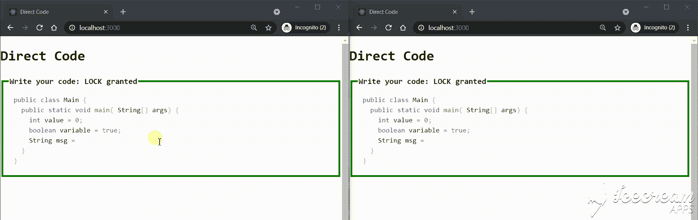

# 如何构建一个 Web 应用程序来与 Node 实时共享代码？JS 和 Socket。木卫一

> 原文：<https://medium.com/geekculture/how-to-build-a-web-app-to-share-code-live-with-node-js-and-socket-io-b37c23ec0862?source=collection_archive---------16----------------------->

## 带有语法突出显示的 HTML 文本区域字段，其中的更改会立即传送到所有连接的客户端。

食谱的成分真的很便宜:我们总共需要 300 行 JS 代码，40 行 HTML，外加 100 行 CSS 代码；用 npm 烘焙，结果如下:

The demo of the “direct-code” simple app. Make it yourself!