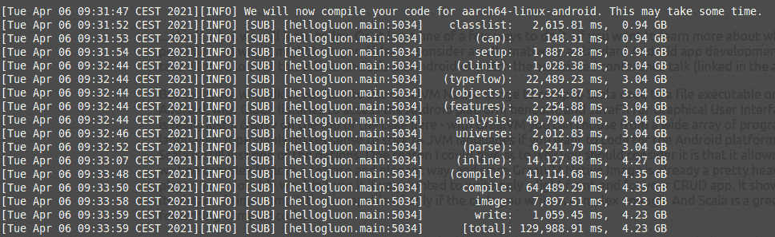
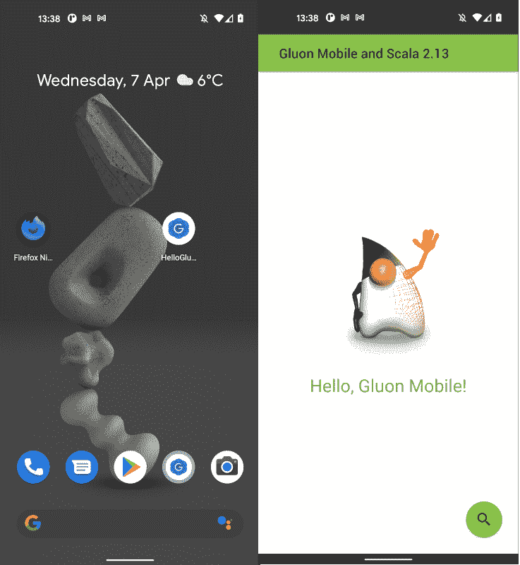

# 如何在 Scala 2.13 中构建一个 Android 应用

> 原文：<https://medium.com/geekculture/how-to-build-an-android-app-in-scala-2-13-e2d887c4dc2?source=collection_archive---------22----------------------->

或者至少我们今天会讨论几种方法中的一种。如果你想了解更多关于什么是可能的，以及为什么考虑标准 Android 应用程序开发的替代方案可能是一个好主意，请看看[这篇关于 Android](/geekculture/scala-on-android-74874d056c1a?source=friends_link&sk=56f6fd922bb1b324228f654597fe7080) 上 Scala 的文章，或者观看相关的会议演讲。

但今天我们将讨论如何使用 GraalVM 原生映像将 Scala 代码编译成可在 Android 上执行的文件，使用 Gluon 库访问底层的 Android 平台，使用 JavaFX 实现图形用户界面。Scala 在某种程度上只是蛋糕上的一颗樱桃——使用 GraalVM，您可以从大量编程语言中进行选择。如果你想为 Android 平台编码，坚持使用 JVM 语言可能是有意义的，但是 Scala 仍然只是选择之一。我可以给出为什么应该考虑它的一个原因是，它允许以简洁和优雅的方式编写复杂的逻辑，并且由于 GraalVM 原生映像已经是一个相当重要的播放器，如果您只想为 CRUD 应用程序编写一个轻量级的前端，您可能不会使用它。只有当您编写的代码足够复杂时，它才会显示其提前编译的能力。Scala 是编写复杂代码的绝佳选择。

# 要求

1.  你需要一台好的电脑。哈哈，不过说真的。构建一个哪怕是最小的示例应用程序的本机映像也需要一段时间，而且在 Intellij 完成之后，它会占用你所有的内存。



但是现在还不要害怕逃跑。在您准备让 GraalVM 接管您的计算机并编译 Android APK 之前，您可以使用 JavaFX maven 插件来快速编译 GUI 并在您的笔记本电脑上运行该应用程序。我们一会儿会谈到它。

2.我们将使用 Linux。据我所知，暂时 Android 原生映像只能在 Linux 机器上工作。如果你使用的是 Mac 或 Windows 系统，并且你仍然能够按照这个教程操作，并得到一个正常工作的安卓系统，请联系我并描述你是如何做到的。说真的。我想知道。*(更新:* [*伊凡报道说它在 Windows 上工作*](/@ivan.velikanova/regarding-if-you-use-a-mac-or-windows-and-you-are-still-able-to-follow-this-tutorial-and-get-a-406087ce5fae) *跟*[*【WSL】*](https://en.wikipedia.org/wiki/Windows_Subsystem_for_Linux)*)*

3.从[这里](https://github.com/graalvm/graalvm-ce-builds/releases)下载 GraalVM，基于 Java 11 的社区版。

4.将此添加到您的`~/.bash_profile`:

```
export GRAALVM_HOME=<path to GraalVM home directory>
export JAVA_HOME=$GRAALVM_HOME
export PATH=$GRAALVM_HOME/bin:$PATH
```

当您键入`java -version`时，它现在应该显示如下内容:

```
> java -version
openjdk version "11.0.10" 2021-01-19
OpenJDK Runtime Environment GraalVM CE 21.0.0 (build 11.0.10+8-jvmci-21.0-b06)
OpenJDK 64-Bit Server VM GraalVM CE 21.0.0 (build 11.0.10+8-jvmci-21.0-b06, mixed mode, sharing)
```

(GraalVM 版本可能会有所不同)

5.键入`native-image`检查它是否已经在路径上。如果没有，请安装:

```
gu install native-image
```

因为你的`PATH`里有`$GRAALVM_HOME/bin`，所以`gu`现在应该在你的控制台里了。另外，[阅读这个](https://www.graalvm.org/reference-manual/native-image/#prerequisites)，安装你需要的任何东西。

6.您将需要`adb`“Android Debug Bridge”，连接到您的 Android 设备并在其上安装应用程序。在这里，你可以找到更多关于如何做的信息。哦，如果还不清楚，你需要一个安卓设备😉

7.确保您的`gcc`至少是版本 6。[你可以试试下面这些步骤](https://tuxamito.com/wiki/index.php/Installing_newer_GCC_versions_in_Ubuntu)。最重要的是，你将需要一些特定的 C 库(如 GTK)来构建本机映像，并且它因计算机而异，所以我不能确切地告诉你该怎么做。不过应该问题不大。只需按照错误信息，说你缺少一些东西，谷歌如何安装它们。在我的例子中，列表如下:

```
libasound2-dev (for pkgConfig alsa)
  libavcodec-dev (for pkgConfig libavcodec)
  libavformat-dev (for pkgConfig libavformat)
  libavutil-dev (for pkgConfig libavutil)
  libfreetype6-dev (for pkgConfig freetype2)
  libgl-dev (for pkgConfig gl)
  libglib2.0-dev (for pkgConfig gmodule-no-export-2.0)
  libglib2.0-dev (for pkgConfig gthread-2.0)
  libgtk-3-dev (for pkgConfig gtk+-x11-3.0)
  libpango1.0-dev (for pkgConfig pangoft2)
  libx11-dev (for pkgConfig x11)
  libxtst-dev (for pkgConfig xtst)
```

# 属国

好了，如果您已经达到这一步，并且一切似乎都正常，这意味着您可能应该能够编译和运行其中一个示例应用程序:

*   [HelloScala](https://github.com/makingthematrix/scalaonandroid/tree/main/helloscala)
*   [HelloFXML](https://github.com/makingthematrix/scalaonandroid/tree/main/HelloFXML)

无论你选择哪一个，只要[克隆整个 GitHub 库](https://github.com/makingthematrix/scalaonandroid)，并转到其中一个子文件夹。HelloScala 基于来自[胶子样本](https://github.com/gluonhq/gluon-samples)的 [HelloGluon](https://github.com/gluonhq/gluon-samples/tree/master/HelloGluon) 。hello XML 基于来自同一个 repo 的[hello XML，但是我对它进行了简化——我删除了所有的 Gluon 依赖项，只留下了裸露的 JavaFX 和 Gluon 的`client-maven-plugin`,以显示以这种方式制作的 Android 应用程序的最低要求。在这两种情况下，我们都使用 Maven——而不是 SBT，后者是标准的 Scala 构建工具 **—** ,因为我们需要 Maven 插件，据我所知*(我计划很快对此进行研究)*。如果还没有安装`mvn`。](https://github.com/gluonhq/gluon-samples/tree/master/HelloFXML)

在 HelloScala(但不是 HelloFXML)的例子中，我们将在 Gluon Mobile 的帮助下创建应用程序——这是一个使用 [JavaFX](https://openjfx.io/) 构建 Java 客户端应用程序的平台。看起来在可预见的未来，这将成为用 GraalVM [构建 Android 应用的**方式**](https://github.com/oracle/graal/issues/632#issuecomment-643816258)**。没有标准的 Android 小部件，而是 JavaFX。它有一些有趣的含义:我们在自己和 Android 平台之间创建的抽象层不仅仅是一个有用的工具，它还是一个需求。我们将无法访问 Android SDK——要么完全无法访问，要么除非我们卷入了一些严重的黑客攻击，但我不建议这么做。相反，这里惯用的方法是编写与平台无关的代码，只在实际需要时才访问平台的特征。例如，你会在 HelloScala 代码中看到，我们检查我们是否在桌面而不是 Android 上，因为如果是，那么我们需要为我们的应用程序提供窗口大小。如果我们在 Android 上，我们可以让应用程序的窗口占据整个屏幕。如果你决定用这个技术栈写一些更复杂的东西，你会很快发现，你可以使用 Gluon 的库和 JavaFX(可能与 [ScalaFX](http://www.scalafx.org/) 一起使用)来实现其他开发人员通过修补 Android SDK 获得的相同结果，同时你也可以编写可以在其他平台上轻松重用的代码。*(但请注意，我并不声称它马上就会完全独立于平台——只是为了易于重用)*。**

**在 HelloScala 和 HelloFXML 的`pom.xml`中，你会找到应用程序使用的插件和依赖项的列表。让我们来看看其中的一些。**

*   **我们将使用 Java 16 和 Scala 2.13。这里没有太多要说的，除此之外，我很高兴在这里看到这个版本号。在我使用 Android SDK 的工作中，我仍然必须使用 Scala 2.11 和 Java 的 Android 版本，这仍然是介于 7 和 8 之间的东西。**
*   **[一个微小的 Scala 库](https://mvnrepository.com/artifact/org.scalameta/svm-subs)解决了【Scala 2.13 与 GraalVM 原生映像交互中的这个问题。谢谢你，奥拉弗尔！**
*   **对于 GUI，我们将使用 JavaFX 16。**
*   **在 HelloFXML 的例子中，需要 javafx-fxml 库来让我们处理 [FXML 文件](https://en.wikipedia.org/wiki/FXML)。FXML 是 JavaFX 中描述 GUI 部件布局的一种方式。另一种是将它们直接放在代码中，这就是我们在 HelloGluon 中所做的。两者各有利弊。FXML 文件可以由[一个叫做场景生成器](https://gluonhq.com/products/scene-builder/)的所见即所得编辑器生成，这非常有用，但是它使用反射将生成的视图与代码连接起来。**
*   **在 HelloScala 的例子中，我们将使用两个库: [Glisten](https://docs.gluonhq.com/charm/javadoc/6.0.6/com.gluonhq.charm.glisten/module-summary.html) 和 [Attach](https://gluonhq.com/products/mobile/attach/) 。Glisten 用专门为移动应用程序设计的附加功能丰富了 JavaFX。Attach 是底层平台上的一个抽象层。对我们来说，这意味着我们应该能够使用它来访问 Android 上的一切，从本地存储到推送通知的权限。我想通过示例应用和教程来探索这一点，因为如果这些功能中的任何一个不能很好地工作，并且没有简单的替代方法，这意味着整个技术体系还不成熟。但就我目前所见，我非常乐观。**
*   **[javafx-maven-plugin](https://github.com/openjfx/javafx-maven-plugin) 让我们使用`mvn javafx:run`命令，快速测试应用程序 GUI 的变化。**
*   **[scala-maven-plugin](https://github.com/davidB/scala-maven-plugin) 让我们在 maven 构建中使用 Scala*(嗯，d'oh)* 。谢谢你，大卫！**
*   **[gluofx-maven-plugin](https://github.com/gluonhq/gluonfx-maven-plugin)让我们将 Gluon 和 JavaFX 代码编译成本机映像。在 HelloScala 的例子中，你会在这里找到一个胶子依赖的列表。HelloFXML 不需要它们，但是它需要一个带有控制器名称的`reflectionList`标记，用于从 FXML 文件生成的视图。**

# **代码**

**在这两个示例应用中，实际的 Scala 代码只设置了几个小部件并显示它们。在 [HelloScala](https://github.com/makingthematrix/scalaonandroid/tree/main/helloscala) 中，`[Main](https://github.com/makingthematrix/scalaonandroid/blob/main/helloscala/src/main/scala/helloscala/Main.scala)`类从 Glisten 库中扩展了`MobileApplication`，然后用两种方法编程构造主视图:`init()`用于创建小部件，`postInit(Scene)`用于装饰它们。在[hello XML](https://github.com/makingthematrix/scalaonandroid/tree/main/HelloFXML)中甚至更简单:`[Main](https://github.com/makingthematrix/scalaonandroid/blob/main/HelloFXML/src/main/scala/hellofxml/HelloFXML.scala)`类从 JavaFX 扩展了`Application`(Glisten 的`MobileApplication`是这个类的子类)，在它的`start(Stage)`方法中，我们从 FXML 文件中加载场景。FXML 文件描述了两个小部件——一个按钮和一个标签——它指向`[HelloFXMLController](https://github.com/makingthematrix/scalaonandroid/blob/main/HelloFXML/src/main/scala/hellofxml/HelloFXMLController.scala)`作为这些小部件的控制器。在那里我们可以初始化它们并对按钮点击做出反应。*(详情请点击本段链接)。***

**如果您想编写任何更复杂的应用程序，您可能会混合使用这两种方法:FXML 用于或多或少的静态视图，而在一个视图中的 UI 响应事件而变化的地方以编程方式设置小部件(例如，考虑一个输入消息的可滚动列表)。此外，选择应该受到您希望测试覆盖多少 GUI 代码的影响。我建议构建由 Scala 类控制的相当轻量级的 GUI，它不依赖于 Gluon 或 JavaFX，因此可以进行单元测试——但这是另一篇文章的主题。**

**顺便说一句，现在你应该可以很容易地看到如何从 pom.xml 中删除所有涉及 Scala 的内容，而仍然用 Java 16 *在 Android 上编写一个应用程序(这也很酷——我们不能在标准的 Android SDK 中这样做)*。它展示了一件令我印象深刻的事情。为了以这种方式编写一个 Android 应用程序，我把许多才华横溢的人的工作放在一起，他们甚至不一定彼此了解。他们中的一些人在 Scala 库上工作，一些人在 GraalVM 上工作，其他人在 Gluon 库和 JavaFX 上工作。他们都出于各种原因创造新功能和修复错误，并不真正关心有人想用 Scala 编写 Android 应用程序。然而，这一切都符合在一起。反过来也一样:通过用 Scala 编写 Android 应用程序，我们可以测试和试验所有的难题。我们可以为他们的开发者提供反馈，甚至可能帮助修复一些错误或编写一些对其他人有用的代码，这些人从未想过用 Scala 编写 Android 应用程序。**

# **如何运行应用程序**

**正如我已经提到的，构建 Android 原生映像需要时间，所以我们希望避免过于频繁地这样做。即使在第一次运行应用程序之前，你也应该在单元、组件和集成测试上投入一些时间，这样，如果你改变了应用程序中的某些东西，你仍然可以确保它在任何手动测试之前都可以正常工作。然后，要检查 GUI 的外观和工作方式，请使用:**

```
mvn gluonfx:run
```

**如果一切正常，构建本机映像…但是首先，对于您的桌面:**

```
mvn gluonfx:build gluonfx:nativerun
```

**毕竟我们这里是跨平台的。除非你想测试你的应用程序只能在移动设备上运行的特性，你可以先把它作为一个独立的桌面应用程序来运行。这将再次让您测试应用程序的一些层，而无需在 Android 设备上实际运行它。然后，如果一切正常，或者如果你决定跳过这一步:**

```
mvn -Pandroid gluonfx:build gluonfx:package
```

**成功执行该命令将在 `target/client/aarch64-android/gvm`目录中创建一个 APK 文件。用 USB 线把你的安卓手机连接到电脑上，给电脑发送文件的权限，输入`adb devices`检查你的手机是否被识别。它应该在控制台中显示如下内容:**

```
> adb devices
List of devices attached
16b3a5c8	device
```

**现在你应该可以用`adb install <path to APK>`在连接的设备上安装应用程序了，过一会儿你应该会在你设备的主屏幕上看到一个新图标。当你点击图标时，它应该会打开与你的应用程序桌面版本大致相同的屏幕。**

**安装可能会因为很多原因而不工作，其中最常见的原因是你的 Android 不允许以这种方式安装应用程序。进入设置，找到“开发者选项”，然后启用“USB 调试”和“通过 USB 安装”。如果你无论如何也找不到“开发者选项”，那么这可能意味着你需要做一些事情，比如用你的 Android 操作系统版本号点击十次(或者谷歌一下)。**

****

**如果一切正常，你可以在你的设备上看到应用程序的屏幕，输入`adb logcat | grep GraalCompiled`查看日志输出。现在，例如，如果你安装了 HelloGluon，你可以点击应用程序屏幕上带有放大镜图标的按钮，你应该会看到控制台上打印的`"log something from Scala"`。当然，对于任何更复杂的东西，请查看您选择的 IDE 中的插件，这些插件可以以更用户友好的方式显示来自 adb logcat 的日志。**

# **仅此而已。[我们现在去哪里？](https://www.youtube.com/watch?v=1w7OgIMMRc4&t=215s)**

**嘿，你成功了！已经挺远了。**

**如果您设法构建了一个示例应用程序，并且想要编写更复杂的代码，至少有几种方法可以让您了解如何去做:**

*   **阅读更多内容并尝试使用 [JavaFX](https://openjfx.io/) 。你可以从它的官方文档和 Jacob Jenkov 的教程列表开始。**
*   **安装[场景构建器](https://gluonhq.com/products/scene-builder/)并学习如何用它构建 GUI。除了文档，你可以在 YouTube 上找到很多关于它的教程。**
*   **浏览 Gluon 的文档并附上以了解如何让你的应用在移动设备上看起来更好，以及如何访问你的设备的功能。**
*   **从 [Gluon 的样本列表](https://docs.gluonhq.com/)中下载一个例子，并将其重写到 Scala 中。当你找到的时候，告诉我！**
*   **深入研究[Scala FX](http://www.scalafx.org/)——Java FX 上更具声明性的 Scala 惯用包装器。**
*   **从 GitHub 上我的“Android 上的 Scala”库中下载一些其他的例子。联系我，如果你写了一个自己的例子应用程序，并希望我包括它。**
*   **加入我们的官方 Scala discord——我们有一个#scala-android 频道**
*   **还有 [an #android 频道](https://discord.gg/XHMt6Yq4)关于“学习 Scala”的不和。**
*   **最后，如果你有任何问题，[你可以在推特上找到我](https://twitter.com/makingthematrix)**