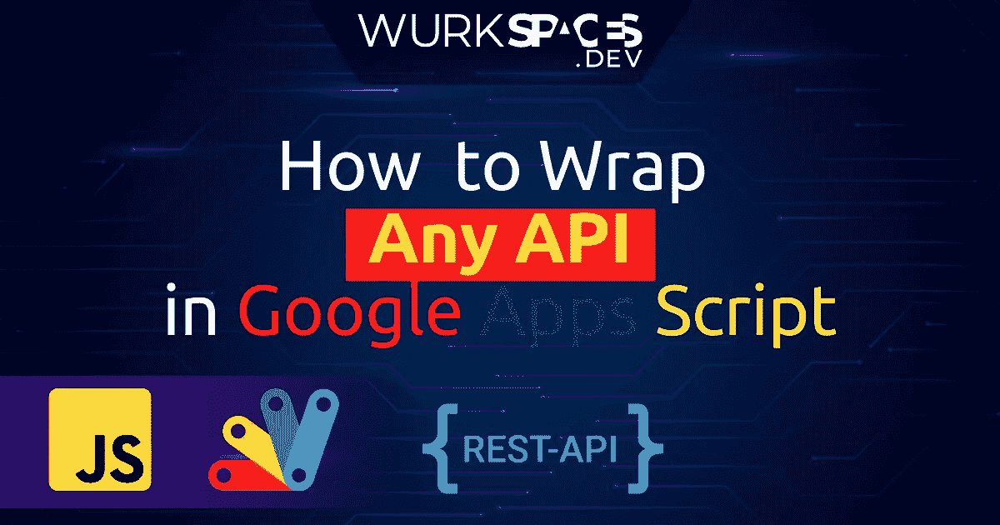

# 如何在 Google Apps 脚本中构建 API 包装器

> 原文：<https://medium.com/geekculture/how-to-build-an-api-wrapper-in-google-apps-script-904be20f0dd7?source=collection_archive---------4----------------------->

没有你喜欢的 API 的 Google Apps 脚本 SDK？没问题！

# 什么是 API 包装器？为什么你可能想要建立一个

每个开发人员在某种程度上都需要利用外部服务来扩展他们的代码。API 就是基于这个目的构建的；它们允许我们与其他服务和应用程序进行通信…