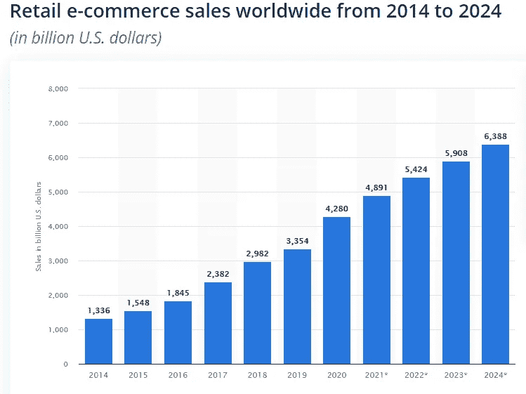
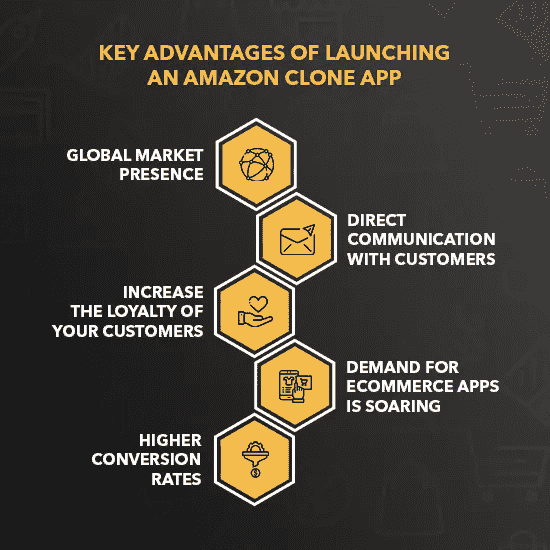
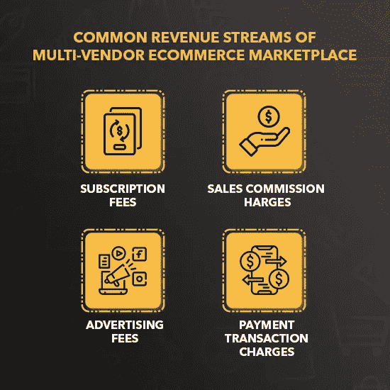

# 如何在 2022 年建立像亚马逊一样的电子商务应用程序:简单指南

> 原文：<https://medium.com/geekculture/how-to-build-an-ecommerce-app-like-amazon-in-2022-a-simple-guide-23722b70f9b8?source=collection_archive---------17----------------------->

不容置疑的事实是，近段时间网购已经成为一种潮流。此外，在疫情时期，人们除了偏好移动应用程序之外，别无选择。毫无疑问，对电子商务这样的应用程序的需求永远不会在大流行后激增，因为人们已经习惯了在家门口接收产品的便利。

亚马逊就是这样一个最受欢迎的电子商务应用，人们更喜欢在网上购物。它的增长促使年轻的企业家用一个类似的应用程序进入在线市场。电子商务应用对你有启发吗？**为什么你不能通过将你的应用想法变成现实来创业呢？**你是一个愿意通过亚马逊这样的应用程序进入在线市场的企业家吗？**选择** [**可定制的亚马逊克隆脚本**](https://www.uberlikeapp.com/amazon-clone) **而轰动业界。**

> 这个博客将指导你如何开发像亚马逊这样的应用。继续阅读以获得真知灼见。

**全球电子商务市场统计数据&事实与未来前景**

*   近年来，电子商务已经成为全球产业不可或缺的一部分。特别是，新冠肺炎疫情是人们开始对网上购物感兴趣的时候。
*   据统计数据显示，亚马逊是访问量最大的在线电子商务市场。此外，中国是电子商务销售的主导国。
*   2020 年**全球 [**电子商务销售额**](https://www.statista.com/statistics/379046/worldwide-retail-e-commerce-sales/) 为 4.28 万亿美元，预计到 2022 年底将达到 5.4 万亿美元。**
*   值得注意的是，在新冠肺炎疫情开始后，电子商务销售额大幅飙升。

**智能手机应用用户统计——网上购物**

*   根据最近的一份报告，有 64 亿人使用智能手机，到 2026 年底将达到 75 亿。
*   很大程度上，人们更喜欢 Android 和 iOS 应用程序进行在线购物，而不是选择通过浏览器访问网站进行购物。
*   根据一份可靠的报告，69%的美国人选择移动设备来提前在线查看产品评论。
*   在智能手机用户中，近 69.4%的人更喜欢通过移动应用程序在线购物。
*   可以预见的是，到 2023 年第四季度末，电子商务销售额将达到 6.5 万亿美元。

这一数据足以说明，人们正在依赖移动应用进行在线购物，并且在未来几年将继续蓬勃发展。

**投资开发亚马逊克隆产品的理由**

*   **全球市场占有率**

亚马逊克隆的部署对你的品牌有好处。这是因为智能手机已经成为每个人生活中至关重要的一部分，所以人们更喜欢在线购物的移动应用程序。然而，有了电子商务应用，你应该能接触到更广泛的受众。因此，你可以在全球市场建立一个在线的存在。

*   **与客户直接沟通**

客户便利是电子商务成功的关键。通过该应用程序，您可以与客户直接联系，因为他们可以随时联系您的支持团队。由于移动应用程序本身是一种营销工具，它可以用来影响客户选择你的服务。

*   **提高客户的忠诚度**

在你的应用程序中引入忠诚度计划将有助于增加忠诚的目标受众。因此，有可能你的忠实客户甚至不会想到不惜任何代价转向你的竞争对手的应用。

*   **对电子商务应用的需求正在飙升**

如前所述，未来电子商务应用的范围将会很大。所以，现在是时候用一个可定制的 Amazon 克隆脚本投入这个行业了。

*   **更高的转化率**

通过移动应用，你将有更大的机会增加活跃用户的数量，从而增加销售额。最终，这将是持续增长的主要原因，并通过纳入各种流来提高收入。

**构建电子商务市场应用的简单步骤**

建立一个电子商务平台是一个循序渐进的过程。以下是[**推出一款成功的多厂商电子商务 app**](https://www.uberlikeapp.com/amazon-clone) 需要考虑的主要方面。

*   **确定你的定位**

电子商务应用出现的根本原因是按需应用，包括送餐、杂货配送、家庭服务、美容服务等。在开始电子商务业务之前，你必须确定这是一个有利可图的利基。

首先要找到你的目标受众，了解他们的需求。请注意，您选择的地区对电子商务应用程序的要求很高。开展调查以满足目标受众的需求。

*   **市场调查和竞争对手分析**

为了应付目前的形势，了解最近的市场趋势是很重要的。与此同时，分析竞争对手将使你的业务更上一层楼，因为你可以继续向客户提供与众不同的产品。

*   **实现你的应用理念**

一旦你构思了你的生意，现在是时候把它变成现实了。应用程序开发有两种方法。第一种方法是从头开始制作电子商务应用程序，第二种方法是选择现成的电子商务多供应商脚本。

第一种方法既费时又费钱，而第二种方法省时，只需很少的费用。根据资源可用性和其他因素，您可以决定在这些选项中进行选择。

*   **选择基本功能**

您选择的功能将决定应用程序的运行方式。所以，千万不要错过电子商务应用的基本功能。然而，考虑一些能让你在竞争中脱颖而出的显著特征。

**亚马逊等电子商务应用的基本特征:**

*   即时注册
*   高级搜索过滤器
*   订单跟踪
*   多种支付方式
*   优惠和折扣
*   轻松结账

**为开发像亚马逊这样的应用选择合适的技术组合**

技术栈的选择会对决定 app 的性能有很大的影响。所以，当你创建一个像亚马逊这样的应用时，你必须决定你应该选择哪种技术。下面列出了标准技术堆栈。

> **编程语言—** Java，Objective C，Kotlin，React Native，Flutter
> 
> **数据库—** 亚马逊的 Web 服务、PostgreSQL、Redis、MySQL、MongoDB、亚马逊的 DynamoDB、谷歌的 Firebase 数据库
> 
> **前端开发—** HTML、JavaScript、ReactJS、CSS
> 
> **网络服务器—** Nginx，Apache
> 
> **存储—** AWS S3 亚马逊简单存储解决方案或谷歌 Firebase 存储
> 
> **支付集成—** Braintree，Paypal

将你的商业投资货币化的最好方法是什么？

创收是任何业务的核心。当谈到多供应商电子商务市场，你应该实施各种盈利战略。在本节中，让我们来看看电子商务应用程序的一些常见创收方式。

*   **认购费**

这是最受欢迎的创收渠道之一。像亚马逊 Prime 和网飞这样的平台正在利用这一点赚取可观的利润。通过这种收入模式，您可以允许您的客户在使用订阅计划时无限制地使用您的服务。

*   **佣金费用**

可以向在应用程序中注册的供应商收取佣金。费用可能是固定的或可变的，因为你可以设置一个固定的百分比，或根据他们通过应用程序收到的订单收取费用。

*   **广告费**

这是一种从电子商务应用产生收入的间接方式，因为你可以有一笔可观的收入。给供应商和其他企业留出空间，让他们在你的平台上宣传他们的产品/服务，并根据印象或点击量向他们收费。

*   **支付交易手续费**

这似乎是一种持续的创收方式。在这种情况下，只要支付交易在应用程序内完成，你就可以向卖家或买家收费。

**2022 年打造一个像亚马逊一样的应用需要多少钱？**

你可能想知道在 2022 年开发一个像亚马逊这样的电子商务应用程序的总成本会是多少。不了解你的 app 需求是无法估算的。但是，根据您对应用程序的要求和期望，成本很容易评估。

粗略估计，开发这款应用的成本大约在 3000 美元到 9000 美元之间。当你想要电子商务应用程序的高级版本具有新的&创新功能时，它可能会提升。然而，应用程序开发的确切成本将由各种因素决定。

快速浏览一下决定开发像亚马逊这样的电子商务应用程序的总成本的主要因素。

*   **特性&功能**

这是主要的成本决定因素。然而，应用程序的复杂性将取决于你加入的功能。当应用程序更复杂时，制作所需的时间会增加。也就是说，成本会随着包含的功能数量而增加。

*   **发布平台的选择**

平台的选择也起着至关重要的作用。当你想要更广泛的覆盖面时，你可以考虑不同的发布平台。如果能选择跨平台就太好了。显然，当你选择为 Android 和 iOS 推出亚马逊克隆时，成本会上升。

*   **app 的 UI/UX 设计**

该应用程序吸引人的用户界面/UX 设计将会引起用户的注意。除此之外，确保他们能够无缝、快速地浏览各种功能。这给了应用程序用户的第一印象。

*   **App 开发团队/公司**

开发一个多供应商电子商务市场是如此复杂的一个问题，需要给予最大的重视。因此，你必须选择正确的应用程序开发团队或公司来实现你的应用程序想法。根据技能、经验和地理位置，可以确定成本。

**总结思路:准备好进军全球电子商务市场了吗？**

希望你已经对亚马逊这样的电子商务应用的**开发有所了解。如果你决心投身于这个行业，那么在做好适当准备的情况下，开始发布你的应用吧。现在，是时候联系一家应用程序开发公司/团队，将你的应用程序想法转化为现实了。然而，**更喜欢一个** [**多厂商电子商务脚本**](https://www.uberlikeapp.com/amazon-clone) **而不是选择从头开始构建应用程序，这将是很棒的。****