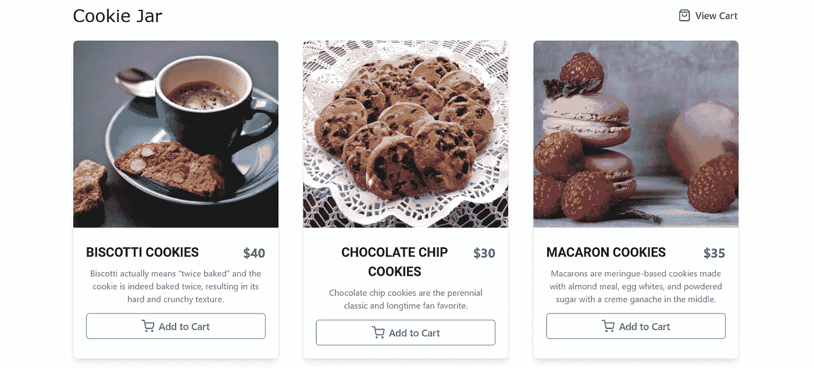

# 如何使用 React 构建电子商务应用程序

> 原文：<https://medium.com/geekculture/how-to-build-an-ecommerce-app-with-react-a040bec4089d?source=collection_archive---------6----------------------->

在本教程中，我们将使用 [ButterCMS](https://buttercms.com/) 和 [Snipcart](https://snipcart.com/) 构建一个带有 [React](https://reactjs.org/) 的电子商务应用。我们将使用 [Chakra UI](https://chakra-ui.com/) ，一个模块化和可访问的组件库，来设计应用程序。
最后，我们将使用 [Stormkit](https://www.stormkit.io/) 部署我们的电子商务应用，Stormkit 是一种类似于 Vercel 或 Netlify 的 JavaScript 应用的无服务器部署服务。