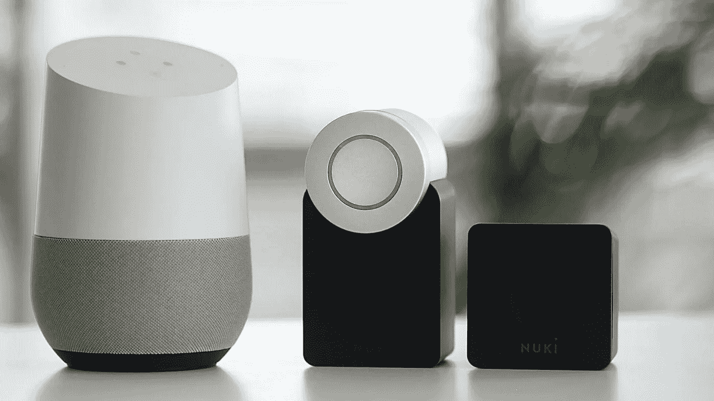
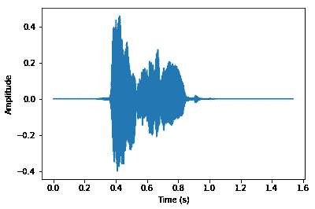
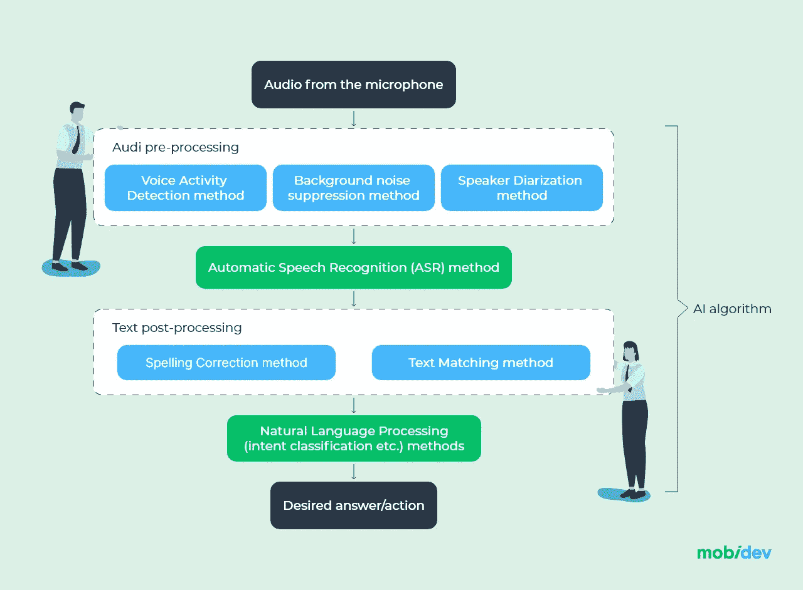
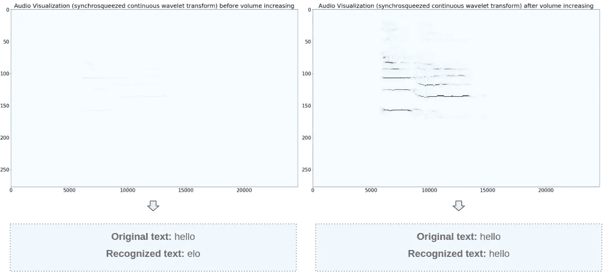
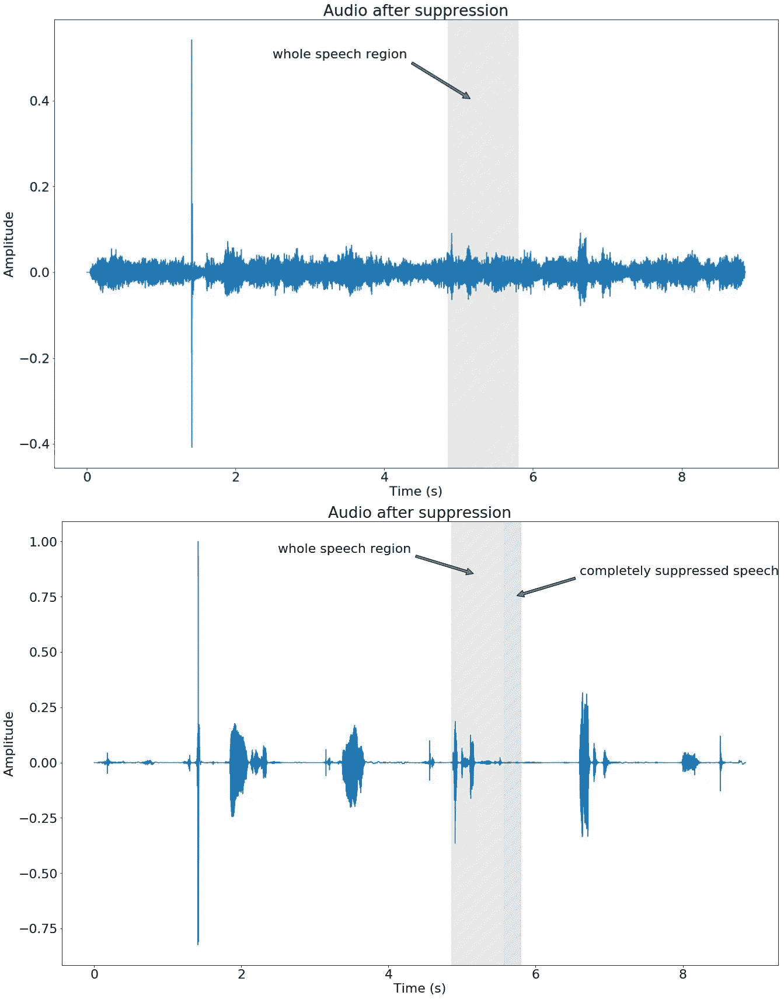
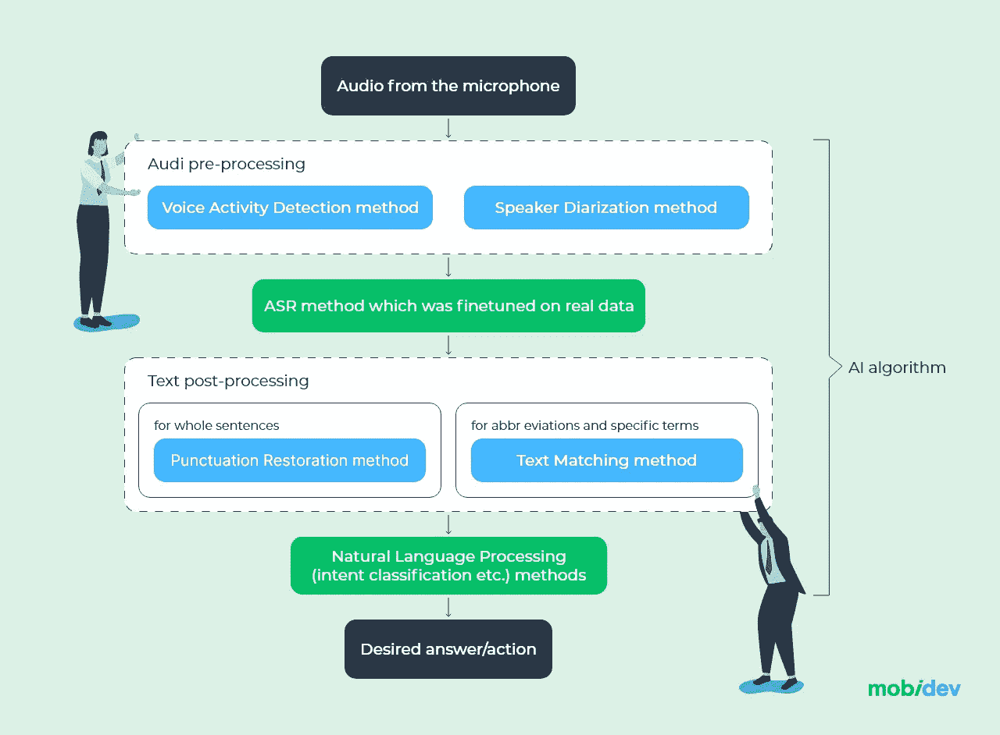

# 如何建立一个有效的语音识别系统

> 原文：<https://medium.com/geekculture/how-to-build-an-effective-speech-recognition-system-391cb88dfcb3?source=collection_archive---------13----------------------->

现代语音应用程序使用人工智能算法来识别不同的声音，包括人声和语音。用技术术语来说，大多数语音应用程序要么执行语音识别，要么执行语音识别。虽然执行语音/语音识别的架构和人工智能模型之间没有太大的差异，但它们实际上与不同的业务任务相关。那么首先让我们来阐述一下两者的区别。

# 声音识别与语音识别

**语音识别**是从其他声音中挑出特定声音的能力，并识别主人的语气以实施语音生物识别等安全功能。

**语音识别**主要负责从音频中提取有意义的信息，识别所说的话，以及它们所处的上下文。有了这个，我们可以创建像聊天机器人和虚拟助手这样的系统，用于自动交流和精确理解语音命令。

这两个术语通常可以互换使用，因为执行这些功能的算法之间没有太大的技术差异。但是，根据您的需要，语音或语音识别的管道在处理步骤方面可能会有所不同。

在本帖中，我们将关注语音识别应用程序的一般方法，并详细阐述一些我们可以应用的架构原则，以涵盖所有可能的功能需求。

# 语音识别应用程序是如何工作的？

语音识别涵盖了从语音驱动的用户界面到像 Alexa 或 Siri 这样的虚拟助手的大范围商业应用。任何语音识别解决方案都基于**自动语音识别(ASR)** 技术，该技术从音频中提取单词和语法结构，对其进行处理并提供某种类型的系统响应。

# 哪种类型的人工智能用于语音识别？

语音识别模型可以直接对语音作出反应，作为任何类型动作的激活信号。但既然我们在谈论语音识别，那么需要注意的是，AI 并没有直接从音频中提取有意义的信息，因为其中有许多奇怪的声音。这是语音到文本转换作为进一步应用[自然语言处理](https://mobidev.biz/blog/natural-language-processing-nlp-use-cases-business)或 NLP 的必要组件完成的地方。

所以语音识别应用程序的顶级范围可以表示如下:用户的语音为 AI 算法提供输入，这有助于为用户找到合适的答案。

*High-level representation of an automatic speech recognition application*

然而，需要注意的是，将语音转换为文本以进行进一步处理的模型是整个 AI 管道中最明显的组件。除了转换模型之外，还有许多组件可以确保适当的系统性能。

因此，在着手开发语音识别系统时，首先必须确定所需应用的范围:

*   应用程序将做什么？
*   谁将是最终用户？
*   会在什么环境条件下使用？
*   领域区域有什么特点？
*   未来将如何扩展？

# 语音识别技术重要的是什么？

在开始开发语音识别系统时，我们需要从一开始就考虑一些基本的音频属性:

1.  音频文件格式(mp3，wav，flac 等。)
2.  通道数量(立体声或单声道)
3.  采样速率值(8kHz、16kHz 等。)
4.  比特率(32 千比特/秒、128 千比特/秒等。)
5.  音频剪辑的持续时间。

其中最重要的是音频文件格式和采样率，我们来详细说说。输入设备以不同的文件格式录制音频，大多数情况下音频保存在 loosy mp3 中，但也有像 WAV 或 Flac 这样的无损格式。每当我们记录一个声波时，我们基本上是通过在离散的时间间隔内采样来数字化声音。这就是所谓的采样率，其中每个样本都是特定持续时间内波形的幅度。

*Audio signal representation*

一些模型可以容忍格式变化和采样率变化，而其他模型只能接受固定数量的格式。为了尽量减少这种不一致性，我们可以在每种编程语言中使用各种内置方法来处理音频。例如，如果我们谈论的是 Python 语言，那么可以使用像 [Librosa](https://librosa.org/doc/latest/index.html) 、 [scipy.io.wavfile](https://docs.scipy.org/doc/scipy/reference/generated/scipy.io.wavfile.read.html) 等库来执行各种操作，例如读取、转换和记录音频。

一旦我们获得了音频处理的细节，这将使我们对我们需要什么数据以及处理它需要多少努力有一个更坚实的理解。在此阶段，强烈建议由在 ASR 和 NLP 方面经验丰富的数据科学团队提供咨询服务。因为收集错误的数据和/或设定不切实际的目标是最大的风险。

# 自动语音识别过程和组件

自动语音识别、语音转文本和 NLP 是整个基于语音的管道中最明显的模块。但是它们涵盖了非常基本的需求范围。现在，让我们看看语音识别的常见要求，以了解我们的管道中还可能包括哪些内容:

*   应用程序必须在后台模式下工作，所以它必须将用户的语音与其他声音分开。对于这个特性，我们需要声音活动检测方法，它将只传输那些包含目标声音的帧。
*   该应用程序是为了在拥挤的地方使用，这意味着会有其他声音和周围的噪音。背景噪声抑制模型在这里是优选的，尤其是神经网络，其可以去除低频噪声和高频响亮的声音，如人声。
*   在有几个人在说话的情况下，比如在呼叫中心的情况下，我们还希望应用扬声器二分化方法将输入语音流分成几个扬声器，找到所需的一个。
*   应用程序必须向用户显示语音识别的结果。那么它应该考虑到 speech2text (ASR)模型可能会返回没有标点符号或者有语法错误的文本。在这种情况下，建议应用拼写校正模型，这将最小化用户在他们面前看到实心文本的可能性。
*   该应用程序将用于使用专业术语和缩写的领域。在这种情况下，存在 speech2text 模型不能正确处理该任务的风险，然后将需要定制 speech2text 模型的训练。

通过这种方式，我们可以得到下面的管道设计，它将包括多个模块来获取正确的数据并对其进行处理。

*Automatic Speech Recognition (ASR) pipeline*

在整个 AI 管道中，有一些默认使用的模块:ASR 和 NLP 方法(例如，意图分类模型)。本质上，人工智能算法将声音作为输入，使用 ASR 模型将其转换为语音，并使用预训练的 NLP 模型为用户选择响应。然而，对于定性结果，诸如预处理和后处理的阶段是必要的。

现在我们将转向高级架构。

# 我们关于提高 ASR 质量的 4 条建议

为了优化开发计划并在陷入困境之前降低风险，最好提前了解标准方法中存在的问题。MobiDev 对标准管道进行了显式测试，因此在本节中，我们将分享一些需要考虑的发现。

# 1.注意采样率

正如我们之前提到的，音频具有诸如采样率、通道数量等特征。这些会显著影响语音识别的结果和 ASR 模型的整体操作。为了获得可能的最佳结果，我们应该考虑大多数预训练模型是在具有 16Hz 样本和仅一个声道(换句话说，单声道音频)的数据集上训练的。

这就对我们可以处理哪些数据带来了一些限制，并增加了对数据准备阶段的要求。

# 2.正常化录音音量

显然，ASR 方法对包含大量外来噪声的音频很敏感，并且在试图识别非典型口音时会受到影响。但更重要的是，语音识别结果将强烈依赖于音量。由于与麦克风的距离、噪音抑制效果和语音中的自然音量波动，录音的音量经常不一致。为了避免这种不准确性，我们可以使用 Python 语言的[pyloudnom](https://github.com/csteinmetz1/pyloudnorm)库，该库有助于确定音量范围并放大声音而不失真。这种方法非常类似于音频压缩，但产生的伪像更少，从而提高了模型预测的整体质量。

*Nvidia Quarznet 15×5 speech recognition results with and without volume normalization*

这里你可以看到一个语音识别的例子，没有音量归一化，也有。在第一种情况下，模型努力识别一个简单的单词，但在音量恢复后，结果有所改善。

# 3.提高短单词的识别能力

大多数 ASR 模型是在数据集上训练的，这些数据集包含每个句子之间具有适当语义关系的文本。这给我们带来了另一个识别断章取义的短语的问题。下面是 [ASR 模型](https://catalog.ngc.nvidia.com/orgs/nvidia/models/quartznet15x5)在断章取义的短词和完整句子上的性能比较:

*The result of recognizing short words in and out of context*

为了克服这个问题，有必要考虑使用任何预处理方法，使模型能够更准确地理解一个人希望在哪个特定区域接收信息。

此外，在文本到语音转换期间，ASR 模型可以生成不存在的单词和其他特定错误。拼写纠正方法在最好的情况下可能只是失败，或者选择将单词纠正为接近正确选择的单词，甚至改变为完全错误的单词。这个问题也适用于断章取义的非常短的单词，但是要提前预见到。

# 4.仅在需要时使用噪音抑制方法

背景噪声抑制方法可以极大地帮助将用户的语音从环境声音中分离出来。然而，一旦出现大噪声，噪声抑制会导致另一个问题，例如 ASR 模型的不正确操作。

人类说话的音量往往会根据句子的不同部分而变化。例如，当我们说话时，我们会在句子结束时自然地降低声音，这导致声音与其他声音混合，并被噪音抑制淹没。这导致 ASR 模型不能识别消息的一部分。下面你可以看到一个噪声抑制的例子，它只影响用户的一部分语音。

*Noise suppression effect on the speech recognition*

还值得考虑的是，作为应用背景噪声抑制模型的结果，原始语音被失真，这不利地影响了 ASR 模型的操作。因此，如果没有特别的需要，就不应该应用背景噪声抑制。

# 获得增强型 ASR 系统

基于上述几点，最初的管道可能会带来比实际性能好处更多的麻烦。这是因为一些看起来合乎逻辑和必须的组件可能会中断其他基本组件的工作。在其他情况下，在实际的 AI 模型可以与数据交互之前，严格需要添加预处理层。因此，我们可以提出以下增强型 ASR 系统架构:

*Enhanced automatic speech recognition system pipeline*

这就是为什么，基于以上几点，噪声抑制和拼写纠正模块被删除。相反，为了解决在识别的文本中消除噪声和错误的问题，ASR 模型必须在真实数据上进行微调。该数据将充分反映该领域的实际环境条件和特征。

由 [MobiDev](https://mobidev.biz/services/machine-learning-consulting) 移动开发主管 [Liubov Zatolokina](https://mobidev.biz/our-team/liubov-zatolokina) 撰写。

*全文原载于*[*https://mobidev . biz*](https://mobidev.biz/blog/automatic-speech-recognition-asr-system-development)*，基于 mobi dev 技术研究。*