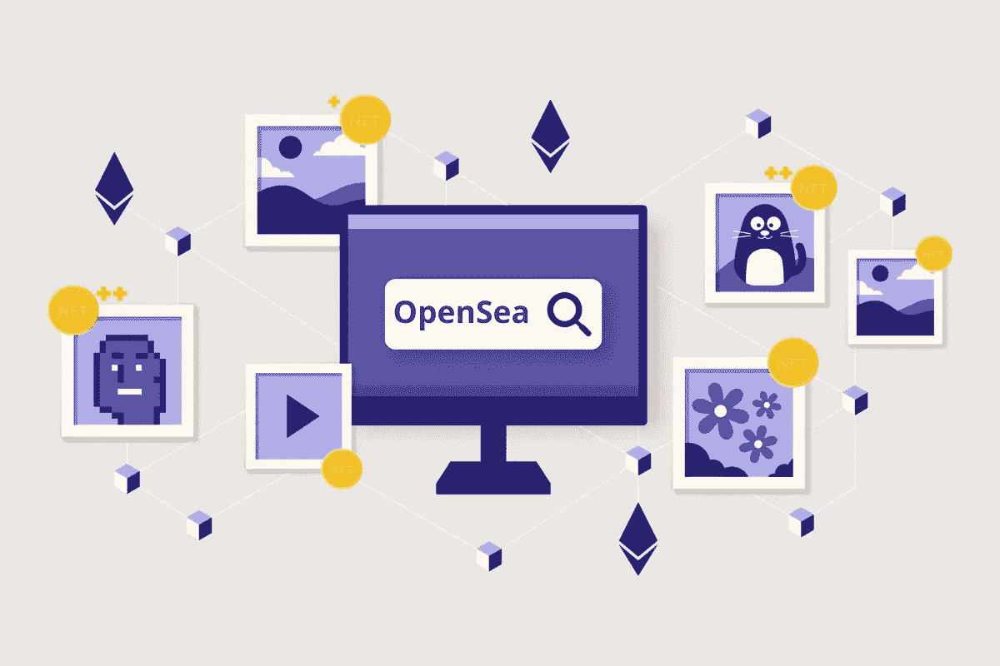

# 如何建立像 Opensea 这样的 NFT 市场？[详尽的指南]

> 原文：<https://medium.com/geekculture/how-to-build-an-nft-marketplace-like-opensea-extensive-guide-71610f2b8481?source=collection_archive---------9----------------------->

在目前的趋势中，非技术人员正在成为突出的接班人。建立一个像 OpenSea 这样的 NFT 市场将会在市场上大受欢迎。

拥有独一无二的东西是一种独特的感觉。这就是 NFTs 给人们提供的东西——拥有稀有独特的东西的数字所有权。除了数字所有权，它还提供了绝佳的投资机会。NFT 开发或销售的核心发生在一个被称为 NFT 市场的指定市场。这些市场为企业家创造巨额收入提供了巨大的空间。

就创业而言，顺应潮流非常重要。在当前的趋势中，非功能性测试正在成为后继者。在这种情况下建立一个 NFT 市场将会在市场上大受欢迎。从这个博客了解 NFT 市场发展**的方方面面。**

****不可替换的令牌在加密领域是如何工作的？****

**不可替代的代币是稀有或独特收藏的数字表示。每个 NFT 代币将代表一种特定的资产，并且没有标准的价值嵌入其中。一个 NFT 可以和另一个 NFT 交换，因为两者的价值不同，它们可以互换。**

**NFT 建立在区块链上，因此可以复制或更改。NFT 展示原创性、真实性、身份和所有权。**

**NFT 属于加密令牌的范畴，但是它们在许多方面不同于其他令牌。让我们简要地看看它们，**

*   **NFT 是唯一的加密令牌。一个比特币和另一个比特币一样。但是，每个 NFT 都有自己独特的标准。**
*   **NFT 不能分成更小的部分，而以太坊和比特币可以分成几个部分。**

**当我们讨论两者之间的差异时，讨论相似之处也很重要。让我们看看 NFTs 和其他加密令牌之间的相似之处。**

*   **以太坊或 Nifty Gateway 等区块链生态系统用于铸造加密令牌。甚至 NFT 也是用区块链技术建造的。**
*   **NFTs 和加密令牌都可以在市场上交易。**
*   **可以通过在计算机中创建不同的代码来开发 NFTs 和加密令牌。**

****NFT 有哪些不同的变体？****

**NFT 不一定是艺术。任何数字或实物资产都可以被铸造成 NFT。任何看起来真实可信的收藏或资产都可以被制作成 NFT。NFT 的主要准则是资产应该是同类中的一种。**

**NFTs 的细分市场集中在各个方面，如游戏资产、体育、音乐等。看看一些流行的 NFT 收藏，它们在隐密体中非常有名。**

*   **Cryptokitties 是一款著名的 NFT 游戏，用户可以购买或培育数字小猫，以 NFTs 的形式赢得奖励。**
*   **NBA 是每个体育爱好者都会记得的东西。NBA 顶级镜头推出，聚焦于那些体育爱好者。用户可以找到罕见的时刻、获胜的时刻等。，来自 NFTs 的那些锦标赛。**
*   **《人物》杂志的著名作品集《每天的——前 5000 天》以 6900 万美元的天价售出。**
*   **Bored Ape 游艇俱乐部是一个指定的 NFT 市场，将有 10，000 名 NFT 的集合。**

**如何开发像 OpenSea 这样的 NFT 市场？**

**NFT 市场是指定进行非金融交易的平台。这些 NFT 建立在区块链平台上，允许出售从房地产到虚拟形象数字收藏的一切权利。以太坊和索拉纳是用来建立 NFT 市场的最著名的区块链网络。**

**市场上的每个加密爱好者都知道 OpenSea 在市场上的表现如何。OpenSea 是一个著名的 NFT 市场。这是一个分散的平台，买家和卖家可以在这里找到不同类型的数字收藏品。最初，在 2017 年推出时，它只专注于 Cryptokitties。但后来它扩大了范围，推出了各种数字资产，包括艺术、域名、游戏角色等。**

**你对 [**像 OpenSea**](https://www.appdupe.com/opensea-clone) 一样推出 NFT 市场感兴趣吗？那就选择 OpenSea 克隆吧！这是一个分散的 NFT 市场，用户可以购买和出售他们的非功能性交易，而不管非功能性交易的类别。这个 NFT 市场是原始平台的复制版本，具有动态特性和功能。**

**像 OpenSea 这样的 NFT 市场是现成的 NFT 市场。从零开始发展 NFT 市场不是一件容易的事情。开发一个需要将近六个月的时间。然而，选择一个现成的 NFT 市场将会节省你很多时间，而且价格也很实惠。**

****如何推进 NFT 市场的发展？****

**在建立 NFT 平台时，从基层做起很重要。一切都从计划开始。让你自己的团队来执行你的计划。这个团队应该有经验丰富、对区块链非常了解的人。此外，拥有自己的团队后，你可以开始规划你的市场发展。**

*   **了解市场，了解市场的深度和需求。这将有助于你引出人们真正想要的东西。**
*   **进行大量调查以确定目标市场。确定目标市场将有助于你更好地推销你的产品。**
*   **在这个阶段，你必须最终确定你的商业模式。商业模式是带领你前进的先决条件。找出你可以赚取收入的渠道。**
*   **雇佣最好的区块链开发者团队，他们可以帮助你建立一个有效的 NFT 市场。**

****将纳入 NFT 市场的顶级功能****

*   **一个店面，让用户清楚地看到平台能为用户提供什么。**
*   **高级搜索功能，用于从平台的内容池中搜索所需的 NFTs。**
*   **用户可以购买或拍卖市场上存在的 NFT。**
*   **NFT 市场应该与 Metamask 这样的加密钱包相结合。加密掩码将允许用户存储、出售或购买 NFTs。**
*   **市场应该为用户支付他们的 NFTs 提供多种支付选择。**

****最后的想法****

**当你准备启动你的 NFT 市场时，你可以开始寻找最好的 NFT 市场开发者来建立你的 NFT 平台。立即开始您的 [**NFT 市场开发**](https://www.appdupe.com/nft-marketplace-development) ！**