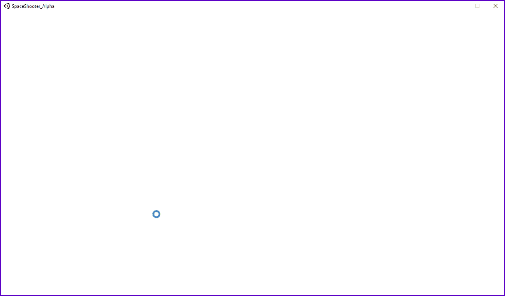
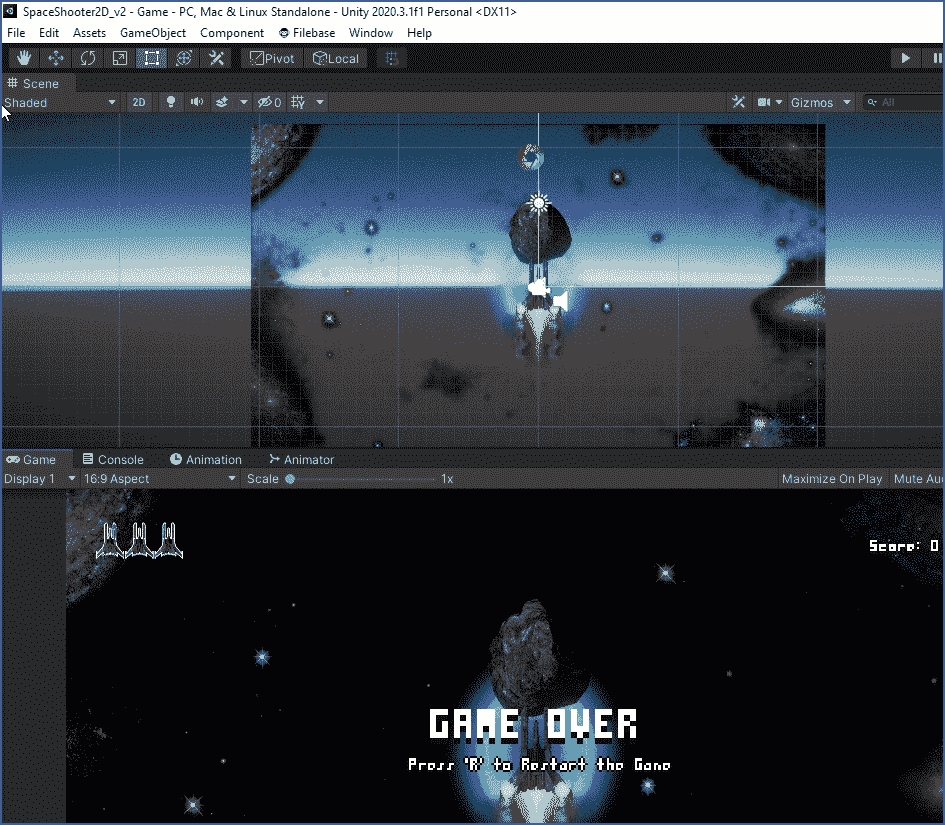
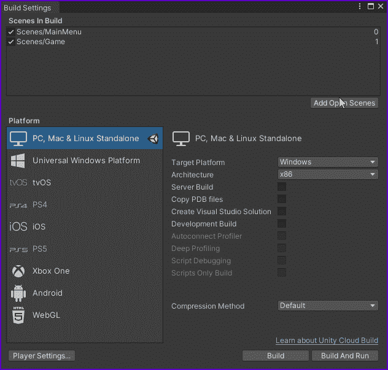
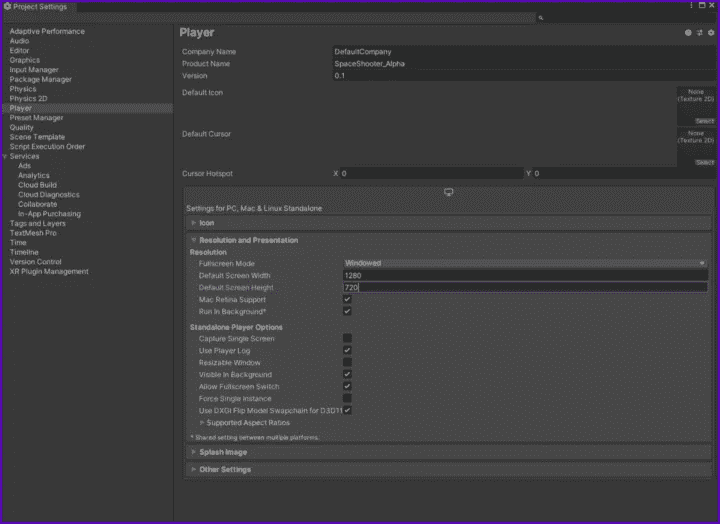
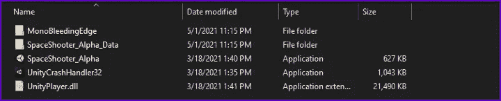

# 如何在 Unity 中构建和测试你的游戏

> 原文：<https://medium.com/geekculture/how-to-build-and-test-your-game-in-unity-1eeab1b7937e?source=collection_archive---------13----------------------->

在你的项目中，有时你想看看它在 Unity 编辑器之外是如何运行的。也许你想把它给你的几个朋友，让他们帮你测试一下，给你一些可靠的反馈。要做到这一点，你首先需要 ***【构建】*** 你的游戏。

为此，我们必须返回到*“文件”>“构建设置”一旦进入这里，确保你已经列出了所有你想要的场景，并且每个场景都有它的索引。*

现在，您可以选择您想要构建的平台。默认的是“Pc，Mac 和 Linux 单机版”——对于其他的，你必须安装一个许可证才能使用。我将使用默认平台——在这里，我选择了*‘Windows’*和*‘架构 x86’*

接下来，点击*‘播放器设置’*按钮。在这里，您可以为您的构建自定义许多不同的设置。我已经调整了产品名称，只是作为对我的一个提示，那还不是最终版本。接下来，我已经从全屏模式切换到窗口模式，因为我们的游戏还不支持任何*‘逃离’*或*‘退出游戏’*功能。我还改变了默认分辨率。

现在我们需要做的就是点击*“构建”*按钮。现在选择你要构建游戏的文件夹，等待构建完成！

一旦完成，进入你选择的文件夹-运行游戏的*‘应用程序’*文件！

瞧啊。您的游戏已经启动并运行-您现在可以将此文件夹的存档版本发送给您的朋友，让他们为您做一些游戏测试！

但是现在就这些了，感谢您的阅读，并随时关注我的更多文章-和往常一样，祝您好运，下次再见！