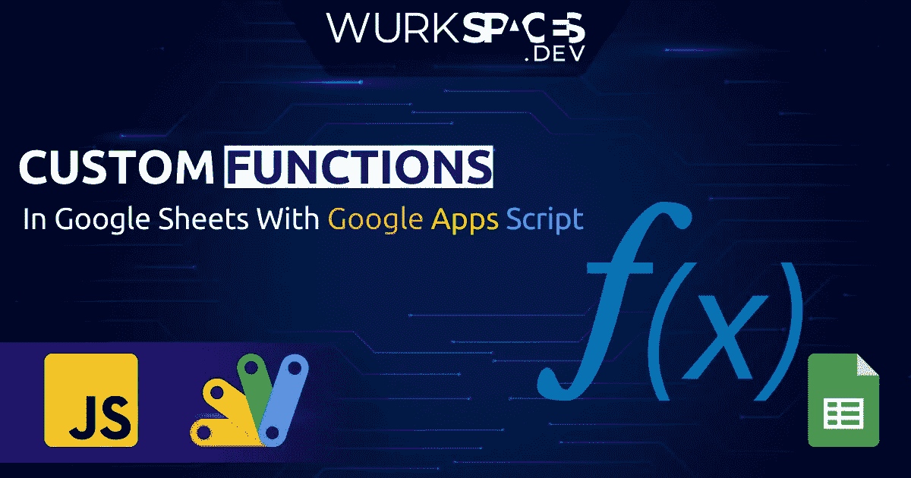

# 如何使用 Google Apps 脚本在 Google Sheets 中构建自定义函数

> 原文：<https://medium.com/geekculture/how-to-build-custom-functions-in-google-sheets-with-google-apps-script-94766c31d8e6?source=collection_archive---------16----------------------->

## 在 Google Sheets 中构建你自己的函数，用几行代码就可以完成你需要的任何事情。

# 什么是自定义函数？

如果您使用任何类型的电子表格，您都知道它们包含内置函数，可以帮助您处理您的…