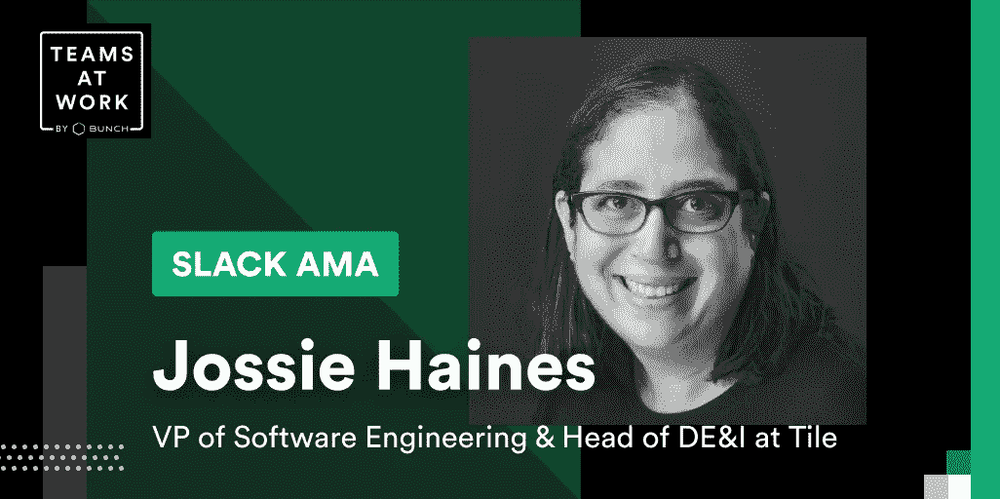
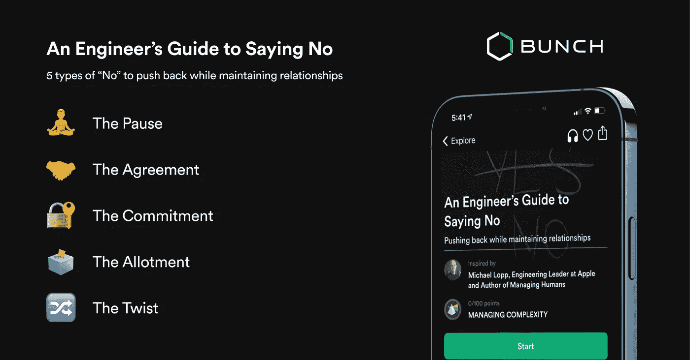

# 如何与乔西·海恩斯一起构建科技领域的多样性

> 原文：<https://medium.com/geekculture/how-to-build-diversity-in-tech-with-jossie-haines-61f3e62aed1a?source=collection_archive---------67----------------------->

上周，我们的 Slack 社区[Teams in Work](https://bunch.ai/slack-community)与乔西·海恩斯(Jossie Haines)合作了一个小时的 AMA(随便问我)。乔西是 Tile 的工程副总裁兼部门主管。她还领导苹果公司和 Zynga 公司的获奖团队。出于显而易见的原因，社区迫不及待地想问她一些关于技术、领导力和多样性的问题。

以下是我们和乔西在《松弛的 AMA》中的一些心得:

# 👐创造有效和公平的领导实践和原则

**问:你有效且公平的领导实践和原则是什么？**

**琼西:**有很多。我的基金会以同理心为主导，真正花时间从别人的角度考虑问题，从好奇而不是判断的角度考虑问题。

我采取的一些做法包括明确的目标设置，其中反馈与目标直接相关(这是一个挑战，尤其是对女性而言，因为她们往往比男性获得的技术反馈更少)，以身作则并在我犯错误时承认，坚持到底并承担责任，以便我可以让其他人承担责任，花时间亲自了解我的直接下属，并激励我的团队成员也能有效地沟通和管理冲突。

问:这些如何影响你每天、每周、每月、每年的行为？

Jossie: 我喜欢这个问题，因为它暗示了系统，我认为从长远来看，拥有良好的系统和框架会使管理工作有效而公平。

我有一个每天结束时的回顾，在那里我思考 3 件事:

1.  今天进展顺利吗？
2.  什么不顺利？
3.  我学到了什么，我可以做不同的事情？

这鼓励我真的花时间慢下来反思。我将这种实践扩展到每周和每月的反思，包括计划和目标设定。在管理方面，我也能够利用这一点来思考我与我的团队在 1:1 中讨论的主题以及我应该提出的内容(例如职业目标等)，我需要改进哪些流程，哪些项目需要我关注。通过放慢速度并考虑这些，你更有可能考虑任何偏见，从而导致更有效的管理实践。

**问:你在哪里奋斗？(个人制造的压力)**

**琼西:**我个人是从不想伤害别人的地方奋斗出来的。我可能会陷入完美陷阱，如果出了问题，我会感觉很糟糕，然后陷入沉思，而不是接受它作为一次学习经历并继续前进。

> 作为经理，我们每天要做出数百个决定，我们会犯错误，所以这是关于真正能够接受和继续前进，并从成长的心态来看待它。

# 🚀作为技术领导者，如何克服骗子综合症

问:作为一名领导者，你如何处理冒名顶替综合症？我听说了其他公司的优秀领导者/开发人员，觉得他们应该和我一样。

**琼西:**我个人患有冒名顶替综合症。当我离开苹果的时候，我经历了一次巨大的购买，我认为我已经征服了它。然后大约 6 个月前，我的执行教练为她的社区创建了一个免费的 [5 天培训](https://tonicollis.com/resources#elementor-action:action=popup:open&settings=eyJpZCI6IjU4NzEiLCJ0b2dnbGUiOmZhbHNlfQ==)关于抛弃自我怀疑。我忽略了它一段时间，认为我已经处理了我的自我怀疑，但想看它给我的团队提供建议。我看了它，然后意识到还有更深一层的冒名顶替综合症仍然潜伏着，等待着出现。

这个故事的寓意是，*它可以回来*并且处理起来很重要。

> 当事情进展不顺利或者你认为自己在某件事情上“失败”时，冒名顶替综合症就会出现——但这是关于转变你的心态，意识到你正在学习。有一个想法可以帮助我克服冒名顶替综合症，那就是写一份每周完成的清单，我每周都会把它附加在清单上。如果我开始觉得自己没有价值，我会仔细检查我做过的事情。

# 💻通才型工程师的管理与晋升

**问:通常在工程领域，人们关注的焦点是提拔在该行业的特定职位或领域最有经验的人。对于拥有更广泛背景的人(可能从行业的一个部分或角色类型转移到另一个部分或角色类型)如何让自己处于进入领导层的最佳位置，你有什么想法？**

**Jossie:** 我喜欢这个问题，因为它是让公司变得更加多元化的核心问题。在工程领域，我们经常关注经验，但我们需要做的是将它分解为实际需要的能力和技能。

为了进入领导层，我最初认为这只是提供更多，但意识到这实际上并没有让我获得更多的关注。我意识到的一件重要事情是，我需要成为解决问题的人——作为一名工程师，发现问题并提出来非常容易，但作为一名领导者，你需要**提出解决方案和计划，并能够影响他人**。

# 🔫论爆破偏差

问:消除无意识偏见的可能性有多大？

你不能只做一个小时的偏见训练就指望它持续下去——任何学习都是如此。相反，它是要弄清楚如何以可重复和可操作的方式，随着时间的推移有效地传播内容，激发人们真正的思考。

我最近读了金·斯科特的新书《工作就是工作》，书中有一个惊人的实践，叫做“消除偏见”，我希望这种实践在工作场所变得更加普遍。

💡这个想法是创造一个简单的短语，任何人都可以在看到有偏见的事情发生时说，并使之成为一种规范，这种情况在会议中最有可能发生 1-2 次，这是可以的。我们的目标是，这不是一个巨大的干扰或中断，而是承认偏见的发生，并让人们慢下来思考它。

# 🌱关于招聘多样性和内部配额

**问:我一直想知道如何“规范”招聘，以使团队更加多样化和包容。当被问到时，(几乎)每家公司都会说他们在尽最大努力，但是，看起来“通常的嫌疑人”仍然不断被雇佣/提升。为什么会这样，能做些什么？强制坚持内部配额？**

**琼西:**这个问题与我的心息息相关，因为它是我目前的奋斗目标。发生这种情况是因为很难改变招聘流程，而退回到现有的流程和做法要容易得多。你需要你的招聘经理和招聘人员都承诺，多样性是真正重要的，是一个焦点——否则指针不会移动。

我认为有两个方面，一是确保来自不同背景的足够多的候选人得到考虑，二是确保评估过程是公平的，注重能力而不仅仅是经验，面试团队知道偏见会如何影响他们，并花时间将这一点纳入反馈过程。

> 你需要有人在看到这种情况没有发生时愿意站出来抗争——这是最难的部分，有时候做这样的人会变得很累，让人筋疲力尽。

希望雇佣更多不同的候选人？这里有一个 DEI 社区列表,你可以去那里认识一些人，甚至在你被雇佣之前就培养这些关系。

# 😅几乎退出科技行业

问:作为一名女性，是什么让你差点离开科技行业？哪些事情不顺利/你错过了什么？你在 Tile 的新职位上是如何积极改善这些的？

琼西:我称这一次死亡为千刀万剐。这不是什么特别大的事情，而是多年来与这样的文化打交道:男人们会在周末被邀请出去喝酒，而我从来没有，因为在电话中坚持自己的立场而被称为好斗，当我走进会议室时，人们认为我不是技术人员，被告知辅导不是重要或必要的事情，等等。这最终让我对能够成功管理或希望从事科技工作产生了一种冒名顶替综合症。

我意识到，如果我离开，我就不会影响未来，所以当我回来加入 Tile 时，我希望事情有所不同。我们正在花时间创造一种包容性的文化，我们有一种发现问题就说出来的文化，我们正在努力创造一个更好的渠道，让招聘体验更加公平。它并不完美，还在不断完善中，但我们创造了我在一家科技公司中见过的最具包容性的文化之一。

# 💪论女性领导的支持系统

问:我很好奇你对为其他目前正在崛起的女性领导者建立支持系统有什么建议？做得好的时候是什么样子的？

**琼西:**是的！如果你能建立一个赞助项目，让新兴的女性领导者和公司的高层领导者配对，她们可以得到关注，坐在桌子旁边，了解正在发生的事情，这将是真正有影响力的。

还要意识到，随着你职业生涯的发展，你可能需要在公司之外寻找导师——我强烈建议女性领导者创建自己的个人董事会，包括来自外部网络的人。

***乔西是众多分享他们给 Bunch 的两分钟建议的领导者之一。下载我们的*** [***AI 领导力蔻驰***](https://apps.apple.com/app/apple-store/id1500872908?pt=121075759&ct=MEDIUM%20Jossie%20AMA&mt=8) ***app 每天 2 分钟成为更好的领导者。***

想和乔西联系吗？[加入我们在 Work Slack community 的团队](https://bunch.ai/slack-community)与她和成千上万的其他领导者交谈！

🐦[在推特上关注我](https://bit.ly/3qwwVNB)或[查看我们的 YouTube 频道](https://bit.ly/3uaB8ZH)了解更多关于科技领导力的内容。

💌你也可以订阅每周简报，这是我的周日领导时事通讯。