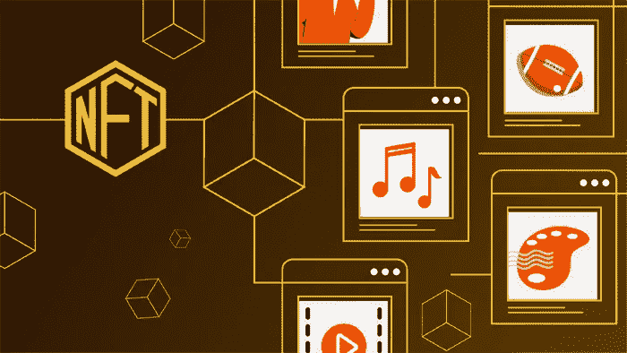
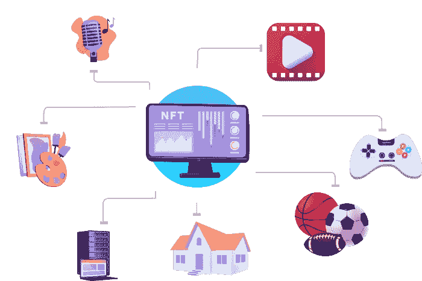

# 如何从零开始建立 NFT 市场？简短的漫游

> 原文：<https://medium.com/geekculture/how-to-build-nft-marketplace-from-scratch-a-brief-walkthrough-a34f6607e26e?source=collection_archive---------6----------------------->

用于交易不可替代代币的 NFT 市场的巨大受欢迎程度与日俱增。对于商业平台来说，这是一个通过全面了解 NFTs 进入数字空间的绝佳机会。因此，商业平台需要了解的第一个也是最重要的术语是*[***如何创建一个 NFT 市场***](https://www.blockchainappfactory.com/how-to-build-an-nft-marketplace?utm_source=GeekGulture+medium&utm_medium=25-04-2022&utm_campaign=Vishnu) ***？”*** 本博客提供了解决方案。*

## *什么是 NFT 市场？*

*NFT 市场是一个允许用户保护他们的 NFT 并进行交易的平台。有各种各样的方法来交易非功能性交易。最常见的方法是拍卖法，在拍卖中出售非森林产品。另一种方法是以固定汇率购买 NFT。对于任何要投入使用的市场，加密钱包都是必要的，并且它应该与市场有效地同步。这是一个商业实体在 NFT 空间开始他们职业生涯的完美平台。因此，一个商业平台必须从零开始建立一个 NFT 市场，以享受 NFT 空间提供的每一个好处。*

## *NFT 市场的运作*

*   *用户应该**注册到平台**并连接到加密钱包。*
*   *NFT 的**创建发生，所有需要的参数都已定义。***
*   *下一步是**将铸造的 NFT**上市销售，并继续等待审核完成。*
*   *进入平台的买家会在拍卖运行活跃时出价。*
*   *当购买了想要的 NFT 时，市场将加密货币和 NFT 转移到连接的加密钱包。*

## *创建 NFT 市场应增加的显著特征*

**

*   ***店面***

*一个完美的店面是任何 NFT 市场的必备条件。这个店面将作为一个仪表板。该功能为用户提供了所需的数据；所有者、出价、预览和价值历史。*

*   ***高端代币搜索***

*应该毫不费力地向进入平台的用户提供关于 NFT 的所有相关信息。因此，NFT 市场应该有一个高端的令牌搜索功能，其中每个 NFT 资产都是按类别排列的。*

*   ***过滤器***

*过滤器对于市场平台来说是非常重要的。该过滤器使用户更容易搜索和选择他们想要的 NFT。有多种过滤器可用，如类别、付款方式、列表状态和截止时间。*

*   ***列表创建***

*该功能允许用户在平台上列出他们的 NFT。通过这种方式，NFT 将以一种完美的方式进行分类，以便买家通过 NFT 并开始从直接购买或通过拍卖模式购买它们。*

*   ***钱包整合***

*NFT 市场应该与各种各样的加密钱包相集成，以便它们给平台带来灵活性。集成适当的加密钱包非常重要。*

## *影响 NFT 市场的因素*

*   ***透明度***

*透明度是任何市场最重要的因素。该因子通过向公众展示所有交易，在平台和用户之间建立信任因子。这种透明度是由区块链技术的影响提供的。*

*   ***放权***

*权力下放是任何区块链相关平台的基础，也包括 NFT 市场。这一因素排除了银行和中央政府等中间人的介入。因此，向市场提供了分散化。*

*   ***安全***

*这个因素不仅对市场很重要，而且对构建在数字空间中的任何应用程序都很重要。安全协议被添加到平台中，以消除对 NFT 资产的复制和破坏。*

*   ***货币化模式***

*实施适当的货币化模式非常重要，因为这是 NFT 资产买卖的核心。*

*   ***智能合约***

*智能合约的出现取代了 NFT 市场中的中间商。这些合同是具有交易条款和条件的可编程合同。如果条款和条件得到满足，交易就发生了。*

* [## 如何建立一个 NFT 市场？-完整的 NFT 市场解决方案

### 如何创建自己的 NFT 市场？NFTs 市场是创建和交易 NFT 的平台…

www.blockchainappfactory.com](https://www.blockchainappfactory.com/how-to-build-an-nft-marketplace?utm_source=GeekGulture+medium&utm_medium=25-04-2022&utm_campaign=Vishnu) 

## 如何打造自己的 NFT 市场？

为了让商业平台创建一个 NFT 市场。商业平台应与 NFT 开发公司联系。

*   **商业利基**

选择一个完美的商业利基是从零开始建立 NFT 市场的第一步。这一步包括为 NFT 市场创造一个利基市场的头脑风暴会议。在这一步中，从前端夹具到后端夹具，一切都计划好了。根据业务需求，制定进一步的开发决策。

*   **构建用户界面**

UI/UX 架构是创建 NFT 市场的一个非常重要的部分。用户界面应该以一种简单而复杂的方式来设计。因此，一个好的用户界面被认为能为平台带来广泛的用户。

*   **前端开发**

在创建了 UI/UX 设计之后，是时候实现市场前端的想法了。选择一个可靠的框架需要选择一个符合业务平台所有需求的框架。

*   **智能合同开发**

前端做好了，后端的时候就到了。后端是通过选择正确的区块链和创建智能合同并将其与区块链技术相连接来开发的。

*   **试运行**

一旦 NFT 市场发展起来。它通过大量的测试运行进行处理，以识别错误并纠正它们。一旦测试完成，NFT 市场就可以部署到 mainnet 中了。

## 总结一下，

如何 [***打造自己的 NFT 市场***](https://www.blockchainappfactory.com/how-to-build-an-nft-marketplace?utm_source=GeekGulture+medium&utm_medium=25-04-2022&utm_campaign=Vishnu) 对于任何进入 NFT 市场的商业平台来说，都是一个重要问题，这篇博客已经完美地给出了答案。NFT 市场将会继续存在。他们特殊的运作方式和改进空间被认为是在未来将这项技术推向了一个新的高度。*