# 作为初学者，如何构建强大的数据科学产品组合

> 原文：<https://medium.com/geekculture/how-to-build-strong-data-science-portfolio-as-a-beginner-5540dd84aff1?source=collection_archive---------4----------------------->

学习一种独特的方法来建立数据科学投资组合，让你得到聘用。

Photo by [Hal Gatewood](https://unsplash.com/@halacious?utm_source=medium&utm_medium=referral) on [Unsplash](https://unsplash.com?utm_source=medium&utm_medium=referral)

作为一个初学者，我有很多关于如何开始的问题。我如何学习或从哪里获得项目工作的想法？所以，经过长时间的寻找，我找到了一个关于数据分析的项目。光是写代码就花了我 3 天时间，我对我的第一次尝试很满意，但接下来有一个大问题，那就是我如何与世界分享它？我只是没有良好的编码技能或文档技能来展示我的工作，所以我把它存储在云中，然后忘掉它。一个月后，我在 GitHub 上随机寻找更多的项目，发现了这个惊人的[简介](https://github.com/subhamrex)，它激励我创建了我的作品集。这是我做出的最好的决定，因为它让我在开发人员社区中崭露头角，并且在我开始收到招聘人员和初学者关于我的项目的电子邮件后不久。

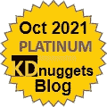

[Platinum Award — KDnuggets](https://www.kdnuggets.com/2021/11/top-stories-2021-oct.html)

**找份工作**通常是建立投资组合的主要原因。有时，如果我们没有相关的教育或经验，这是必要的[(eugeneyan.com)](https://eugeneyan.com/writing/data-science-portfolio-how-why-what/)。在这个现代社会，雇主对雇佣新毕业生持怀疑态度，那么你如何让他们相信你最适合这份工作呢？你通过展示你在以前的项目中所做的工作来展示你的技能。你的在线投资组合越强大，就意味着你获得理想工作的机会越大。

> “拥有投资组合极其重要，因为当你参加面试时，它会展示你的现实世界经验，所以你可以从头到尾向雇主解释整个数据科学工作流程。”大卫·雅各布维奇。

另一个动机是创建你的个人项目，满足你学习新事物的好奇心。当我们学习一项新技能时，我们希望进行实验，并最终建立一个可以在现实世界中使用的工作产品。

在本文中，我们将学习如何展示作为数据科学初学者的工作。你将了解一些让你的生活变得轻松的新平台，以及建立强大投资组合的技巧。

# 开源代码库

让我澄清一下数据科学家中的误解，是的 [GitHub](https://github.com/) 是必要的，我们都应该学习 [git](https://git-scm.com/) 。作为一名数据科学家，我每天都使用 Github 来寻找有趣的数据集和项目。这是开发者中最受欢迎的平台，老实说，招聘人员在给你打电话面试之前会检查你的 GitHub 档案。

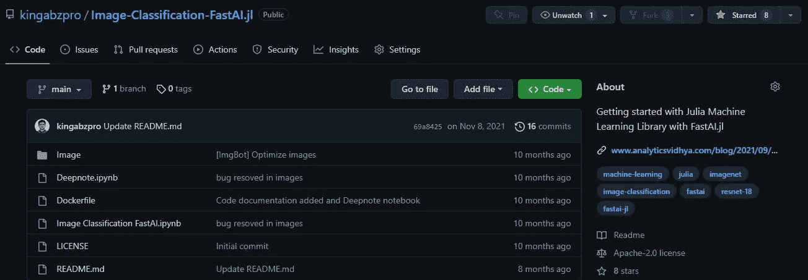

Image from [GitHub](https://github.com/kingabzpro/Image-Classification-FastAI.jl)

GitHub 是一个全球协作平台，人们可以在这里分享和协作项目。正如你在下面我的个人资料中看到的，我是如何为别人的项目做贡献的，也是如何为我自己的项目工作的。

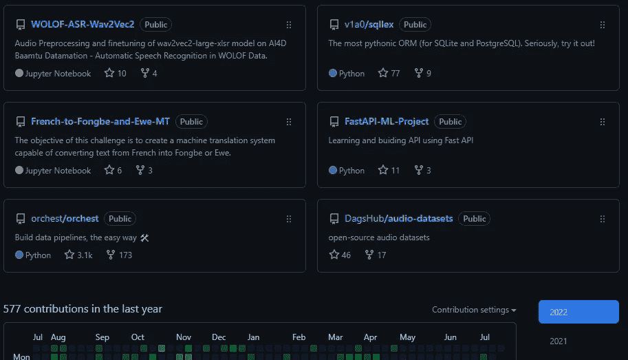

Image by Author | [kingabzpro](https://github.com/kingabzpro)

**打造立体轮廓的小技巧:**

1.  创建你的个人资料页面，查看莎拉·哈特的博客。
2.  用链接、封面图片和详细描述记录每个项目。
3.  叉上你最喜欢的项目，发送你的第一个拉动请求[(freecodecamp.org)](https://www.freecodecamp.org/news/how-to-make-your-first-pull-request-on-github-3/)。
4.  通过贡献、错误报告和推动您当前的项目，活跃在这个平台上。

# 深度笔记

GitHub 要简单得多，对初学者也很友好。如果你熟悉 Jupyter 笔记本，那么发布你的第一个项目对你来说就是小菜一碟。我对 Deepnote 的体验绝对令人惊叹，因为该平台为您提供了 GitHub 的所有品质，但要简单得多，并且专注于数据科学家社区。

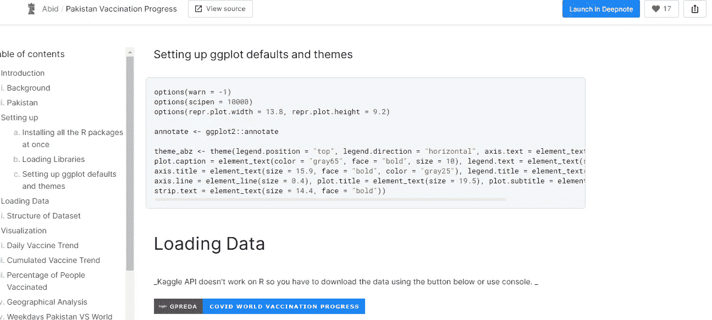

Image by Author | [Pakistan Vaccination Progress](https://deepnote.com/@abid/Pakistan-Vaccination-Progress-sgGprLfPSHuLyI5XTrYiqQ)

最近，他们推出了一个 Deepnote 个人资料，将显示你发布的所有笔记本的信息和个人资料图片。

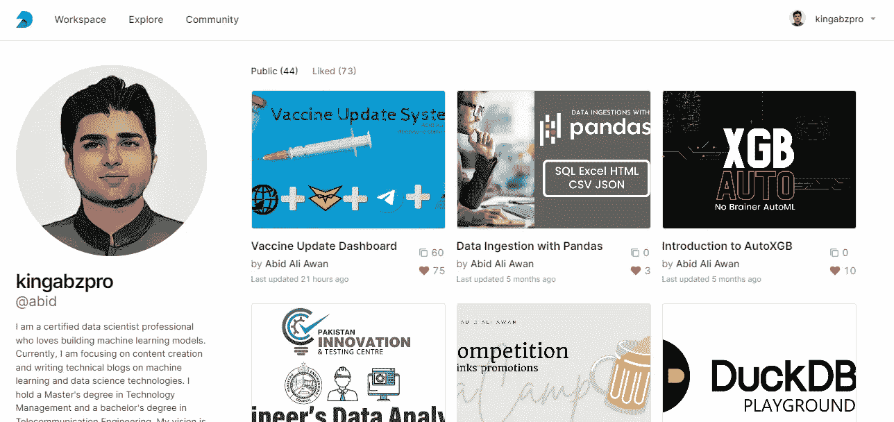

Image by Author | [Abid Ali Awan](https://deepnote.com/@abid)

就像 [GitHub Gist](https://gist.github.com/) 一样，你可以与你的团队或公众分享你的代码片段。我在所有媒体出版物和社交媒体平台上都使用过 Deepnote cell。你可以查看我之前的[文章](https://towardsdatascience.com/deploying-your-first-machine-learning-api-1649236c695e)来了解如何实现一个 Deepnote 单元格。使用带有输出的代码片段使您能够在多个平台上共享您的项目。

相比 GitHub Gist，我更喜欢 Deepnote embedded cell 的原因是它带有输出，不仅仅是静态输出，还有交互功能。

> 您可以使用 Plotly，并在中等文章中显示您的图表。

**创建立体轮廓的技巧:**

1.  更新你的简历、个人照片和联系信息。
2.  始终使用降价单元格添加关于项目的详细描述。
3.  使用封面照片让你的项目脱颖而出。
4.  使用 Deepnote 中的应用功能创建交互式 webapp。
5.  继续张贴您的旧项目，甚至从 GitHub 转贴笔记本。

# 达格舒卜

DagsHub 对这个世界来说是新的，它通过为机器学习从业者和数据工程师提供一站式解决方案而迅速成名。DagsHub 附带了一个 [DVC](https://dvc.org/) 服务器、 [MLflow](https://mlflow.org/) 、可视化管道和 GitHub 同步。我们不会深入到功能，而是将重点放在使它脱颖而出的功能上。

DagsHub 允许您共享您的 GitHub 存储库，并创建您的数据科学项目，具有可视化机器学习和数据管道的能力。它还有一个隐藏的特性`README.ipynb`作为你的项目描述文件，最适合不习惯 markdown 的初学者和喜欢在 Jupyter 笔记本上工作的数据科学家。它类似于 GitHub，这意味着你需要学习 Git 和 DVC 来正确使用这个平台。

> 我所看到的其他用户享受的是通过管道可视化他们的项目结构的能力，以及将他们的数据和模型视为项目的一个组成部分的能力。此外，我们基于开源工具，而不是重新发明现有的解决方案，这是人们喜欢的事实。— [院长](https://www.linkedin.com/in/deanpleban/)

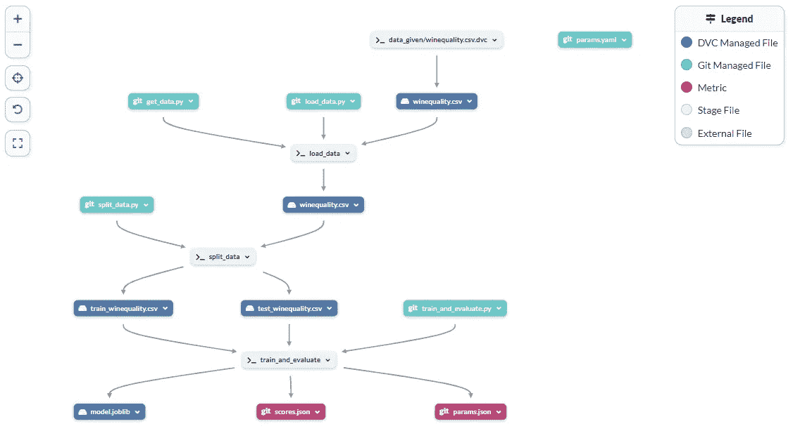

Image by Dean | [dagshub](https://dagshub.com/Dean/DHEERAJKU)

我的个人资料很新，但我喜欢这个平台，因为它们为我提供了一个完整的机器学习生态系统。我觉得从功能和 UI 简单性来说，我更喜欢它而不是 GitHub。

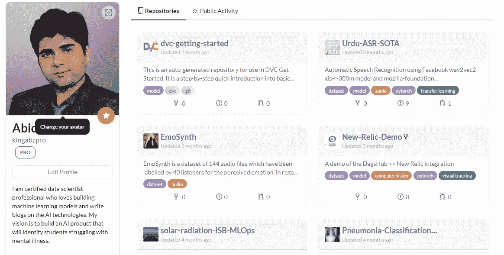

Image by Author | [Abid Ali Awan](https://dagshub.com/kingabzpro)

**创建实体轮廓的技巧:**

1.  学习 [DVC](https://dvc.org/) 、 [Git](https://git-scm.com/) 和 [mlflow](https://mlflow.org/) 以充分利用。
2.  在您的笔记本和自述文件中添加项目描述。
3.  通过添加简历、头像和联系信息来更新您的个人资料。
4.  尝试在您的项目中添加`dvc.yaml`和`dvc.lock`来显示数据管道，更多信息请查看定义管道的[。](https://dagshub.com/docs/tutorial/pipeline/index.html)
5.  通过参与开源项目和推动你的个人项目来保持积极的姿态。您可以使用 [fds](https://github.com/DAGsHub/fds) cli 让您的生活变得轻松并避免错误。
6.  通过将您的数据和模型上传到远程服务器来充分利用 DVC。招聘人员感兴趣的是了解从数据接收到仪表板的完整数据科学周期的候选人。

# 卡格尔

如果你想在数据科学领域更快获得关注，你应该创建一个 [Kaggle](https://www.kaggle.com/) 账户，并开始参与**竞赛、数据集、笔记本、**和**讨论**。当你成为特级大师时，人们会尊重你，并给你提供更好的职业机会。如果你问我，我会建议你在学习基础知识的同时创建一个 Kaggle 个人资料。向专家学习，发现自己的优势。我是这个平台的超级粉丝，因为它为初学者提供了支持，让他们能够为各种行业竞争和开发创新的解决方案。它是人工智能研究的支柱。

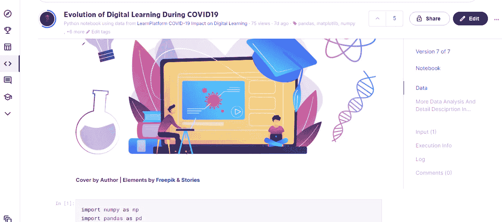

Image by Author | [Kaggle](https://www.kaggle.com/kingabzpro/evolution-of-digital-learning-during-covid19)

你可以看看我下面的简介，因为从一开始我就在各种类别中做出贡献以获得排名。目前，我是一名**专家**，但凭借比赛中的一枚金牌和银牌，我将成为一名**大师**，这并不容易，老实说，我尊重**大师**，因为他们已经证明了他们是其他数据从业者中最好的。

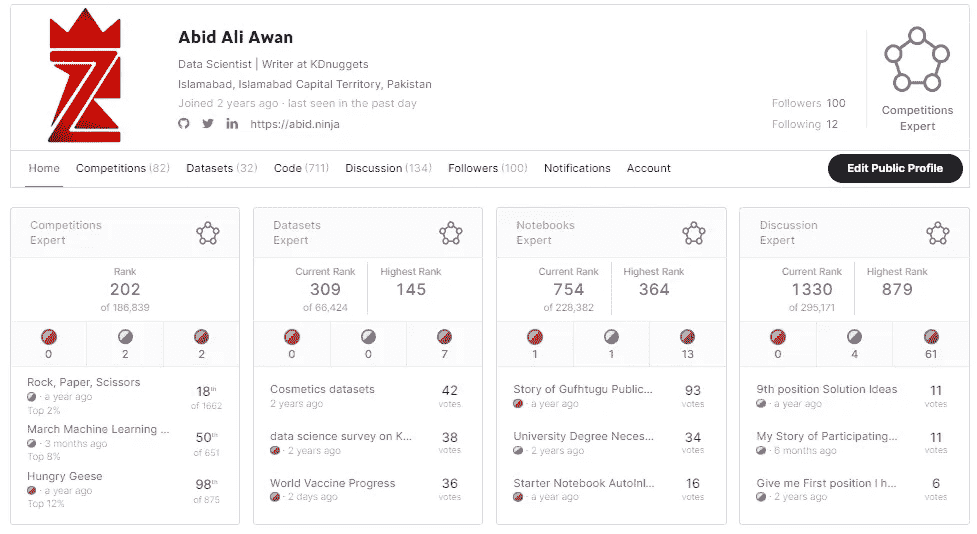

Image by Author | [Kaggle](https://www.kaggle.com/kingabzpro)

**创建实体轮廓的技巧:**

1.  通过使用新的数据集和创建数据分析或机器学习模型，在平台上保持活跃。
2.  参与讨论，向专家学习，寻求帮助。
3.  使用 web 抓取发布新数据集。
4.  参加大多数比赛来学习几种类型的机器学习问题，并获得徽章。
5.  专注于发布你最好的作品，有详细的描述和高质量的代码。
6.  在简历中写下你自己，并添加联系方式。

# 博客

在上述平台上创建项目后，下一步就是写博客。如果你想扩大你的受众，我强烈建议你从[媒体](/)开始。写博客不是必须的，但是你可以从不同的领域获得更多的动力。这个媒介允许你创建你的个人资料，让你在各种出版物上发表你的文章，例如[对数据科学](https://towardsdatascience.com/)和[对人工智能](https://pub.towardsai.net/)。你可以开发自己的博客网站，或者使用另一个类似的平台，比如 [Analytics Vidhya](https://www.analyticsvidhya.com/) 。

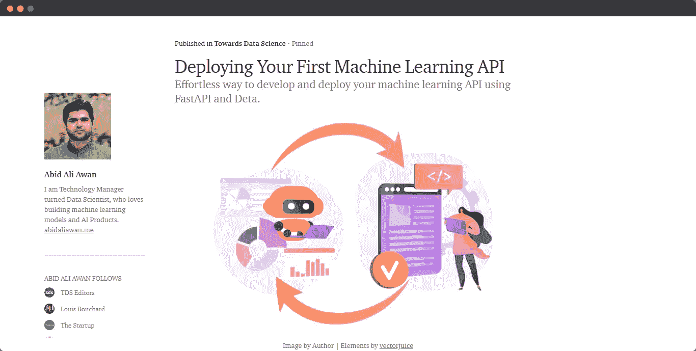

Image by Author | [Medium](/@kingabzpro)

**创建实体轮廓的提示:**

1.  写关于你个人参与的项目的博客。
2.  创建关于新兴技术或新数据科学应用的博客。
3.  写博客时做适当的研究，并添加引用，以避免违反平台规则。
4.  为每个博客使用吸引人的封面照片。
5.  总是写下你在开发某个数据科学项目时从经验中学到的东西。
6.  不要跟风，专注于自己擅长的事情。

# 作品集网站

你也可以在个人网站上展示你的项目，如果你不是网站开发者，有一些简单的工具可以让这个过程变得非常容易。您可以查看[如何使用 Hugo & GitHub Pages](https://www.youtube.com/watch?v=mEZ1Hj5yQ-8&t=235s) 和 [Hugo](https://gohugo.io/) 构建数据科学组合网站，获取各种模板。

我的投资组合网站有一个来自所有平台的项目，有简短的描述和子类别。我花了三天时间创建了整个网站，并将其部署在 GitHub 页面上。

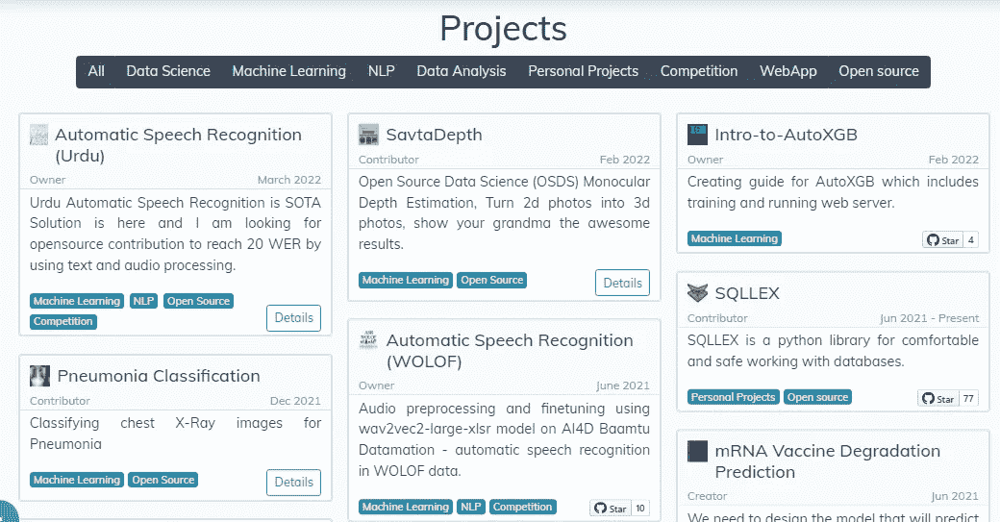

Image by Author | [Abid’s Portfolio](https://abid.ninja/)

**创建可靠投资组合网站的技巧:**

1.  添加你的技能、简历和履历。
2.  展示你的经历和奖励。
3.  通过 GitHub 或 Deepnote 项目的链接展示您的项目。
4.  使你的网站简洁并具有互动性，这样招聘人员就可以轻松浏览你的整个简历。
5.  让你的作品集网站与你正在进行的最新项目保持同步。

# 重量和偏差

我通常使用[权重&偏差](https://wandb.ai/)进行机器学习实验，并记录我的模型的性能指标，但随着 W & B profile 的引入，这种情况发生了变化。你可以通过使用嵌入链接和图形集成来写一篇关于你当前项目的博客。它与我提到的其他投资组合平台非常相似，但它伴随着与 python 库直接集成的高峰。

Ayush 的简介给我留下了最深刻的印象，因为他在撰写关于机器学习的博客时一直在为其他组织做出贡献。

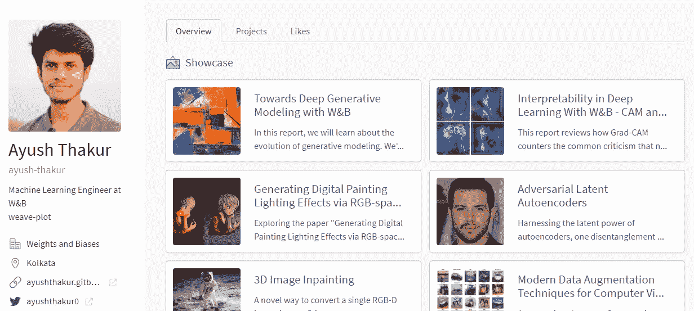

Image by Ayush | [Weights & Biases](https://wandb.ai/ayush-thakur)

W&B 项目具有如下所示的模型性能指标。

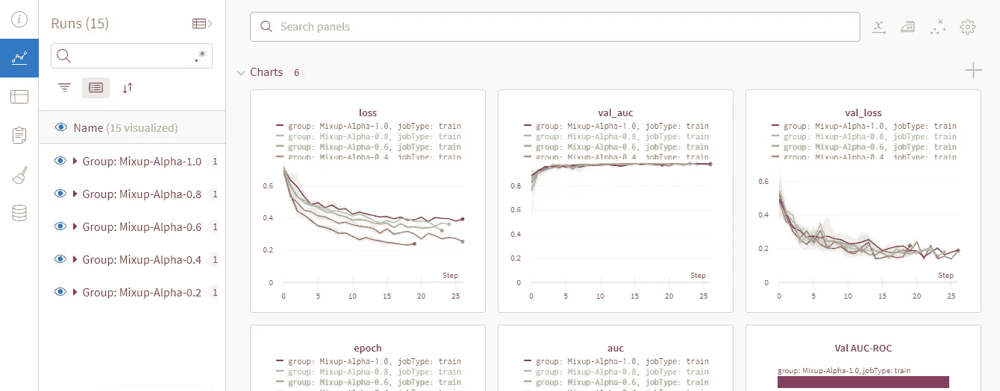

Image by Author | [kaggle-seti](https://wandb.ai/ayush-thakur/kaggle-seti-exp2?workspace=user-kingabzpro)

**创建实体轮廓的技巧:**

1.  加入其他数据科学组织，参与团体项目。
2.  使用 W&B API 显示您的机器学习项目结果。
3.  使用 W&B 指标集成写博客。
4.  添加简历，个人资料图片，联系信息。
5.  尝试参与社区讨论，并总是寻找一个新的有趣的项目。

# 结论

W&B 是一个通配符，因为它以记录实验而不是投资组合而闻名，但随着交互式博客的引入，我们获得了展示您的项目和创建强大投资组合的独特优势。如果你是初学者，我会建议你从 Deepnote 开始，因为它对团队来说是免费的，并为你提供初学者友好的入门工具。如果你希望得到数据科学社区的关注，尝试在 GitHub 和 Kaggle 上创建你的个人资料。如果你想创建自己的品牌，那就从博客网站或创建自己的网站开始。
最后，我希望大家在我上面提到的所有平台上创建自己的个人资料，因为它们都有独特的优势，可以给你的潜在雇主留下深刻印象。我知道在开始的时候这很难，但是一旦你习惯了记录和展示你的项目，它就会变得容易。

[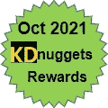](https://www.kdnuggets.com/2021/11/top-blogs-rewards-oct.html)

[Top Blogs Rewards for October 2021 — KDnuggets](https://www.kdnuggets.com/2021/11/top-blogs-rewards-oct.html)

[的原创](https://www.kdnuggets.com/2021/10/strong-data-science-portfolio-as-beginner.html)博客发布在 KDnuggets 上。