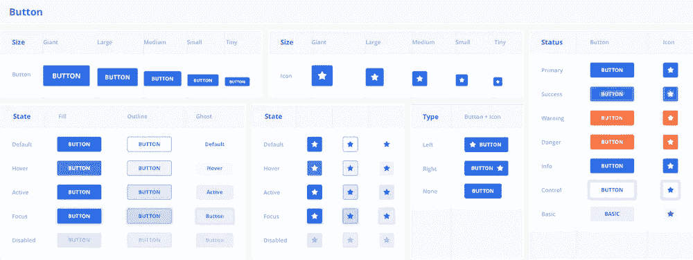
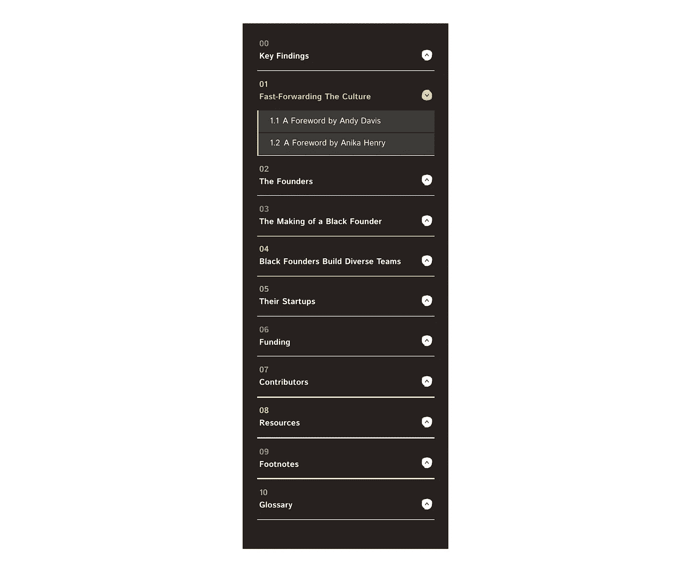

# 如何使用组件库更快地发布应用程序🛳

> 原文：<https://medium.com/geekculture/how-to-build-web-apps-quicker-with-component-libraries-99794052e24f?source=collection_archive---------7----------------------->

快速过程是掺杂。我越是关注科技初创企业，就越是看重对完美或量身定制的事物的快速和敏捷。

如果你正试图从一个完美主义者转变为更多的运输和迭代，时间是至关重要的。为了快速进入前端开发，我花时间学习工具包。作为前端开发人员，我投入时间开发的一种“工具包”是组件库。

## 什么是组件库？

这是一个为用户界面和网站预制的组件库。例如，导航菜单、文本按钮、排版和布局网格通常都包含在组件库中。

有一些组件库允许简单的样式定制，所以你只需要担心样式而不是组件的功能部分。



Different components in a component library

## 这些用在现实世界中吗？

绝对是的。事实上，我在从事[10x 10](https://10x10vc.com/)&谷歌项目[黑报告](https://theblack.report)时，有机会使用开源设计系统 [ChakraUI](https://chakra-ui.com/) 。


▪️ Read [theblack.report](https://theblack.report) ▪️

它以易于主题化、可组合和可访问为卖点。我们同意。

这使得我们的开发团队不那么担心复杂的导航逻辑。我们可以把精力集中在设计和内容上。



[The Black Report’s](https://theblack.report) menu system. Designed by our Design Lead, [Sahara Jones](https://www.linkedin.com/in/saharajones-visual-designer/)

由于 Chakra UI 有内置的可访问性问题，这节省了我们很多时间，因为我们只有有限的时间来完成这个项目。

依靠预构建的组件可以节省开发时间。为什么要浪费昂贵的时间重新创建复杂的组件呢？这些问题已经解决了(并且保持了很高的标准！).

除非我们需要从头开始构建，否则我们最好在其他聪明开发人员的工作基础上进行构建。

## Chakra UI 的手风琴组件

```
import {
  Accordion,
  AccordionItem,
  AccordionButton,
  AccordionPanel,
  AccordionIcon,
} from "[@chakra](http://twitter.com/chakra)-ui/react"
```

[Chakra UI 的手风琴组件](https://chakra-ui.com/docs/components/accordion) API 是🔥用于定制。accordion 组件可以作为单独的移动部件导入，也可以组合在一起。这很好，因为它允许您设计和替换某些部分。

它甚至允许您定制已经实现的逻辑之外的逻辑。

能够改变手风琴图标非常有帮助，因为它允许我实现取决于手风琴是打开还是关闭的微交互。

令人印象深刻的是，Chakra UI 向开发人员公开了这些状态，因此我们可以按照自己的意愿利用它们。它真正允许深度定制，并提供真正构建良好构件。

好了，关于查克拉用户界面的宣传已经够多了😂。

## 当我不使用组件库时。

不会在任何情况下使用它。

有些情况下，您可能需要从头开始制作。

您可能正在构建不需要外部依赖的东西。在这些情况下，我仍然会使用组件库来获得灵感，并观察某些复杂组件的最佳实践。

许多组件库也使用 styled-components， [emotion](https://emotion.sh/) 其他 CSS-in-JS 范例。许多人对此有强烈的意见；这不是每个人都喜欢的。

一些组件库也是基于其他系统和框架的，这可能需要一些调整时间来让你的开发者适应。

例如，查克拉用户界面是建立在[风格系统](https://styled-system.com/)框架之上的。它处理媒体查询和简化 CSS 属性名称的方式很有趣。对于不熟悉的人来说，这可能需要一段时间来适应。


On first glance, some of these shorthand properties may not make sense.

它还依赖于相对了解 CSS 的人。这可能会阻碍一些 CSS 知识不太丰富的人轻松地做出有意义的改变。

自然，这就提出了可维护性的问题。让新开发人员参与进来有多容易？这是他们需要完成的一长串事情中的又一件。

有时候，简单的 HTML、CSS 和一些简单的 JS 就足够了。有人说我们已经超越了 Javascript。

最终——如果您想快速开发 react web 应用程序并进行 UI 编程，而不是构建 UI 块——组件库是一种很好的方式！绝对值得用它们做实验。