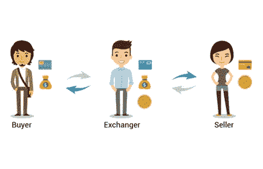

# 如何建立你的比特币交易所——只需 8 个步骤

> 原文：<https://medium.com/geekculture/how-to-build-your-bitcoin-exchange-just-8-steps-process-2797ccc6e972?source=collection_archive---------13----------------------->

**Start Your Bitcoin Exchange**

像比特币一样，加密货币现在也很流行。那些开采比特币或对比特币进行早期投资的人正坐拥微薄的财富，这种想法正在蔓延。在开发加密货币交易所之前，我们必须首先了解加密货币及其工作原理。被称为加密货币的电子/数字货币是利用区块链技术创造的。对于贸易和商业，加密货币可以用作交换媒介。世界上第一种加密货币，比特币，是由一个身份不明的创造者创造的，只知道他是中本聪。

# 加密货币交易初探

买卖加密货币的在线市场被称为 [**加密货币交易所**](https://www.infiniteblocktech.com/cryptocurrency-exchange-software?utm_source=medium&utm_medium=guestblog&utm_campaign=vigneshraju) 。这些市场充当买家和卖家之间的中间人，使用户能够将加密货币兑换成法定货币或替代货币。由于交易费用通常很低，加密货币交易所经常被投资者使用。

# 为什么要创建加密货币交易所？

我们生活在一个互联网的世界，每个人都与全球网络相连。这为企业家和商业组织带来了新的机会，开辟了新的盈利平台。加密货币交易所是数字世界的最新革命。密码交易所的出现改变了世界范围内的市场，并为初创公司和企业家提供了从分散市场及其活动中获利的巨大自由。加密交换平台开发是任何人都可以在数字世界开展业务的过程。

# 加密交换平台开发的步骤

如果你想在加密领域开展业务，并寻找在分散空间推出平台的简单步骤，那么利用 [**白标加密货币交易服务**](https://www.infiniteblocktech.com/white-label-cryptocurrency-exchange-software?utm_source=medium&utm_medium=guestblog&utm_campaign=vigneshraju) ，并遵循以下步骤。

# 第一步

在实施你的计划之前获得法律建议是至关重要的，这样你才能理解你的新业务的监管要求。必须在企业打算开展业务的每个国家获得适当的许可。在许多地区，由于技术和政府政策仍然落后，比特币交易所的运营几乎没有监管。

# 第二步

你应该知道大致相关的费用。你应该注意建立和启动一个加密交易所所需的最低资金。技术的价格，托管，一些初期的法律顾问，政府注册，市场广告都包括在内。即使不是所有的资金都必须预先提供，确保企业有足够的资金来给它一个体面的跑道也是至关重要的。

# 第三步

为您的加密业务寻找合适的技术提供商。为你提供技术支持和服务的公司应该有良好的形象，并且必须完成成功的项目。他们应该提供一个专门的团队来帮助，并有一个熟练的团队来管理所有的业务需求。

# 第四步

加密货币 交易所的前端和后端 [**开发对于引入投资者非常重要。投资者通过交易所的前端访问所有数字资产，因此它必须简单，并以最佳方式开发它应该是优先事项。**](https://www.infiniteblocktech.com/cryptocurrency-development-company?utm_source=medium&utm_medium=guestblog&utm_campaign=vigneshraju)

# 第五步

并非所有的支付处理商都是平等的。除此之外，不同企业之间的费用结构会有很大不同。要和其他交易所竞争，你必须有最低的交易率。此外，您应该确保阅读您签署的协议，因为一些加工商在他们的协议中包含隐藏成本。

# 第六步

凭借离线冷存储钱包、双因素身份验证和加密数据库，采用最新安全技术构建的交易所是世界上最安全的交易所之一。此外，加密技术不存储密码。更好的可靠性将增加参与者对你的交易平台的信任，并改善你的业务。

# 第七步

在开发之后，基础设施必须经历严格的测试阶段，以寻找可能损害用户或数据交换的缺陷和瑕疵。测试过程提高了交换的质量，增强了用户的体验。一定范围的用户和软件测试人员应该能够访问平台来测试它，他们的建议应该得到尊重和考虑。

# 第八步

在最后一步中，用户可以在分散的环境中启动他们的数字业务。随着交易所的推出，市场参与者可以使用该平台毫不费力地铸造、购买、出售或交易资产。最后一步将允许进入市场的参与者。

**结论**

上面讨论的步骤是任何类型的交换平台开发的基础。如果你在专业团队的帮助下正确遵循上述步骤，你就可以在加密货币的去中心化世界中轻松开展业务。