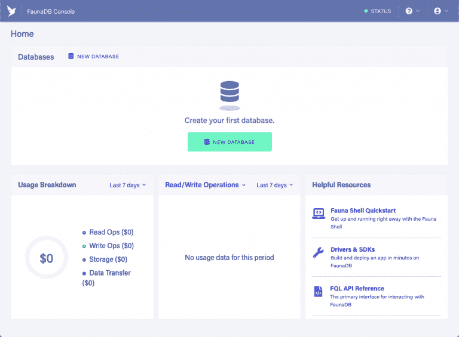
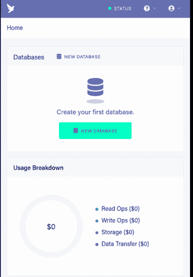
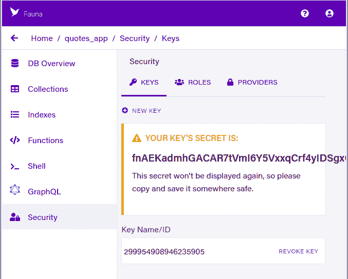
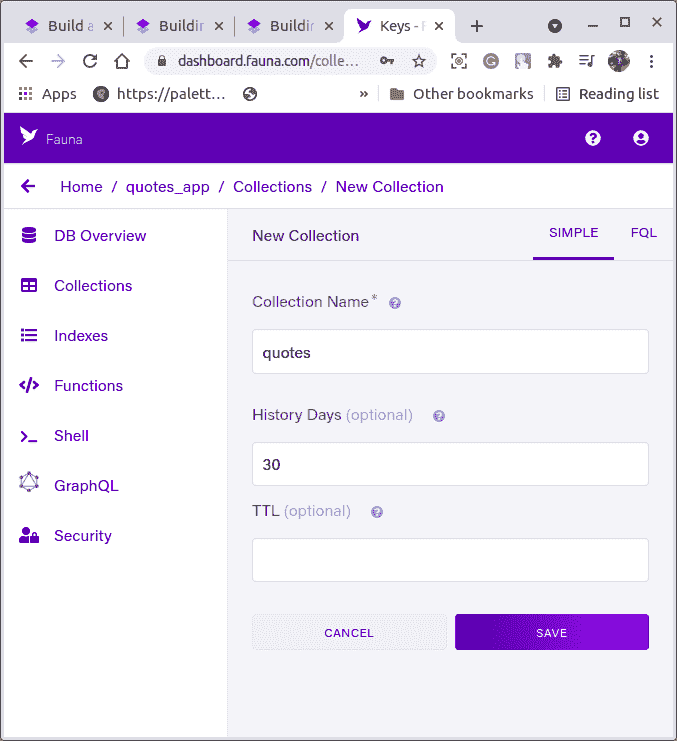
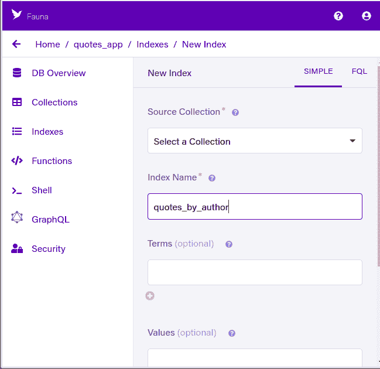
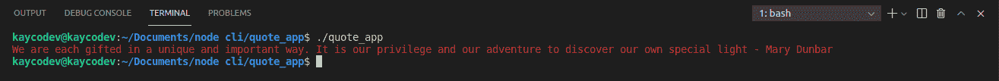

# 如何用 Node.js 和 Fauna 构建命令行工具

> 原文：<https://medium.com/geekculture/how-to-building-a-command-line-tool-with-node-js-and-fauna-60a0e1005bf?source=collection_archive---------24----------------------->


如今使用最广泛的程序之一是命令行工具。每天，我们都在使用命令行工具，比如 git、npm 和 yarn。对于自动化程序和工作流，命令行工具非常快速和有用。

在本教程中，我们将使用 Node.js 和动物群为我们的数据库创建一个命令行工具。此外，我们将使用 Node.js 创建一个随机报价应用程序，并为我们的应用程序提供权限和关键字。

# 先决条件

在本文中，我们将使用 Node.js 和 Fauna 为数据库构建一个命令行工具。此外，我们将使用 Node.js 开发一个随机报价应用程序，并向我们的应用程序授予权限和关键字。

*   [Node.js](https://srv.buysellads.com/ads/long/x/T6IFZUDTTTTTTT4BWG2CTTTTTTT37OOSKTTTTTTTPD2RYYTTTTTTT2Z427PDC7ZY2R66WIQUC2NMTOIN2RI6AAB4C7JT) 版本> = 16.x.x 已安装。
*   访问一个包装经理，如 [npm](https://srv.buysellads.com/ads/long/x/T6IFZUDTTTTTTT4BWG2CTTTTTTT3SOOSKTTTTTTTPD2RYYTTTTTTTLLB2WAMT742KHZU4SL2KMSNK2INFHYN5JBFV2DE) 或 [yarn](https://srv.buysellads.com/ads/long/x/T6IFZUDTTTTTTT4BWG2CTTTTTTT3ROOSKTTTTTTTPD2RYYTTTTTTTJPMFHMFELDCKRPUTOIGCJLMVWDQFHD6Y5PZVHCE) 。
*   访问动物仪表板。

## 动物群入门

使用您的电子邮件地址或 GitHub 帐户创建一个新帐户。您可以在这里创建一个新帐户。创建新帐户或登录后，您将看到仪表板屏幕。



## 创建新的动物群实例

您必须遵循一些基本步骤来使用 Fauna 服务构建一个新的数据库实例。按下仪表板屏幕上的新建数据库:按钮。



现在应该输入并保存数据库的名称。在您设置了一个数据库实例之后，您将能够访问这个键。在单页应用程序中，使用访问键连接授权和数据库连接。要制作访问密钥，请转到侧面菜单，选择“安全”，然后单击“新密钥”选项。



## 创建收藏

导航到您的仪表板，从侧面菜单中选择 Collections 选项卡，点击 New Collection 按钮，为该集合命名，然后保存。



## 创建索引

为我们的应用程序创建索引以完成设置。索引是必要的，因为动物学通过将用户输入与 tern 字段匹配来使用索引搜索文档。导航到我们的动物仪表板的索引选项卡，创建一个索引。



我们现在准备使用 Node.js 和我们的数据库来创建我们的 notes 命令行应用程序。

## 初始化 Node.js 应用程序并安装依赖项

使用 NPM 包，我们将建立一个 Node.js 应用程序并安装我们需要的依赖项。我们还将使用这个 URL 创建一个简单的报价应用程序。

## 入门指南

首先，在我们的终端中使用下面的代码块，在项目文件夹中为我们的应用程序创建一个文件夹。

```
mkdir quotes_cli
cd quotes_cli
touch quotes_app
npm init -y
```

在初始化上面代码块中的 npm 依赖项之前，我们建立了一个新目录，进入其中，并创建了一个名为 quotes app 的新文件。然后，使用 axios 创建一个包，向 quotes 服务器发出请求。

```
npm i axios
```

加个包装给我们的文字上色；粉笔是一个 NPM 包，允许我们添加颜色到终端打印。使用下面的代码块添加粉笔。

`npm i chalk`让我们也使用代码块导入一个 dotenv 包:

```
npm i dotenv
```

# 构建报价应用程序

在我们的 quotes_app 文件中，让我们添加下面的代码块

```
const axios = require('axios')
const chalk = require('chalk');
const dotenv = require('dotenv');
const url = process.env.APP_URL
axios({
  method: 'get',
  url: url,
  headers: { 'Accept': 'application/json' },
}).then(res => {
  const quote = res.data.contents.quotes[0].quote
  const author = res.data.contents.quotes[0].author
  const log = chalk.red(`${quote} - ${author}`) 
  console.log(log)
}).catch(err => {
  const log = chalk.red(err) 
  console.log(log)
})
```

我们在上面的代码块中导入了 axios、chalk 和 dotenv。我们插入了我们的数据库——动物数据库的 URL，并使用 axios 对带有标题的 URL 发出检索请求，以允许我们获得 json 响应。

为了记录报价，我们实现了一个 catch 函数来捕捉错误，并使用 JavaScript promises 在我们的控制台上记录报价及其作者。
在运行之前，让我们使用下面的代码更改文件的权限:

```
chmod +x quotes_app
```

接下来，使用下面的关键字运行应用程序:

```
./quotes_app
```

我们应该会得到类似下图的结果



## 结论

在本文中，我们了解了更多关于 Fauna 和 Node.js 命令行工具的知识。您可以扩展应用程序，以便能够实时添加日期提醒。我希望您喜欢这篇文章，并在下一篇文章中讨论与 Node.js 相关的其他几点。

快乐阅读！！