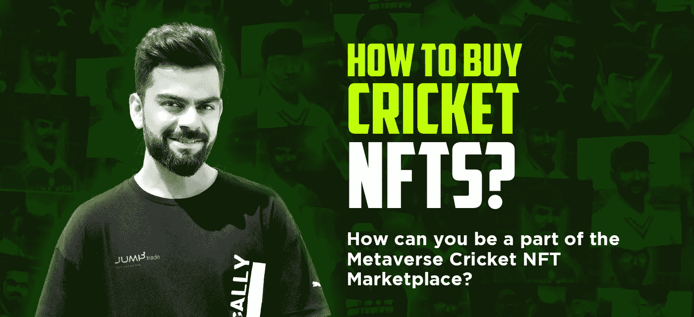
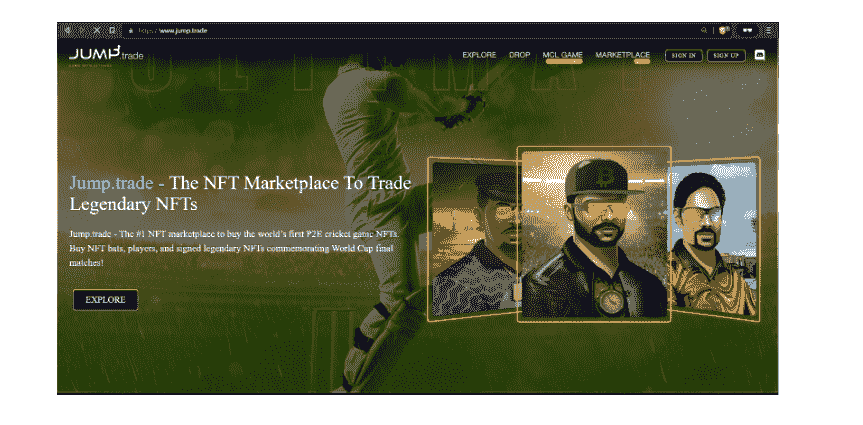
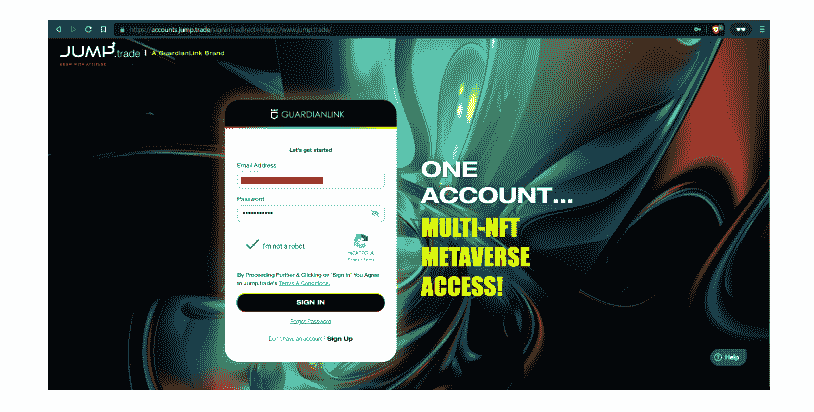
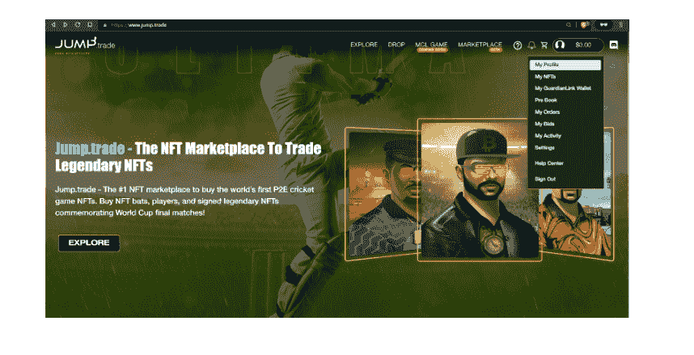
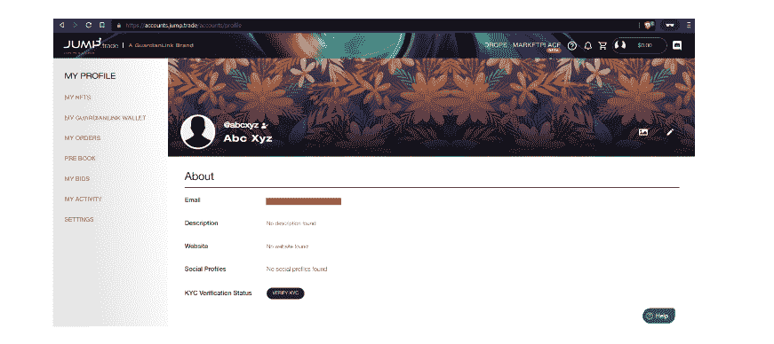
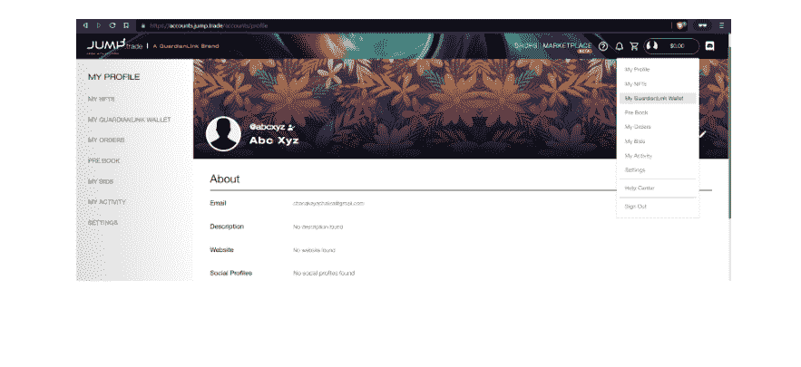
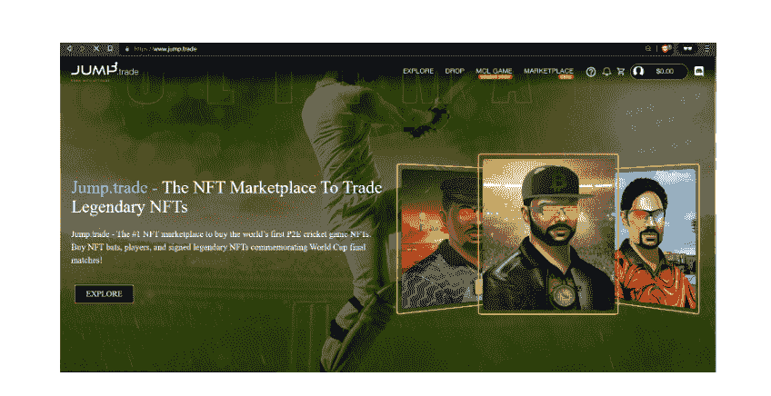
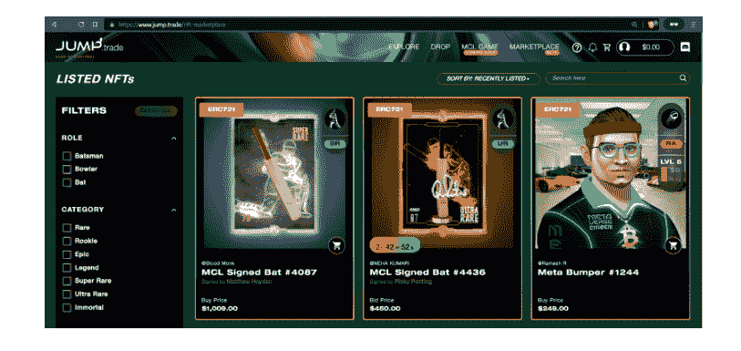
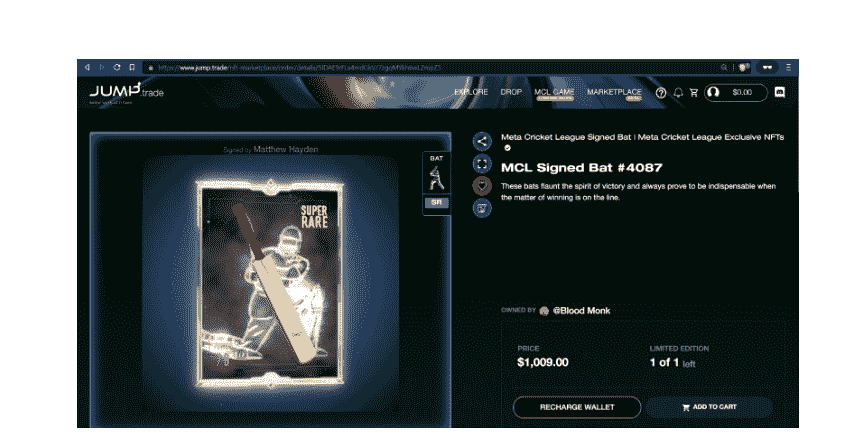

# 如何购买板球 NFT？

> 原文：<https://medium.com/geekculture/how-to-buy-cricket-nfts-ce0d7fddcaae?source=collection_archive---------15----------------------->

## 你如何成为元宇宙板球 NFT 市场的一部分？

**How To Buy Cricket NFTs**

随着每一天的过去，元宇宙和板球 NFT 的需求和粉丝群都在呈指数增长，因此，知道如何成为这场新革命的一部分变得很有趣。

除此之外，新闻头条还充斥着科技巨头和投资者如何投入巨额财富来发展板球 NFTs 市场和基于板球的元宇宙。

所以请系好安全带，因为在这篇文章中，你将经历一次伟大的旅程，我们将讨论元宇宙 [**板球 NFT 市场**](https://jump.trade/?fsz=Karthik) 的当前和未来范围，随后是一步一步的指导，引导你成为其中的一部分。

# 元宇宙板球 NFT 市场的当前和未来范围

目前，Web3 空间的最新趋势，包括元宇宙和 NFTs，在 NFT 板球市场的帮助下，为元宇宙板球的发展创造了一个理想的生态系统。

许多公司实际上已经朝着这个方向发展，但整个运动的先驱是 GuardianLink 的子公司 Jump.trade，它推出了世界上第一个 P2E 板球游戏 NFTs Marketplace。

Jump.trade 也是板球爱好者的最佳平台，因为它有大量的板球 NFT 收藏品，允许用户购买球棒、球员和签名的传奇 NFT，以纪念世界杯决赛。

与此同时，如果关于板球 NFTs 和板球元宇宙的未来的问题出现，那么它似乎也非常光明，因为在印度，板球作为一项游戏本身拥有巨大的粉丝群。这不仅仅是一场普通的比赛，而是一种情感，一场团结整个民族的比赛。

因此，在 Web3 技术的帮助下培养这个庞大的板球粉丝群，并为板球爱好者开发一个专用的元宇宙，有着巨大的潜力。

经过这次讨论，我们相信你会很乐意成为这个新的大革命的一部分，并想知道你如何才能做到这一点。现在让我们快速进入下一部分，你将会发现你是如何成为板球元宇宙和板球 NFT 市场的一部分的。

# 一步一步的指南遵循成为元宇宙板球 NFT 市场的一部分

老实说，你可以通过许多不同的方式成为板球元宇宙和板球 NFT 市场的一部分，例如:

*   参加 NFT P2E 板球比赛并以奖励的形式赢得 NFT
*   创建你自己的基于板球的 NFT，然后出售它们
*   在各种平台上买卖和交易板球 NFT

但其中，最简单和最突出的方式是购买、出售和交易板球 NFT，因为当我们谈论板球元宇宙时，很明显每个球员都有自己的化身，他/她会喜欢收集传奇球员签名的球棒或卡片，以纪念一些最著名的板球比赛和时刻，如世界杯决赛。

因此，在这一节中，我们将使用我们在上一节中谈到的 Jump.trade 来了解如何在他们的平台上购买、出售和交易板球 NFT 的整个过程。

所以让我们开始吧。

**第一步:**前往 [**Jump.trade**](https://jump.trade/?fsz=Karthik) 网站。

**Jump.Trade Cricket NFT Marketplace**

您将能够看到类似上面截图的内容。

**步骤 2:** 现在点击网站右上角的“登录”按钮，输入您注册的电子邮件 id 和密码登录。

**Sign Up Page**

**注意:**如果您没有注册帐户，那么您需要先注册，然后才能登录。

**第 3 步:**现在，您已经成功登录，请从下拉菜单中选择“我的个人资料”进入您的个人资料部分，当您点击网站右上角的头像时，将会显示该部分。

**第 4 步:**现在，您将能够看到您的个人资料部分，在底部，您会看到类似 KYC 验证状态和“验证 KYC”按钮的内容，因此单击它并输入要求的详细信息以获得验证。

**KYC Verification**

**注意:**在这里，我们只是使用了一个虚拟名称 Abc Xyz，但是您将能够看到您创建帐户时使用的名称。

此外，需要注意的是，这是一个非常重要的步骤，因为没有成功的 KYC 验证，您将无法购买、出售和交易 NFT。

**第五步:**现在，您的 KYC 验证已经完成，您可以从下拉菜单进入“我的 GuardianLink 钱包”，当您点击网站右上角的头像时，该菜单会显示出来。

**第 6 步:**在这一步，您将会看到一个“存款”按钮，当您点击它时，将会显示您希望通过其进行资金存款的选项，如下所示:

*   用加密支付(USDT)
*   用信用卡支付
*   通过 ACH 转账支付
*   用合众国际社/卡/网上银行支付
*   用合众国际社支付

**GuardianLink Wallet**

**注意:**我们没有存入任何款项，因为这是一个虚拟账户，但是为了从 NFT 板球市场购买 NFTs，你需要存入资金。

现在你已经准备好在 Jump.trade 市场进行买卖和交易了。

**第七步:**转到 [**Jump.trade 网站**](https://jump.trade/?fsz=Karthik) 点击“探索”按钮。

**第八步:**在这里，你会看到成千上万你可以买到的蟋蟀 NFT。

您甚至可以使用显示在网站最左侧的过滤器，根据您的具体要求过滤掉 NFT。

为了简单起见，让我们看看第一个 NFT，标题是“MCL 签署了蝙蝠#4087。”

第九步:在这里，你可以看到关于 NFT 的详细信息，这将有助于你决定买还是不买。

**第 10 步:**现在，如果您已经决定购买它，那么您可以继续点击“添加到购物车”并进行购买，之后它将与您的所有权一起显示在“我的 NFTs”部分，现在您可以自由地再次将其列出出售或持有它以在将来获得更好的回报。

# 包扎

板球、NFTs 和元宇宙作为单独的组件非常强大，但当它们结合在一起时，结果将是 Web3 世界的一场新的大革命。

像 GuardineLink 和 Jump.trade 这样的公司正在引领着同样的成功之路，GuardineLink 发布的路线图还谈到了建设世界上第一个板球元宇宙的愿景，这将进一步推动整个生态系统。

所以你也是元宇宙板球 NFT 市场的一部分，还是你仍然在考虑等待？

> *“机遇*如日出。如果你等得太久，你就会想念他们。”

**免责声明**:加密货币和 NFT 存在市场风险。加密货币和 NFT 是不受监管的数字产品/货币&在印度不是法定货币。