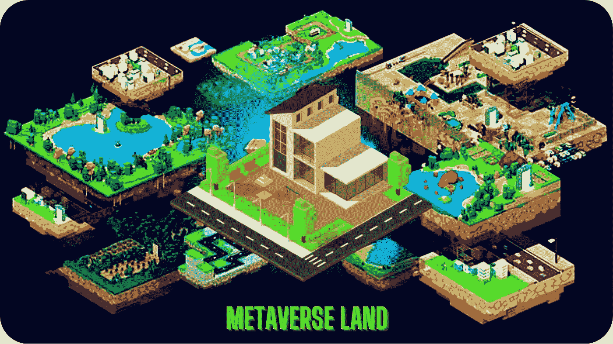

# 如何在元宇宙买地- 2022

> 原文：<https://medium.com/geekculture/how-to-buy-land-in-metaverse-step-by-step-guide-2022-d04d85557b32?source=collection_archive---------13----------------------->

## 许多人对元宇宙的土地成本感到困惑，在元宇宙选择最好的土地购买，许多人不知道如何在元宇宙购买土地。在这里，我们已经一步一步地解释了一切。

**How To Buy Land In Metaverse**

创新和发明是全世界都在看的词。多元宇宙目前正在环绕地球。有另一个实相与当前实相平行存在。每个星球都有自己的土地类型，可以用不同的方式购买或持有。

通过融合增强现实(AR)、虚拟现实(VR)和视频，元宇宙希望将现实世界数字化。用户可以通过使用他们的数字化身在虚拟世界中与他人互动，进行游戏、工作和聊天。你可以做任何事情，从安排会议到在元宇宙进行虚拟环球旅行。

然而，房地产似乎引起了投资者的兴趣。元宇宙的房地产收购数量一直是头条新闻，每隔一周就有创纪录的百万美元收购报道。

要想 [**购买虚拟财产**](https://bit.ly/3MlL3El) ，你必须先在元宇宙的一个平台上注册，比如分散地、沙盒或者 Axie Infinity。对于要进行的交易，在数字世界中，需要完全资助的数字钱包。将你的美元转换成加密货币，如以太货币或元宇宙本地货币，如 MANA 或 Sandbox，可以存储在你的数字钱包中。

在元宇宙几乎完整的生态系统中，你可以出租、购买、转手甚至出售房屋，所有权是通过不可替代代币(NFT)实现的。

**在元宇宙购买房地产时，您必须考虑以下因素:**

与房地产不同，在房地产中，你获得的有形财产可以保证生存，如果你购买的平台出现故障，元宇宙的数字土地将会灭绝。另一件需要记住的事情是，用于在 [**元宇宙房地产**](https://bit.ly/3MlL3El) 市场交易的加密货币非常不稳定。因为数字货币的价值会改变，所以你拥有的元宇宙财产的价值也会改变。

此外，数字房地产的许多方面还有待调查，因为它是一种新的资产类别。 [**投资元宇宙的**](https://www.finextra.com/blogposting/21300/nft-real-estate-new-investment-opportunities-enabled-through-blockchain-technology) 数字房地产市场是非常投机的，因此，建议在做出任何决定之前彻底了解其利弊。

# 购买元宇宙土地的分步指南

## 这是如何在元宇宙购买土地的指南

**第一步**

登录元宇宙的一个房地产市场，如分散土地、Axie Infinity 或沙盒。

**第二步**

比较不同地块的价格。

**第三步**

在你决定购买后，点击一块数字土地，了解更多信息。请记住，如果您使用他们批准的硬币，您只能从特定的元宇宙房地产网站购买。举例来说，客户可以只用分散化的加密货币 MANA 来买卖房屋。

**第四步**

下一步是将您的数字钱包链接到您的酒店平台账户。为此，你首先需要有一个合适的数字钱包。Metamask 是目前最流行的数字钱包。它可以用于几乎任何元宇宙资产平台。

**第五步**

为您的数字钱包注入一种加密货币至关重要，这种货币可以与您选择的数字财产平台配合使用。你可以很容易地在各种交易所买到它们，并把它们安全地储存在你的电子钱包里。你所要做的就是在选好土地并向你的电子钱包注资后，点击“购买”按钮。

**第六步**

在您完成交易后，您获得的数字土地将作为 NFTs 存储在您相关的数字钱包中。在你的电子钱包中，进入“NFTs”标签来查看你新买的土地。

## 结论

购买土地是一项业务，拥有土地是这项业务的最新组成部分。从在元宇宙购买房地产开始，这样你就可以用令人兴奋的回报来经营你的企业。按照上述步骤，在元宇宙购买土地。