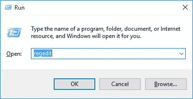
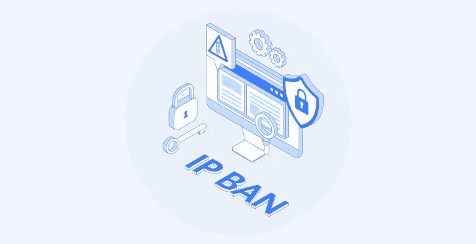
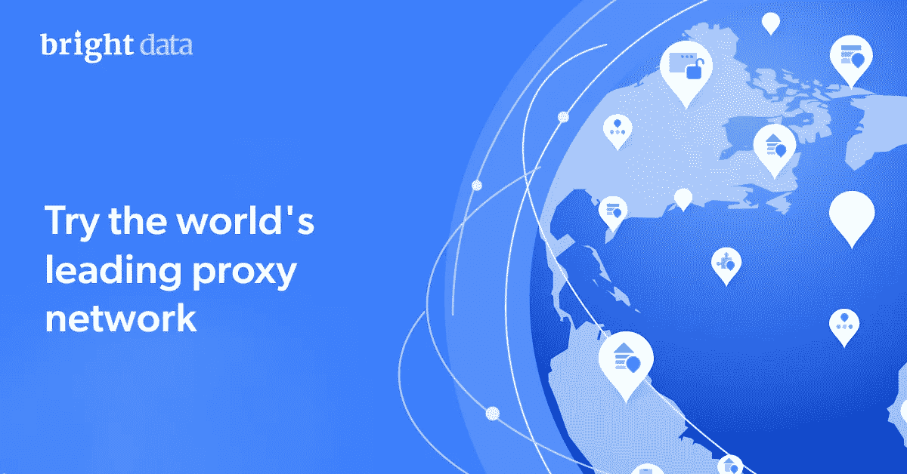

# 如何绕过持续的知识产权禁令

> 原文：<https://medium.com/geekculture/how-to-bypass-a-persistent-ip-ban-cd8ab11afc45?source=collection_archive---------16----------------------->

## 了解如何更改您的 MAC 地址，使用 VPN 更改您的 IP 地址，清除您电脑的缓存，以及使用高级代理解决方案来获得对任何网站的完全访问权限。

Image licensed from shutterstock

在过去十年中的某个时候，绕过网站屏蔽成为一种必要。事实是，在那之前，网络并没有 100%透明。

# 为什么会有人经历 IP 封杀？

个人或公司的 IP 地址被目标网站或平台服务器阻止的常见原因包括:

*   **商业用途的垃圾邮件**，例如未经平台同意的群发信息或产品或服务广告
*   **在论坛**、社交媒体网站和平台上发布链接，将流量转移到另一个领域
*   **从目标网站收集网络数据**。这被称为“速率限制”。不同的站点会以不同的速率阻止请求 IP。例如，每分钟 50 个请求高于平均值，被识别为异常行为。
*   **试图从被阻止的地理位置或设备类型访问网站**。例如，一个中国 IP 可能试图访问一个美国电子商务网站，或者一个桌面/住宅 IP 试图访问一个只对移动设备开放的应用程序。

Image licensed from shutterstock

# 排除 IP 禁令故障的四种行之有效的方法

以下四种方法可以帮助您轻松绕过互联网上一些最常见的知识产权禁令:

# 1.关闭您的媒体访问控制(MAC)地址

MAC 是分配给网络接口控制器的独立网络地址，用于网段内部的通信环境中。许多平台可能会选择阻止您的 MAC 地址以及您的 IP 地址，这就是为什么要注意这一点并确保这不是阻止您的 IP 正常运行的原因。

## 更改电脑 MAC 地址的分步指南

**第一步:**在你的电脑上点击“设置”

**第二步:**点击“网络&互联网”

**第三步:**进入“更改适配器选项”

**第四步:**右击你的网络适配器，点击“属性”

**第五步:**选择“微软网络客户端”，然后点击“配置”。

**第六步:**转到“高级”标签- >然后点击“网络地址”

**第七步:**进入 [**浏览**](https://www.browserling.com/tools/random-mac) ，创建一个新的 MAC 地址，然后复制粘贴到“值”框中。现在点击“确定”，并等待几秒钟。

# 2.使用 VPN 更改您的 IP 地址

当你使用的 IP 地址被禁止时，最合理的做法就是选择 VPN。 [**光明 VPN**](https://brightvpn.com/) 是目前市面上最好的免费高级 VPN 之一。

VPN 是有用的，因为他们改变你的 IP 地址，使你的活动不受限制。它不仅可以改变你的 IP 地址，还可以帮助你改变你所处的位置，以及你目前使用的互联网服务提供商(ISP)。

好的 VPN 服务不会跟踪/存储浏览历史日志、流量目的地、数据内容或 DNS 查询。他们还应该采用 IKEv2(互联网密钥交换版本 2)连接加密技术，这是一种处理所有请求和响应操作的 VPN 加密协议。

## 安装 Bright 免费 VPN 的分步指南

**第一步:**下载 VPN

第二步:在你的设备上安装它

**第三步:**将您的 IP 地址更改为您选择的位置和随机数字组合

**第四步:**找到你的目标网站，绕过之前实施的知识产权禁令

# 3.清除你电脑的缓存&“数字残留”

## 当试图访问您被阻止访问的平台或应用程序时，通常您的计算机上有一些与该程序相关的文件需要首先删除。

为此，请务必在整个计算机中搜索有问题的程序的名称，或者手动搜索下列计算机文件夹:

*   C:/programfiles
*   C:/programfiles (x86)
*   C:/%programdata%

## 一步一步的指南，消除数码剩菜

**第一步:**按 Windows 键，然后键入单词“Regedit”

**第二步:**将打开一个窗口，显示您计算机上的不同位置，将这些位置复制并粘贴到搜索栏中

**第三步:**删除任何与您试图规避禁令的应用程序或程序相关的内容

# 4.卸载程序或浏览器

根据您尝试访问的内容，如果您的目标是网页，请卸载您正在使用的应用程序、程序或浏览器。

## 卸载浏览器/程序的分步指南

**第一步:**转到“控制面板”，选择“程序”

**第二步:**现在点击“程序&功能”

第三步:右击有问题的程序，点击“卸载”

Image courtesy of Bright Data

# 为什么有些人认为代理是最有效的工具？

上述技术对于简单的 IP 禁令可能是有效的，尤其是对于那些希望访问特定网站的个人。但是如果你是一家处理大规模数据收集的公司，你可能要考虑专业的 [**代理服务**](/geekculture/tldr-recap-of-proxyways-2022-proxy-service-market-report-a0f58fd1dc8e) 。

许多目标站点将使用复杂的架构，或者通过采用人类行为检查技术来抢占高流量爬行。 [**购买代理**](https://brightdata.com/pricing/proxy-network) 可以是 [**解决验证码和解锁网站**的一种极其有效的方式。](https://levelup.gitconnected.com/web-scraping-and-the-art-of-war-5-tools-that-will-help-your-bot-win-c2a3840d8b71)

Image courtesy of Bright Data

光明数据提供了更有效的代理解决方案，原因如下:

*   他们的代理网络与使用自动 IP 地址轮换的工具一起工作，这意味着成功率非常高。通过使用诸如代理管理器这样的工具，你很少会被目标站点拦截，如果你被拦截，一个新的 IP 地址将会被替换进来。
*   他们的住宅代理网络可以让你访问世界上每个地理位置的 IP 地址。因此，如果你的公司需要从中国查询美国电子商务网站上竞争对手的价格，你可以使用一个位于纽约的真实用户的 IP 地址。

*这个故事最初发布在光明数据的博客上，谢谢 Aviv Besinsky。*