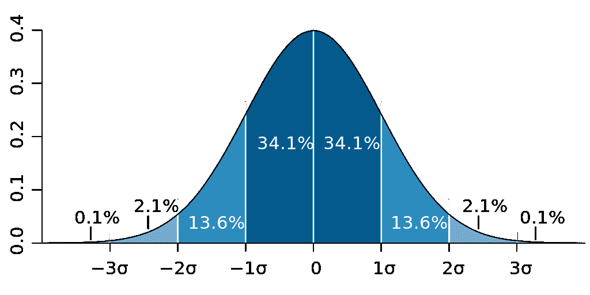

# 如何用 Python 和 R 计算总体的标准差

> 原文：<https://medium.com/geekculture/how-to-calculate-a-populations-standard-deviation-in-python-and-r-fe1b1e1b2c24?source=collection_archive---------11----------------------->

标准差是统计学研究中非常重要的分布度量。具体来说，它是衡量数据相对于平均值的分散程度。低标准偏差意味着数据围绕平均值聚集，而高标准偏差数据更分散。