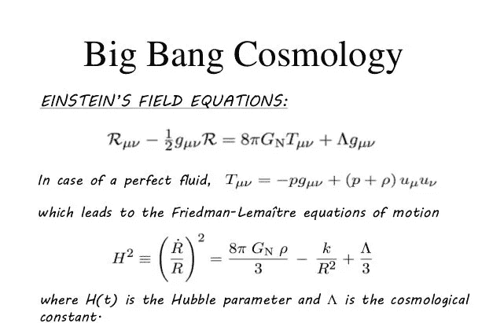
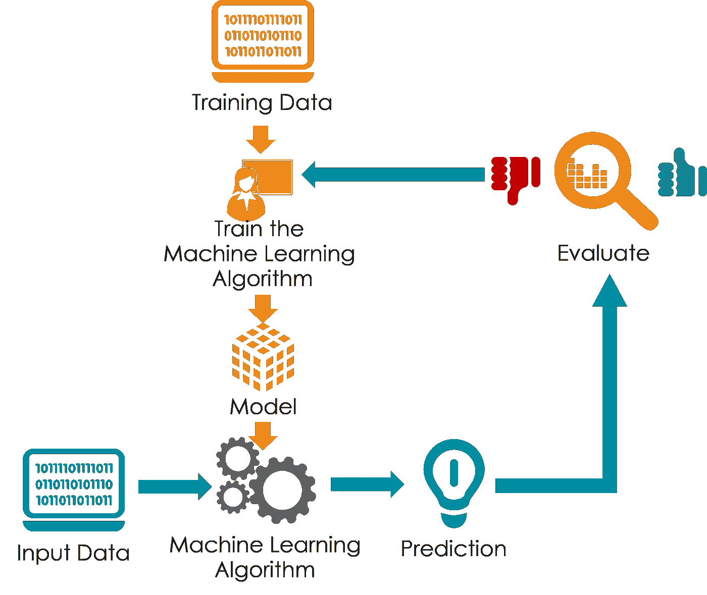
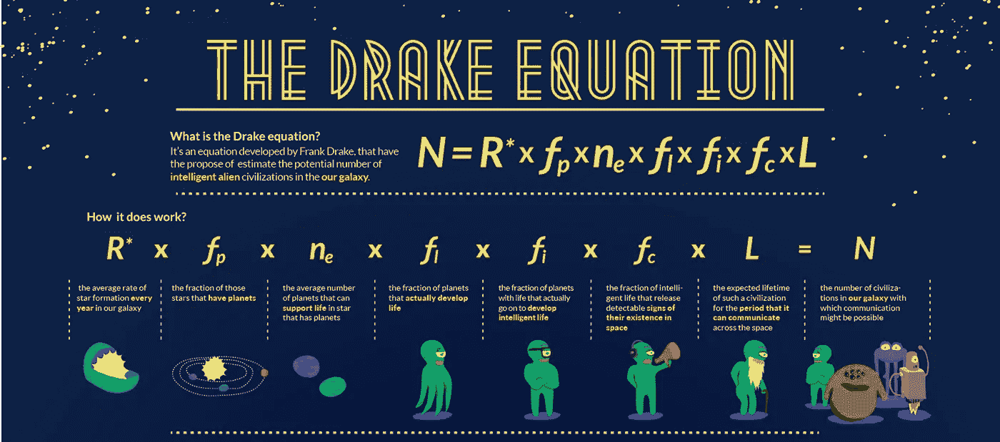
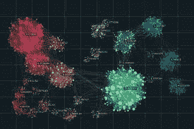

# 如何使用数据科学技术和高效算法计算我们宇宙的指数增长率

> 原文：<https://medium.com/geekculture/how-to-calculate-exponential-growth-rates-of-our-universe-using-data-science-techniques-and-a29e67633e54?source=collection_archive---------20----------------------->

> 图片来源:谷歌

**宇宙膨胀无限大时如何测量，为什么测量？**

在我们的同人小说中，宇宙可能由永恒的黑暗组成，但在物理学家眼中，它是太阳系、小行星、行星和恒星的集群和网络。每一个特定的物体和星团都遵循一种基于引力的方法，在其大气层范围内进行管理和运动。

因此，对于物理学家来说，宇宙的膨胀表明更多的行星、恒星甚至可能是新的太阳系正在形成，只要通过我们的卫星图像接收的数据(数据科学家在这里感到兴奋)和望远镜在已知宇宙范围内捕捉更多更远距离的进步表明有新的亮度迹象。

使用数值测量和分类洞察来评估宇宙的膨胀

通过斯蒂芬·霍金斯对**宇宙膨胀**的研究，我们都知道我们的宇宙正以指数速度膨胀。

如下面的计算所示:

> 图片来源:谷歌

对爱因斯坦场方程和弗里德曼-勒梅特运动方程的解释表明，宇宙以越来越快的速度运动，这通过哈勃参数加倍和测量变化率得到了解释。

**现在来看数据科学在这个复杂的天文方程中的应用？**

> 图片来源:谷歌

在我们做任何进一步的工作之前，我们首先必须应用主成分分析来分析外层空间范围内的所有特征，包括深度、压力真空和探测到的附近漂浮的小行星的存在，以及对空间内恒星的估计。

在这个过程中，我们不能忘记一个非常重要的东西，这个叫做**德雷克方程**，它计算在宇宙中其他地方发现生命的概率。

# 什么是德雷克方程？

这是一种基于物理学的概率论证，用于使用恒星和行星的形成参数以及恒星引发的重力脉冲来估计银河系内的地外文明。

> 图片来源:谷歌

# 我们如何在机器学习算法中推导出这一点？

> 图片来源:谷歌

我们可以应用多种编程语言来起草德雷克方程，供机器学习算法提取和计算。

但在此之前，我们需要看看我们是否有合适的数据集

我们需要一个数据集，包括:

> 任何空间区域内任何大气压力下的氧含量和氢含量。
> 
> 氮、硫、碳含量的存在。
> 
> 空间区域内的小行星数量。
> 
> 行星离太阳的平均距离。
> 
> 地球上存在水。

# 如果我们通过 python 编码得到这个，我们将应用:

> 图片来源:谷歌

*分组方法将数据框中所有需要的特征组合在一起*

*应用估算器和其他此类数据清理方法来填充所有缺失值。*

*应用主成分分析检查数据所需的相互作用和搅动。我们通过分解数据来减少噪音。*

*我们应用基于 RandomForestClassification 的机器学习算法，因为我们需要保持每棵树之间的所有关系对于像时间和空间这样的数据集是不同的，这在超速度模式下会改变复杂性。*

*我们划分训练集和测试集，将预测特征设置为小行星数量，并预测其中发生的变化。因为小行星数量的增加代表了通向太空中星系和太阳系的新路线。*

> 作者指出

嗨，这是我自己根据我的分析和有限的外层空间和物理计算知识得出的。如果你希望纠正我或有任何贡献让我更好地理解。我真的很期待。

您可以通过我的 LinkedIn 个人资料联系我:

 [## Muhammad Ammar Jamshed -人力资源分析数据专家-联合利华| LinkedIn

### 我目前受雇于巴基斯坦联合利华公司，担任人力资源服务部的数据专家，负责数据库管理和…

www.linkedin.com](https://www.linkedin.com/in/goto-resumemuhammad-ammar-jamshed-029280145/) 

*大家好，我叫阿马尔·贾姆希德。*

*我目前是联合利华巴基斯坦有限公司的数据专家，也是 Upwork 分析方面的自由职业者。如果您对任何基于分析的项目有任何评论、批评或任何建议需求。请随时在 LinkedIn 上联系我，并使用我的 Github/ka ggle python 代码模板库和已经制作的可视化实现或参考。*

*linked ln:*[*https://www . LinkedIn . com/in/goto-resumemuhammad-ammar-jam shed-029280145/*](https://www.linkedin.com/in/goto-resumemuhammad-ammar-jamshed-029280145/)

*Github:*[*https://github.com/AmmarJamshed*](https://github.com/AmmarJamshed)

*卡格尔:*[*https://www.kaggle.com/muhammadammarjamshed*](https://www.kaggle.com/muhammadammarjamshed)