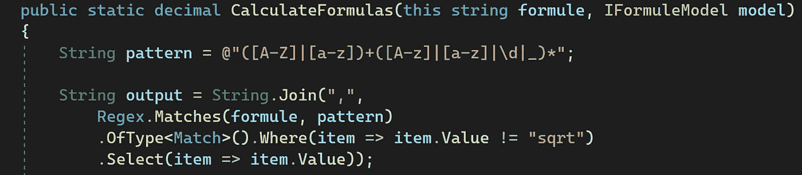
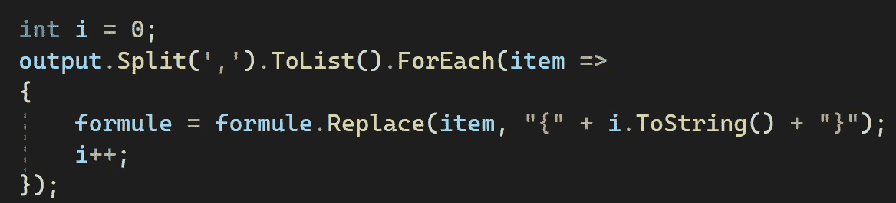
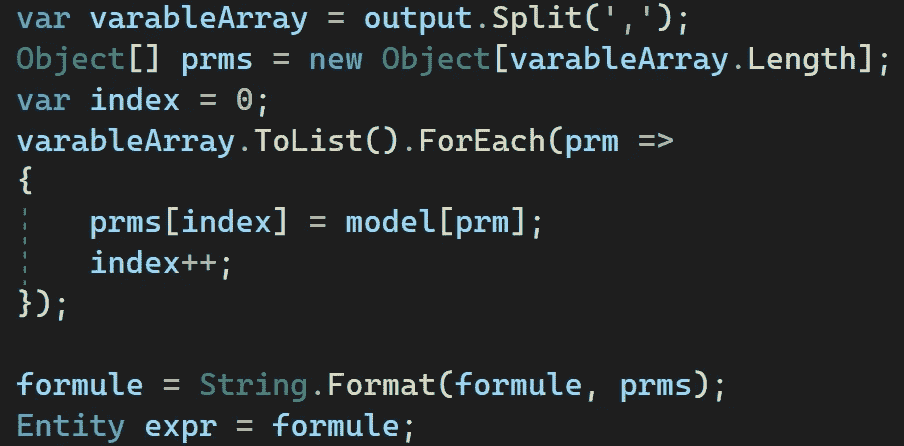
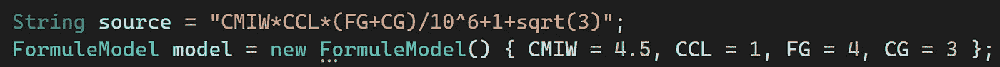
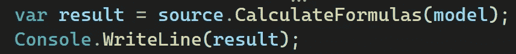

# 如何在运行时计算字符串公式？网

> 原文：<https://medium.com/geekculture/how-to-calculate-string-formulas-at-runtime-on-net-2cddfa8744d8?source=collection_archive---------2----------------------->


NASA in 1961(Image credits: [J. R. Eyerman, via LIFE](http://images.google.com/hosted/life/8c9619c6f6ebf405.html))

嗨，今天我们将讨论如何用 C#在运行时计算字符串公式。

在一个项目中，我们必须运行数千个数学公式来计算产品的尺寸。这些公式以后可以更改，我们可以添加新的公式。因此，在类内部写一个静态公式是不正确的。当我们改变公式时，我们不必重新构建我们的解决方案。

这是我们的示例公式。

> CMIW*CCL*(FG+CG)/10⁶+1+sqrt(3)

这是我们的示例公式模型:

**FormuleModel.cs:** 我们将把公式中的所有参数都声明为这个类中的属性。而我们在计算公式的时候，会通过使用 ***反射*** 从这个类中获取属性值。

```
public  class FormuleModel:IFormuleModel
{
   public double CMIW { get; set; }
   public int CCL { get; set; }
   public int FG { get; set; }
   public int CG { get; set; }
}
```

**IFormuleModel.cs:** 我们可以用这个方法在 FormuleModel 类上使用**反射**库来获取属性的值。我们可以通过参数的字符串名称来获取参数的值。

```
public interface IFormuleModel
{
   public object this[string propertyName]
   {
      get { return this.GetType().GetProperty(propertyName).GetValue(this, null); } set { this.GetType().GetProperty(propertyName).SetValue(this, value, null); }
   }
}
```

> 每一个表达自然法则的公式都是对上帝的赞美诗。—玛丽亚·米切尔

现在我们将创建一个字符串扩展静态类。我们将用这个扩展来计算字符串公式。

> CalculateFormulas()方法有两个参数。其中一个是字符串公式，第二个是模型的参数。在调用这个扩展方法之前，我们必须填充模型。 ***我们会用 Regex 找到公式中的所有参数。***

我们必须从查找参数列表中删除一些特定的数学术语，如“sqrt，sin，cos，lim”。因为 RegEx 不能过滤这些单词，它的行为就好像这些定义是参数一样。因此，我们必须添加“Where”过滤条件，并删除本例中的这些特定数学术语“sqrt”。我们必须去除“罪恶、谭、cos、林”等..如果公式中有一项。

> 在 **regex** 确定了公式中传递的变量后，输出变量看起来是这样的= > " **CMIW，CCL，FG，CG** "
> 
> **公式**:cmiw*ccl*(fg+cg)/1⁰⁶+1+sqrt(3)



> 我们将在每个参数周围加上“{”和“}”，并替换公式。公式看起来是这样的= >“**{0}*{1}*({2}+{3})/10⁶+1+sqrt(3)**我们用增量数代替了所有的参数。



> 我们将使用 Split('，')函数分隔所有参数。并且我们会用**Reflection**(" prms[index]=**model[PRM]**")找到参数的值，用 foreach 循环放入对象数组" **prms** "中。查找参数的值来自于，IFormuleModel 接口的“get”、“set”属性。我们将使用“字符串”将所有参数替换为它们自己的值。格式(公式，prms)”。最后公式看起来是这样的=>**4.5 * 1 *(4+3)/⁰⁶+1+sqrt(3)**。最后，我们将用计算结果的公式设置实体。



> 我们将用“*实体返回计算结果。eval numeric()*"方法的 **AngouriMath** 库。

> 返回(十进制)表达式。EvalNumerical

**CalculateFormulas.cs:** 自定义字符串扩展类。

```
public static decimal CalculateFormulas(this string formule, IFormuleModel model)
{
   String pattern = @"([A-Z]|[a-z])+([A-z]|[a-z]|\d|_)*"; String output = String.Join(",",
   Regex.Matches(formule, pattern)
     .OfType<Match>()
     .Where(item => item.Value != "sqrt")
     .Select(item => item.Value)); int i = 0;
   output.Split(',').ToList().ForEach(item =>
   {
      formule = formule.Replace(item, "{" + i.ToString() + "}");
      i++;
   }); var varableArray = output.Split(',');
   Object[] prms = new Object[varableArray.Length];
   var index = 0;
   varableArray.ToList().ForEach(prm =>
   {
      prms[index] = model[prm];
      index++;
   }); formule = String.Format(formule, prms);
   Entity expr = formule;
   return (decimal)expr.EvalNumerical();
}
```

> 这是我们的测试公式。我们将用测试数据填充我们的参数模型。



> 我们可以把我们的扩展方法叫做“ **CalculateFormulas** ”，毕竟字符串。为了计算公式，我们必须给这个方法一个参数。



**Program.cs:**

```
internal class Program
{
   static void Main(string[] args)
   {
      String source = "CMIW*CCL*(FG+CG)/10^6+1+sqrt(3)";
      FormuleModel model = new FormuleModel() { CMIW = 4.5, CCL = 1, FG = 4, CG = 3 }; var result = source.CalculateFormulas(model);
      Console.WriteLine(result);
   }
}
```

**结果画面:**最终，我们得到了如下图所示的结果:


> 成功有一个简单的公式:尽力而为，人们可能会喜欢。—山姆·尤因

**结论:**

在本文中，我们试图在不将特定的逻辑代码写入程序的情况下计算一个字符串公式。因为在课堂上写成千上万的公式是疯狂的，管理是不可能的。如果你改变了代码，你必须构建所有的项目并重新发布。但是，如果我们将所有公式作为字符串保存到 SQLDB 或任何地方，并动态计算公式，以后我们可以通过管理屏幕更改所有公式，而无需做任何额外的工作，我们可以看到所有结果的突然变化。

Goodbye

下一篇文章再见。

*“如果你读到现在，首先感谢你的耐心和支持。欢迎大家来我的博客*[](http://www.borakasmer.com/)****了解更多！”****

****Github:**[**【https://github.com/borakasmer/CalculateFormulasDynamically】T42**](https://github.com/borakasmer/CalculateFormulasDynamically)**

****来源:****

*   **[**https://am.angouri.org**](https://am.angouri.org)**
*   **[**https://stack overflow . com/questions/28208587/extracting-formula-from-string**](https://stackoverflow.com/questions/28208587/extracting-formula-from-string)**