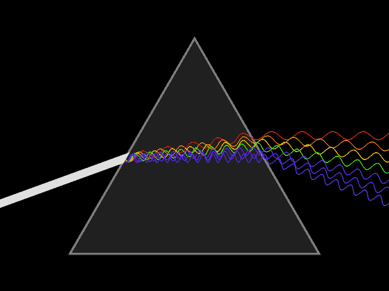

# 如何在 Python 和 R 中计算离差的度量

> 原文：<https://medium.com/geekculture/how-to-calculate-the-measure-of-dispersion-in-both-python-and-r-e9bf2e91e9d1?source=collection_archive---------2----------------------->

在统计学中，离差的度量是数据的分散程度。它解释了数据之间的差异，提供了数据分布的精确视图。它展示并让我们了解一个项目的变化和中心价值。

在本文中，我打算讨论三种不同的离差测量方法，即