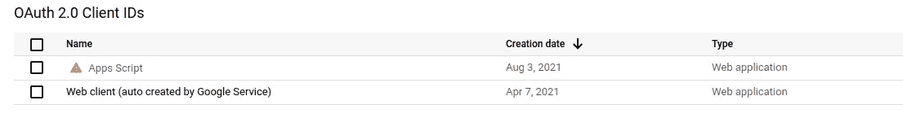

# 如何从应用程序脚本调用 Google Cloud Run(或云功能)

> 原文：<https://medium.com/geekculture/how-to-call-google-cloud-run-or-cloud-functions-from-apps-scripts-c0086289c965?source=collection_archive---------8----------------------->

## 这里有一个简单快捷的方法


*即使我拥有 GCP 项目的* ***所有者*** *权限，我也很难从* ***Apps 脚本*** *到* ***云运行*** *进行认证调用。这篇文章描述了如何在不重新发明轮子的情况下做到这一点。*

## 背景阅读

因此，这里是我用来完成这项工作的参考资料。guillaume blaquiere 的这篇文章是一个好的开始，但并没有完全奏效:

[](/google-cloud/call-cloud-run-from-app-script-the-easy-way-70677086efa1) [## 从应用程序脚本调用云运行:简单的方法

### 在谷歌，应用脚本和云运行属于两个不同的世界，一个在云中，另一个在 Workspace 中。两者并用是…

medium.com](/google-cloud/call-cloud-run-from-app-script-the-easy-way-70677086efa1) 

这个 stackoverflow 问题也帮助我拼凑出了这个谜题:

[](https://stackoverflow.com/questions/66543047/call-google-cloud-functions-from-app-scripts) [## 从应用程序脚本调用谷歌云功能

### 感谢贡献一个堆栈溢出的答案！请务必回答问题。提供详细信息并分享…

stackoverflow.com](https://stackoverflow.com/questions/66543047/call-google-cloud-functions-from-app-scripts) 

仅供参考，这是由 [salmaan rashid](https://medium.com/u/b78c1a5c6205?source=post_page-----c0086289c965--------------------------------) 提供的关于用于身份验证的不同 GCP 令牌的很好资源:

 [## 使用 Google OpenID 连接令牌进行身份验证

### 越来越多部署在 Google Cloud 上的服务可以默认启用自动预认证…

medium.com](/google-cloud/authenticating-using-google-openid-connect-tokens-e7675051213b) 

# 逐步地

1.  确保应用程序脚本与云运行服务在同一个 GCP 项目中。没有这一点，它几乎是没有希望的。谷歌有手册解释如何设置应用 Sritps 项目[这里](https://developers.google.com/apps-script/guides/cloud-platform-projects#standard_cloud_platform_projects)。

项目级别的认证和授权工作。默认情况下， Apps 脚本创建一个**隐藏的** GCP 项目。因此，如果您希望应用程序脚本与其他 GCP 服务交互，您需要将应用程序脚本的执行移动到目标 GCP 项目。

**2。在您的 GCP 项目**中，启用*API&服务*下的 OAuth 同意屏幕

这是一个强制性的步骤，有许多手册描述了如何去做。[这里的](https://support.google.com/cloud/answer/6158849?hl=en#)是 GCP 一号。同意屏幕允许有权访问给定项目的用户向 OAuth 2.0 客户端授予代表他们访问服务的权限。只要选择一个测试或内部类型的应用程序，以避免代表谷歌的验证，只要这只是为了内部目的。然后将您的电子邮件帐户添加到测试用户列表中。

**3。该应用程序脚本函数调用 GCP 云运行服务**

```
CLOUD_RUN_URL="https://cloud-run-base-url";function callCloudRun() {
 // Use the OpenID token inside App Scripts
 const token = ScriptApp.getIdentityToken();var options = {
  'method' : 'get',
  'headers': {'Authorization': 'Bearer ' + token},
 };// call the server
 var response = UrlFetchApp.fetch(CLOUD_RUN_URL + '/hello', options);}
```

将使用应用程序脚本 OAuth 2.0 客户端调用云运行服务，您可以在 GCP 的*API&服务>凭证*下看到:



在请求的授权头中，上面的代码将 [OpenID](https://openid.net/specs/openid-connect-core-1_0.html) 令牌解码后看起来像这样:

```
{
 at_hash=xxxxxxx,
 sub=xxxxxxx,
 aud=app-scripts-oauth2.0-client-id.apps.googleusercontent.com,
 email_verified=true,
 iss=[https://accounts.google.com](https://accounts.google.com),
 hd=example.com,
 exp=1628072693,
 iat=1628069093,
 [email=name@example.com](mailto:email=name@example.com)
}
```

它告诉 GCP 防火墙是谁发出的请求，如果令牌是有效的，并且用户被授权访问服务或 API，它将通过。

**4。编辑应用程序脚本清单**

Apps 脚本有一个名为`appsscripts.json`的 JSON 配置文件，它通常是自动生成的。这里的解释了如何访问它[。在`oauthScopes`下面添加三个额外的示波器。它们允许一个脚本访问 GCP，并生成上面提到的 OpenID 令牌。](https://developers.google.com/apps-script/concepts/manifests)

```
"oauthScopes": [
  ...,
  "https://www.googleapis.com/auth/script.container.ui",
  "https://www.googleapis.com/auth/cloud-platform",
  "openid"
]
```

**5。最后一英里是最棘手的！**

最后一部分来自 GCP 官方关于云运行的文档。

> 如果您有多个 OAuth 客户端 id(例如，Android、iOS 和 web 各有一个)，您必须在添加每个客户端 id 后重新部署服务，以确保服务接受更改。同样，如果您删除一个客户端 ID，您必须重新部署您的服务以删除该客户端 ID 并拒绝请求。项目中的所有客户端 id 都将被接受。

**我所要做的就是重新部署云运行服务！**无论何时部署云运行服务，它都会以某种方式存储特定 GCP 项目中所有 OAuth2.0 客户端 id 的快照。因此，如果您首先部署服务，然后才向 GCP 项目添加应用程序脚本，服务将不会识别应用程序脚本 OAuth 2.0 客户端的新客户端 ID。你只需要重新部署服务，它就能工作。

## 结论

当您考虑用于身份验证和授权的 GCP 安全模型时，上面的步骤完全有意义。有些人可能会说这看起来很复杂，但实际上它可以保证你的信息和资源的安全。

同样的方法也适用于谷歌云功能。

*我的名字叫尼克·瓦克莱夫，我是*[*Techccino Ltd*](https://techccino.com?utm_source=medium.com&utm_medium=tech-blog&utm_content=call-cloudrun-from-appsscripts)*的创始人。如果你有兴趣构建自己的网络应用* [*联系*](https://techccino.com/) *。*