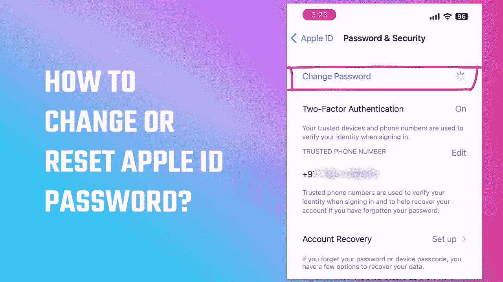

# 在不知道旧密码的情况下，如何更改或重置自己的 apple id 密码？

> 原文：<https://medium.com/geekculture/how-to-change-or-reset-your-apple-id-password-without-knowing-the-old-password-8769edd3aefb?source=collection_archive---------12----------------------->

此外，您不需要访问相关的 Apple id 电子邮件

现在这里有一个最简单的方法来改变你的 apple id 的密码，甚至不需要知道旧密码或访问相关的电子邮件。只有使用密码或 face ID，您才能将密码重设为 apple id。即使你做了也没关系…