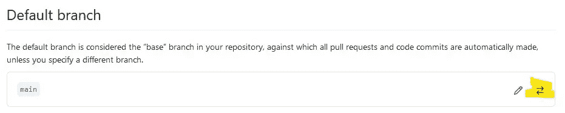
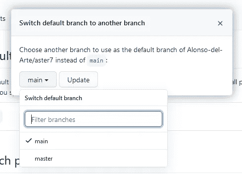

# 如何更改主体 Git 分支的名称

> 原文：<https://medium.com/geekculture/how-to-change-the-name-of-the-principal-git-branch-4dd39a620ad8?source=collection_archive---------28----------------------->


Photo by [Muneeb Qureshi](https://unsplash.com/@muneeb?utm_source=medium&utm_medium=referral) on [Unsplash](https://unsplash.com?utm_source=medium&utm_medium=referral)

我有一台新电脑，我在上面安装了 Git。然后我决定我必须在我的另一台计算机上升级 Git，它的版本是 2.14。2.32 版本有很多重大变化。

其中一个变化让我想到了几年来我一直认为理所当然的事情:存储库中默认分支的名称。

自从我使用 Git 和 GitHub 以来，甚至更早，存储库的默认分支就被称为“master”我从来没有想过我会想改变这个分支机构的名称。

最近几年有议论说“主”这个分支名称有问题，因为有主从关系的暗示。“主”和“从”都在计算机科学的某些上下文中使用。

这不是 Git 和 GitHub 的初衷，它们使用术语“主”，而不是术语“从”。尽管如此，这种关联影响了人们对 Git 和 GitHub 的看法。

如果有一种方法可以将我的 Git 存储库的主要分支名称更改为不会冒犯任何人的名称，我应该进行这种更改。

我有一些特权，可以让我不去考虑这些。坦率地说，如果不是在一台计算机上安装 Git，在另一台计算机上升级，我可能不会考虑这个问题。

根据您在安装 Git 或升级到最新版本时选择的选项，Git 将使用您在安装或升级期间指定的默认分支名称创建新的存储库。

Git 安装程序建议将主分支命名为“trunk”，并且许多团队已经对“master”进行了更改。所以我选择了“主”很简单。

请注意，您的旧存储库不会被更改，除非您有意识地对它们中的每一个进行更改。那可能有点困难。

将存储库的默认分支名称更改为更具“包容性”的名称，如“main”、“base”或“default”，不会解决我们世界中的任何社会不公。

但至少它让我们思考某些偏见是如何被不假思索地编入我们的文化中，以及如何被不假思索地编织进我们认为理所当然的事物中，比如版本控制软件。

希望我不必说服您对您的新存储库和现有存储库都进行这种更改。但是您可能会担心对现有存储库的这种更改可能会清除存储库的历史。

即使你不担心这个，也有很多问题:我该怎么做？我需要经历什么样复杂的 Git 命令序列才能做出这种改变？这将如何影响我的团队和已经分叉我的存储库的人们？

在您对一个现有的存储库进行这种改变之前，我建议您确保您的“工作树”是“干净的”，没有什么要提交的，没有什么未被跟踪的。

如果您在存储库上有合作者，让他们知道您将要进行这个更改。还要检查没有依赖于特定分支名称的程序。

我决定首先对我的一个 QBasic 存储库进行修改。这是我多年前写的一个 QBasic 程序，那时我还不知道版本控制。存储库中唯一的历史记录是初始提交和对自述文件的几次编辑。所以如果删除了也没什么大损失。

# 更改分支名称的步骤

与任何涉及 Git 的事情一样，检查本地机器上的 Git 状态是一个好主意。

```
C:\Users\AL\Documents\QBasicPrograms\aster7>**git status**
On branch master
Your branch is up to date with 'origin/master'.**nothing to commit, working tree clean**
```

而且还要检查存储库中的所有分支。在这个例子中，存储库只有一个分支，我想重命名这个分支。

```
C:\Users\AL\Documents\QBasicPrograms\aster7>git branch
*** master**
```

现在我们开始行动吧。

```
C:\Users\AL\Documents\QBasicPrograms\aster7>**git branch --move master** **main**C:\Users\AL\Documents\QBasicPrograms\aster7>**git branch**
*** main**C:\Users\AL\Documents\QBasicPrograms\aster7>**git status**
**On branch main
Your branch is up to date with 'origin/master'.**nothing to commit, working tree clean
```

这表明在这一点上的变化是严格局部的。为了使这一点更加清楚，请在 Branch 命令上使用 All 选项。

```
C:\Users\AL\Documents\QBasicPrograms\aster7>**git branch --all**
*** main
  remotes/origin/HEAD -> origin/master
  remotes/origin/master**
```

现在我们需要将主分支推到远程存储库。

```
C:\Users\AL\Documents\QBasicPrograms\aster7>**git push --set-upstream origin main**
Total 0 (delta 0), reused 0 (delta 0), pack-reused 0
remote:
remote: Create a pull request for 'main' on GitHub by visiting:
remote:      [https://github.com/Alonso-del-Arte/aster7/pull/new/main](https://github.com/Alonso-del-Arte/aster7/pull/new/main)
remote:
To [https://github.com/Alonso-del-Arte/aster7.git](https://github.com/Alonso-del-Arte/aster7.git)
 *** [new branch]      main -> main
Branch 'main' set up to track remote branch 'main' from 'origin'.**C:\Users\AL\Documents\QBasicPrograms\aster7>**git status
On branch main
Your branch is up to date with 'origin/main'.**nothing to commit, working tree cleanC:\Users\AL\Documents\QBasicPrograms\aster7>**git branch --all
* main
  remotes/origin/HEAD -> origin/master
  remotes/origin/main
  remotes/origin/master**
```

主分支中的两个文件都显示了我期望看到的所有历史:2019 年的初始提交，2019 年的编辑和上周的编辑。

此时，主分支仍然存在于远程存储库中。在我们删除主分支之前，让我们检查一下可能依赖或引用特定分支的事项清单:

*   测试运行程序配置文件
*   构建脚本
*   发布脚本
*   未解决的提取请求
*   证明文件

这些都不适用于我以前的 QBasic 项目。

一旦你确定清单上的事情不会受到改变的负面影响，继续删除:

```
C:\Users\AL\Documents\QBasicPrograms\aster7>**git push origin --delete master**
To [https://github.com/Alonso-del-Arte/aster7.git](https://github.com/Alonso-del-Arte/aster7.git)
 **! [remote rejected] master (refusing to delete the current branch: refs/heads/master)
error: failed to push some refs to '**[**https://github.com/Alonso-del-Arte/aster7.git'**](https://github.com/Alonso-del-Arte/aster7.git')
```

糟糕，出现了问题。我需要在 GitHub 上更改存储库的设置，特别是分支的设置。根据 GitHub，我没有在主分支上定义任何分支保护规则。

尽管如此，GitHub 还是不让我删除默认分支，现在这是主分支。我认为这是分行保护条例。转到存储库的设置并点击分支类别。

在默认的分支标题下，应该有一个小的双箭头图标，我在下面的截图中用黄色突出显示了这个图标:



我应该在做修改前截屏的。哦好吧。当你点击两个箭头时，会出现一个框，你可以在里面选择你想要的默认分支。



当您选择新的默认分支时，您将有机会再次回顾您头脑中的变化，并在您忽略任何重要准备时退出。

两个箭头图标左侧的铅笔图标用于编辑分支名称。我刚刚意识到，我不需要将这个特定的存储库克隆到我的本地机器上，我可以用更少的步骤在 GitHub 上进行更改。

反正 Git 现在应该让我删除 master 分支了。

```
C:\Users\AL\Documents\QBasicPrograms\aster7>**git push origin --delete master**
To [https://github.com/Alonso-del-Arte/aster7.git](https://github.com/Alonso-del-Arte/aster7.git)
 - [deleted]         masterC:\Users\AL\Documents\QBasicPrograms\aster7>**git branch --all**
**warning: ignoring broken ref refs/remotes/origin/HEAD
* main
  remotes/origin/main**
```

哦，这里有点不对劲。我需要修复损坏的头部引用。

```
C:\Users\AL\Documents\QBasicPrograms\aster7>**git symbolic-ref refs/remotes/origin/HEAD refs/remotes/origin/main**
```

对此，您不会看到任何响应，只会看到一个新的命令提示符，因此您应该检查分支和状态。

```
C:\Users\AL\Documents\QBasicPrograms\aster7>**git branch --all
* main
  remotes/origin/HEAD -> origin/main
  remotes/origin/main**C:\Users\AL\Documents\QBasicPrograms\aster7>**git status**
**On branch main
Your branch is up to date with 'origin/main'.**nothing to commit, working tree clean
```

好了，搞定一个，还有四打。

# 再来一遍舞步，进行练习

为了便于练习，让我们走一走另一个存储库。我将选择一个带有主分支和 gh-pages 分支的存储库，古怪的填充(有点像疯狂的库)。

首先，检查状态和分支。如果你还没有在主分支，切换到它。

```
C:\Users\AL\Documents\Web Pages\wacky-fillins>**git status**
On branch master
**Your branch is up to date with 'origin/master'.**nothing to commit, working tree cleanC:\Users\AL\Documents\Web Pages\wacky-fillins>**git branch --all**
* master
  remotes/origin/HEAD -> origin/master
  **remotes/origin/gh-pages
  remotes/origin/master**
```

然后在本地机器上重命名主分支。

```
C:\Users\AL\Documents\Web Pages\wacky-fillins>**git branch --move master main**C:\Users\AL\Documents\Web Pages\wacky-fillins>**git branch --all**
* main
  remotes/origin/HEAD -> origin/master
  remotes/origin/gh-pages
  remotes/origin/master
```

将变更推送到远程存储库。

```
C:\Users\AL\Documents\Web Pages\wacky-fillins>**git push --set-upstream origin main**
Total 0 (delta 0), reused 0 (delta 0), pack-reused 0
remote:
remote: Create a pull request for 'main' on GitHub by visiting:
remote:      [https://github.com/Alonso-del-Arte/wacky-fillins/pull/new/main](https://github.com/Alonso-del-Arte/wacky-fillins/pull/new/main)
remote:
To [https://github.com/Alonso-del-Arte/wacky-fillins.git](https://github.com/Alonso-del-Arte/wacky-fillins.git)
 * [new branch]      main -> main
Branch 'main' set up to track remote branch 'main' from 'origin'.
```

现在进入 GitHub 网站，更改存储库的默认分支。据我所知，没有办法从命令行做到这一点。在第二个例子中，我们完全可以决定将 gh-pages 分支作为默认分支。但是我继续主菜。

接下来，将 head 引用更改为主分支。

```
C:\Users\AL\Documents\Web Pages\wacky-fillins>**git symbolic-ref refs/remotes/origin/HEAD refs/remotes/origin/main**C:\Users\AL\Documents\Web Pages\wacky-fillins>**git branch --all**
* main
  **remotes/origin/HEAD -> origin/main
  remotes/origin/gh-pages
  remotes/origin/main
  remotes/origin/master**
```

我将暂缓删除主分支，因为我还没有告诉合作者这个变更。

# 摘要

将主要分支机构的名称从“主”更改为“主要”的步骤如下:

1.  检查您是否在主分支上，没有挂起的提交或拉请求。
2.  如果适用的话，运行所有的测试套件，检查构建和发布脚本，以及主分支的参考文档，并与您的团队或合作者进行讨论。
3.  用命令`git branch --move master main`重命名本地机器上的主分支。
4.  用命令`git push --set-upstream origin main`将新的主分支推送到远程存储库。
5.  上 GitHub 网站更改默认分支。
6.  用命令`git symbolic-ref refs/remotes/origin/HEAD refs/remotes/origin/main`固定头部参考点。
7.  如果你完全确定，用命令`git push origin --delete master`删除主分支。

但是，如果出于某种原因，您确信这个存储库只是作为 GitHub 上的一个远程存储库存在，您可以简单地在 GitHub 上重命名主分支。

然而，即使存储库显示零个分支，仍然有可能一些人已经把它放到了他们的本地机器上。如果他们没有未决的变更，他们可以简单地从他们的本地机器上删除它，然后重新把它拉回来。

否则，他们可以使用以下命令:

```
git branch -m master main
git fetch origin
git branch -u origin/main main
git remote set-head origin -a
```

这种变化并不能补偿奴隶制的不公正。但这表明了一种意愿，即愿意倾听那些不那么自动享有特权的人的感受和看法，并将这些感受和看法置于个人便利之上。我认为这是朝着正确方向迈出的一步。

我已经更改了我的一些存储库，但我没有更改所有的存储库。我给自己定了一个目标，在下一次 Hacktoberfest 之前把它们都换掉。如果没有，至少是我没有标记为已弃用的。

我很想在评论中听到你对此的看法。也许你知道一个更简单的方法来实现这个改变。