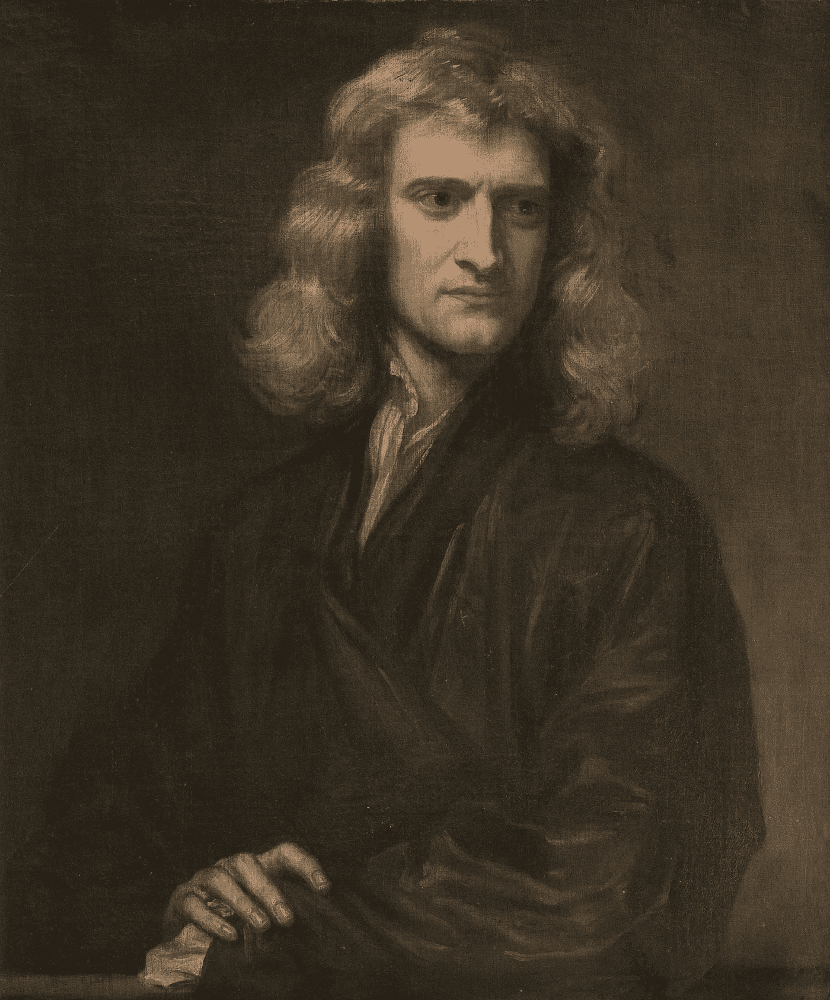
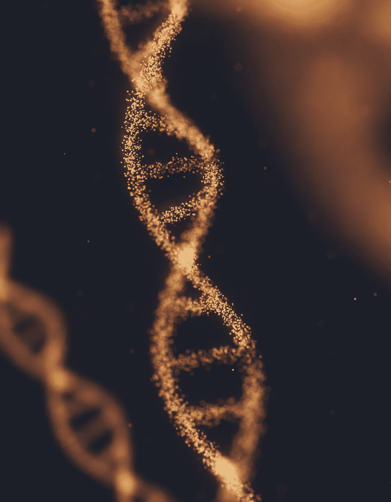
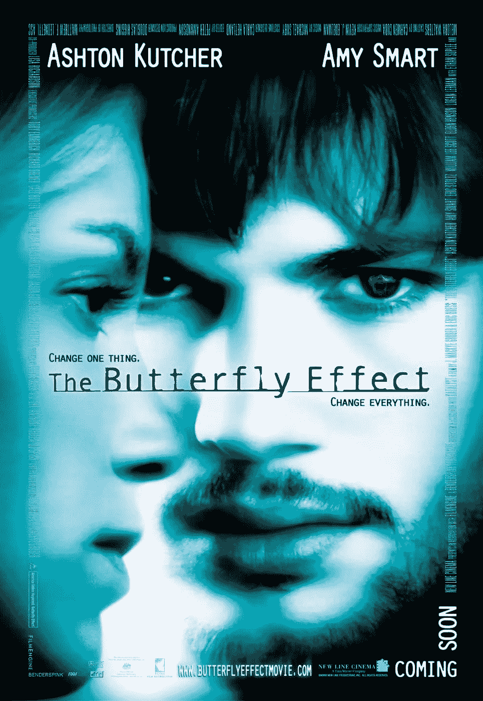

# 如何改变世界？！有弥赛亚情结的人的袖珍指南

> 原文：<https://medium.com/geekculture/how-to-change-the-world-pocket-guide-for-people-with-a-messiah-complex-dd2d16bb92a?source=collection_archive---------11----------------------->

Photo by [Clark Tibbs](https://unsplash.com/@clarktibbs?utm_source=medium&utm_medium=referral) on [Unsplash](https://unsplash.com?utm_source=medium&utm_medium=referral)

年轻的时候，我曾经认为，如果我想真正改变世界，我必须做一些真正大的事情。爱因斯坦发表相对论时所做的事情，或者牛顿发展了 T2 微积分，这是今天人工智能的数学基础。或者马斯克创立 SpaceX、特斯拉、Neuralink 的时候。伟人的想法非常浪漫，但远非完全真实。

*Isac Newton (https://en.wikipedia.org/wiki/Isaac_Newton)*

正如伊萨克·牛顿所说:

> 如果说我看得更远，那是因为我站在巨人的肩膀上

做大事从来都不是独角戏。爱因斯坦的相对论是建立在洛伦兹、麦克斯韦、牛顿和许多其他人的工作基础上的。没有他们，这个令人兴奋的关于空间和时间的理论永远不会诞生。

其他没人知道名字的人呢？激发这种伟大思想的老师和朋友，或者其他写了鼓舞人心的论文的科学家？

*Ideas are viruses that infect our minds (https://unsplash.com/photos/YQYacLW8o2U)*

思想是有生命的东西，就像感染我们思想的病毒。它们可以像活细胞中的 DNA 一样变异和交叉。这是一个真正的进化，我们的思想就是环境，就像思想生活的巨大森林。

我们的人类世界紧密相连。这是我们超越所有其他物种的原因。感谢万维网的魔力，如今这种联系是实时的。人类社会就像一个运行思想的巨型计算云。类似于训练神经网络的 GPU 集群，如 [GPT-3](https://en.wikipedia.org/wiki/GPT-3) 或[达尔-E](https://en.wikipedia.org/wiki/DALL-E) 。训练结束后，最终的重量显示在一台机器的存储器上，但这与这台机器是什么完全无关。结果是整个 GPU 集群计算出来的。每个节点都同样重要。

但是专利呢？它们公平吗？专利和版权制度激励发明。发明一样东西并获得专利就像在区块链上开采一块石头一样。没有奖励，系统就无法运行，但生态系统本身是由所有节点运行的。每个人都很重要。

从这个角度来说，开源社区更公平。你从社区中获益良多，你也可以回馈社会。当我说开源时，我指的是开放知识。那些写文章并免费提供的人，或者制作 YouTube 视频供大家学习的人，或者写维基百科文章的人也是社区的一部分。开放的知识是最有效的思想形式。

Butterfly Effect is a time-travel movie about how the butterfly effect works [https://www.imdb.com/title/tt0289879/](https://www.imdb.com/title/tt0289879/)

穿越电影最喜欢的主题是[蝴蝶效应](https://en.wikipedia.org/wiki/Butterfly_effect)。时间旅行者回到过去，改变了一个很小的细节。他做了一些看起来完全不相关的事情，但是这个小小的改变从根本上改变了未来。不要忘记，我们不断地在时间中从过去旅行到未来，我们所做的每一件事都会对未来产生巨大的影响，就像时间旅行者的行动一样。

最后的答案是什么？如何改变世界？

秘密是每个伟大的人都站在别人的肩膀上，每个伟大的发明都是由许多小发明创造而成的。我说的小，是指非常小的事情。

你在 Medium 上写了一篇关于深度学习基础的鼓舞人心的文章。成千上万的人阅读它，其中一个人因为你的文章而去上大学了解更多。几年后，这个人发明了一个人工智能系统，找到了治疗癌症的方法。成千上万的人治愈了癌症，多亏了这项发明，如果没有你的文章，这项发明将永远不会被发现。蝴蝶效应…

如何改变世界？做好事。你不必做大事，不必发明什么大事。帮助他人，教导他人，成为一名工程师并加入一家很酷的公司，贡献开源项目，或在 Medium 上写文章。每一件小事都会产生巨大的影响。去做吧！今天做一些酷的事情…