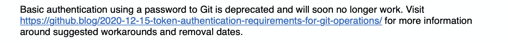
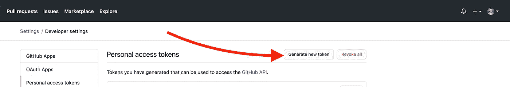
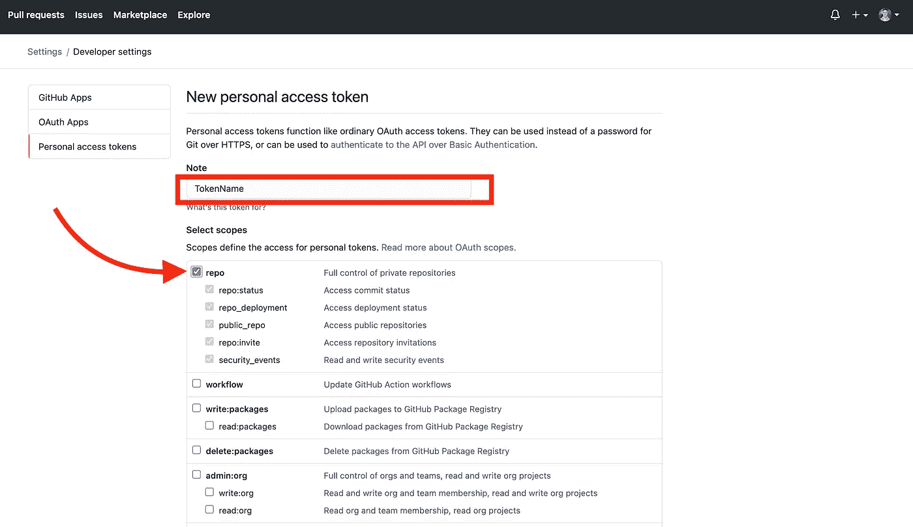
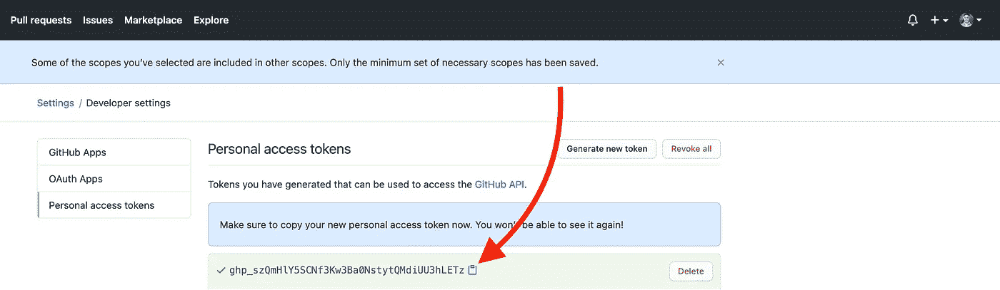
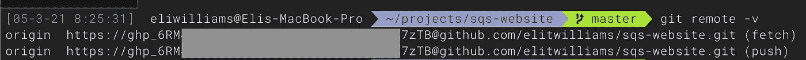

# 如何将您的 GitHub 远程认证从用户名+密码更改为个人访问令牌

> 原文：<https://medium.com/geekculture/how-to-change-your-github-remote-authentication-from-username-password-to-personal-access-token-64e527a766cf?source=collection_archive---------2----------------------->

The dreaded authentication deprecation notice

和我一样，你可能在最近推送你的 GitHub repo 后收到了上面的通知(文字如下):

> 使用 Git 密码的基本身份验证已被弃用，并将很快失效。请访问[https://github . blog/2020-12-15-token-authentic ation-requirements-for-git-operations/](https://github.blog/2020-12-15-token-authentication-requirements-for-git-operations/)了解有关建议的解决方法和删除日期的更多信息。

我发现官方文档有点混乱，所以经过一番挖掘，我发现以下步骤是将您的 GitHub git remote 从密码更新为个人访问令牌认证的最简单方法:

## 将 GitHub 远程身份验证从密码更改为个人访问令牌的分步指南

1.  **进入**[**https://github.com/settings/tokens**](https://github.com/settings/tokens)并登录
2.  **点击【生成新令牌】**，然后确认您的密码

3.**添加令牌名称**(如果您愿意，您可以使用命名约定来帮助跟踪谁拥有哪个令牌)**并选择您想要的范围/权限**。只需勾选**回购**框，即可实现基本回购读/写访问(见下文)。

4.向下滚动**，点击【生成令牌】**。

5.**点击蓝色剪贴板复制令牌**本身。保密！不要与任何您不想访问您的回购协议的人共享此令牌(出于演示目的，我在此示例中包含了完整的令牌，但后来我删除了它)。

6.现在本地更改您的遥控器。启动本地终端，进入本地回购目录。注意:如果需要**拆下旧遥控器**现在就拆；例如，运行一个`git remote remove origin`来移除`origin`遥控器。

7.**按照以下格式添加您的新遥控器**:
`git remote add origin https://<TOKEN>@github.com/<USERNAME>/<REPO>.git`

8.现在**运行** `**git remote -v**`，你应该会看到这样的内容:

就是这样！现在尝试**按下测试提交**以确保一切正常，GitHub 警告应该停止。

如果你觉得这很有帮助，请考虑在 Twitter 上关注我的类似内容。