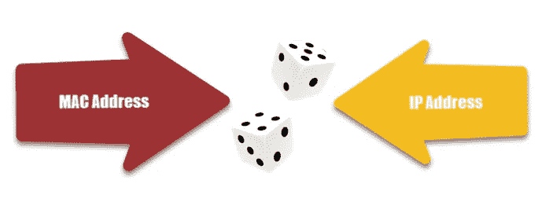
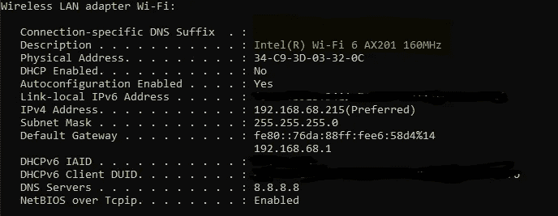
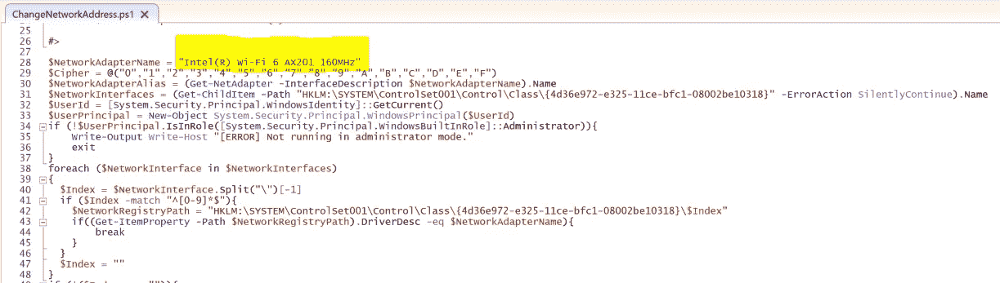
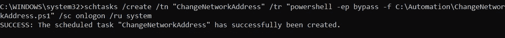

# 如何自动更改您的本地网络地址(IP/MAC)？

> 原文：<https://medium.com/geekculture/how-to-change-your-network-address-ip-mac-automatically-fac78c734c35?source=collection_archive---------17----------------------->

Image Credit: [https://www.guru99.com/difference-between-mac-address-and-ip-address.html](https://www.guru99.com/difference-between-mac-address-and-ip-address.html)

本地网络地址(IP 和 MAC)是我们连接到路由器时留下的信息痕迹。乍一看，这些信息似乎是无害的，因为它没有透露任何个人信息。然而，如果您连接到不可信网络，这可能是危险的，黑客可以执行中间人(MITM)攻击来识别您的计算机，监控您的网络行为，并发现您的身份。

因此，定期更改您的本地网络地址是一个很好的做法，这样可以淡化您的网络痕迹，使别人更难跟踪您，从而提高您的安全性和数据隐私。

由于网络配置对于非技术人员来说可能具有挑战性，所以我创建了一个 powershell 脚本来为您自动完成这项工作(Windows 操作系统)。

现在，我将指导您完成设置过程(大约 3 分钟)。

**第一步:下载 Powershell 脚本**

[https://gist . github . com/ohyi cong/91 ce 75 F5 b 065 F6 bb 77910 e 9518 B7 a 89](https://gist.github.com/ohyicong/91ce75f5b065f6bbe77910e9518b7a89)

**第二步:找到您的网络适配器全名**

用管理员权限打开命令提示符。

键入命令:ipconfig /all

Your network adapter full name can be found in the description

**第三步:编辑脚本**

在脚本中，使用您的网络适配器全名重新分配变量`$NetworkAdapterName`,并将其保存为 ChangeNetworkAddress.ps1

**第四步:运行脚本**

用管理员权限打开命令提示符。

键入命令:powershell -ep bypass -f 

**程序逻辑**

对于那些感兴趣的人，这里有一个程序逻辑的简要总结

1.  检查脚本是否在管理员模式下运行
2.  查找网络适配器注册表路径
3.  生成一个 00–00–00–00–00 到 FF-FF-FF-FF-FF-FF 之间的随机 MAC 地址
4.  在网络适配器注册表路径中重新分配 MAC 地址
5.  生成一个介于 xxx.xxx.xxx.100/24 到 xxx.xxx.xxx.250/24 之间的随机 IP 地址
6.  通过 ping Microsoft beacon 服务，检查随机 IP 地址在网络中是否可用
7.  使用 netsh 命令重新分配 IP 地址

**结论**

恭喜你！通过定期更改本地网络地址，您已经改善了网络安全卫生。现在，在内部网络中，有人很难跟踪和识别您的计算机。

如果你想提高你在互联网上的匿名性，你可以考虑使用 VPN 服务来覆盖你的外部网络痕迹(即 NAT 之外)。

一定要把这篇文章分享给你的朋友，帮助他们！