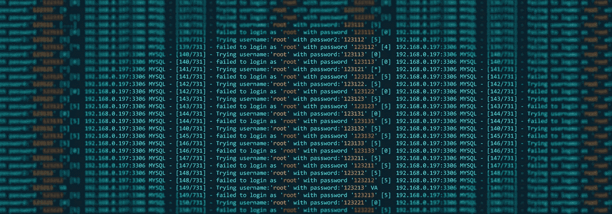
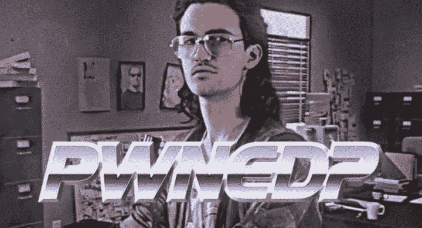

# 如何选择难以破解的密码

> 原文：<https://medium.com/geekculture/how-to-choose-a-password-thats-hard-to-crack-12aa8016309f?source=collection_archive---------34----------------------->

## 不，“公司名称+ 123”可能不是最好的密码

一个好的密码通常是你重要网络服务的第一道也是唯一一道防线。选择一个强而易记的密码可能会很麻烦，因为这两个标准并不总是一致的。人们很容易重复使用旧密码，稍微修改一下，甚至把它写在电脑的文本文件中。

在本指南中，我们将向您展示如何选择一个好的密码，如何记住它，以及糟糕的密码是如何容易被黑客攻击的。

# 良好密码安全的 10 条规则:

## 使用长密码

黑客使用特殊程序猜测密码；这种技术被称为“暴力攻击”，破解三个字符的密码不到一秒钟。不要使用少于 8 个字符的字符，如果可能的话，尽量使用 12 个字符以保证安全。

一个好的经验法则是使用**“8–4 规则”:** *最少 8 个字符，1 个小写，1 个大写，1 个数字和 1 个特殊字符(8，a+B+3+@=4)。*

## 使用无意义的短语

避免在任何语言中使用真实的字典单词，避免倒着拼写字典单词。尽量使用语法不正确的单词，使用自己记得的拼写；这使得它们更难破解。

你可能有一些只有你和你的朋友使用的有趣的拼写，这是一个很好的词。不要使用网上流行的拼写错误；不要用模因中的词。

## 包括数字、符号、大写字母和小写字母

这又是“8-4 法则”。你弄得越乱，计算机就越难猜到。你可以用数字零代替“O ”,或者用“@”代替字母“A”。

## 不要使用个人信息

容易被发现的信息，如你的生日、周年纪念日、地址、出生城市、高中、亲戚和宠物的名字，都不应该包含在你的密码中。

## 不要重复使用密码

当发生大规模攻击和黑客入侵系统时，被入侵的电子邮件地址和密码列表通常会在网上泄露。其他黑客将使用这些登录凭证，因为许多用户并不知道这一漏洞，并且经常在不同的服务上重复使用密码。这就是为什么你不应该重复使用密码。

## 不要告诉任何人

这应该不用说，但人们仍然出于懒惰而这样做。不要把你的密码给任何人，也不要在别人看得见的地方输入你的密码。不要把你的密码写在你电脑旁边的便利贴上；就像乞求被黑一样。

## 更改您的密码

您的信息越敏感，您就应该越频繁地更改密码。例如，你的谷歌或脸书密码应该至少每年更改一次，并且永远不要重复使用。

## 尽可能使用 2FA

2FA 是[“双因素认证”](https://en.wikipedia.org/wiki/Multi-factor_authentication)的缩写，是你可以为谷歌或脸书等更敏感的网络服务启用的第二层安全。例如，在 Gmail 上启用了 2FA，用户像往常一样用自己的用户名和密码登录，然后一个代码被发送到用户的手机，在登录完成之前需要验证该代码。由于超过 80%的人在多个服务中使用相同的密码，启用 2FA 对于阻止黑客至关重要。

## 不要在你的电脑上写下你的密码

你应该写下你的密码；你只需要用笔和纸。在你的电脑或移动设备上写下密码是一个非常糟糕的主意，这就像乞求被黑客入侵一样。如果黑客可以破坏您的设备，他可以很容易地找到您的密码，如果存储在设备上。

## 使用密码管理器

对所有网站使用不同的密码并定期更换密码很容易变得难以管理。解决这个问题的好办法是密码管理器；这是一个应用程序，可以记住你所有的密码，并自动登录到你的服务。你所有的密码都存储在这个应用程序中，并受到主密码的保护，这是你登录所有服务时需要记住的唯一密码。

一个好的和强烈推荐的密码管理器是 **KeePassXC**

*   开源和审计
*   使用现代非 NIST 密码(氩 2 KDF，查查 20)(对不起，美国国家安全局)
*   最小的攻击面(只有谷歌零计划的密码经理塔维斯奥曼迪推荐)
*   免受打破安全平衡的商业压力

下载:【https://keepassxc.org/download 

# 密码是如何被破解的？

黑客根据情况和要破解的密码类型采用不同的技术。如果是可以离线破解的密码，他们会使用暴力攻击或字典攻击；如果是在线密码，他们会使用网络钓鱼。

*A brute using force.*

## 暴力攻击

一个[暴力攻击](https://www.cloudways.com/blog/what-is-brute-force-attack/)适用于长度不超过 8 个字符的较短密码；它本质上只是一个猜测密码直到猜对为止的程序。这是用来破解密码的最古老的方法之一，但在适当的情况下仍然有效。一名黑客在 2012 年使用 25 个 GPU 集群破解了任何 8 个字符的 Windows 密码，每秒钟能够进行 3500 亿次猜测。

## 字典攻击

暴力攻击尝试符号、数字和字母的每一种组合，而[字典攻击](https://privacycanada.net/attack-vectors/dictionary-attack/)则尝试在字典中找到预先安排好的单词列表。由单个英文单词组成的密码很容易被猜到，甚至在单词后面加上数字也不够。从字典攻击中幸存下来的唯一方法是使用不常用的单词、拼写错误以及不止一个单词，最好是八个。

## 网络钓鱼

[网络钓鱼](https://www.khanacademy.org/computing/ap-computer-science-principles/the-internet/cybercrime-and-prevention/a/phishing-and-passwords)是一种社交工程攻击，黑客伪装成受信任的实体，诱骗用户泄露他们的登录信息。通常，黑客会向目标发送网络钓鱼电子邮件，声称他们的某些服务有问题，需要采取措施。电子邮件通常会将用户导向一个链接，该链接指向一个看起来与用户原始服务(银行、电子邮件等)一模一样的欺诈网站。一旦用户输入了他们的信息，这些信息就会被窃取。

## 泄露的密码

在[大数据泄露](https://www.cnet.com/news/2019-data-breach-hall-of-shame-these-were-the-biggest-data-breaches-of-the-year/)之后，这些泄露的信息通常被泄露到网上供其他黑客使用。这些数据库包含许多最大的在线服务的数十亿黑客用户名和密码，对大多数人来说，这没有被注意到，所以他们一直使用相同的密码。使用这些数据库，黑客可以自动循环所有以前被黑过的密码，而且更多次；他们找到了匹配。这就是为什么更改密码如此重要；可能已经泄露了。

# 密码示例:

## 严重的

ilovelamp
donalthedrumpf
kitty
Susan
水母
usher

## 行

il0 velamp
Donald 7 hedrumpf
1 kitty
Susan 53
jelly 22 fish
！引导

## 好的

il0v 3 lamp
D0n @ LD _ 7 H3 _ Drumpf
1ki 77y
. Susan 53
jelly 22 fi $ h
！ush3r

# 检查你是否被黑了

为了检查你的账户是否被黑客入侵，有网络服务将泄露的信息收集到可搜索的数据库中。如果你发现一个帐户被黑客入侵，你应该立即更改所有使用它的服务的密码。

[https://haveibeenpwned.com](https://haveibeenpwned.com)

[https://www.avast.com/hackcheck](https://www.avast.com/hackcheck)

原文可以在 Bitidentify 的博客上找到:[https://www . bit identify . com/Blog/how-to-choose-a-password-thas-hard-to-crack/](https://www.bitidentify.com/blog/how-to-choose-a-password-thats-hard-to-crack/)