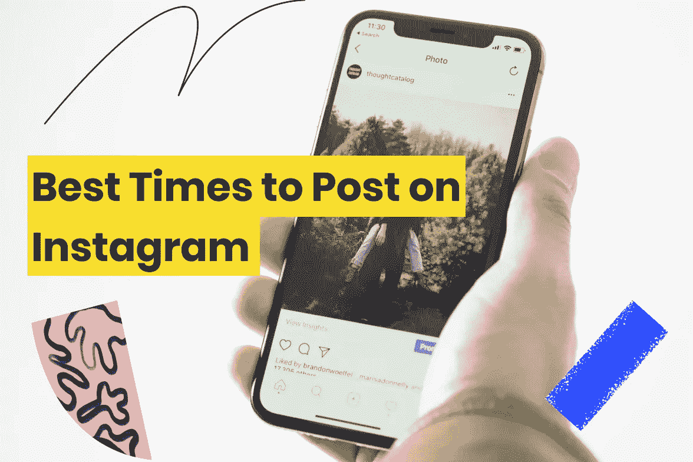

# 如何选择在 Instagram 上发布的最佳时机？

> 原文：<https://medium.com/geekculture/how-to-choose-the-best-time-to-post-on-instagram-c03026fead2?source=collection_archive---------17----------------------->

你已经准备好上传一篇完美的 Instagram 帖子，并附上标题，让观众想看更多。但是等等！你贴的时间对吗？是啊！如果你的内容持续且及时地发布，那么在社交空间上推送内容也很重要。

毫无疑问，Instagram 被用作一种娱乐方式，但后疫情时代，它已成为一个宏伟的营销平台。如果你是企图突破 Instagram 冰山的梦想家之一，那么这个地方就是为你准备的！这里有一条信息，让你找到发布内容的理想时间。

所以，在你开始起草标题和跟上最新趋势之前，你应该试着探索一下在 Instagram 上发布的**最佳时间。请继续阅读，了解更多信息:**

**目录**

*   *在 Instagram 上发帖有最佳时间吗？*
*   *在 Instagram 上发布的最佳时间是什么时候？*
*   *在 Instagram 上发布卷轴的最佳时间。*
*   *包装完毕*

# 在 Instagram 上发帖有没有最佳时机？

你的 Instagram 受众什么时候最活跃？不管多少营销天才都琢磨过这个问题。这个问题没有“谁”的答案。为什么？因为每个品牌在 Instagram 上发布的理想时间略有不同，因为每个品牌针对的是不同行为模式的不同受众。为了找出你在 Instagram 上发布的最佳时间，你还必须考虑你的品牌产品的利用能力、产品的性质和你的利基社区。

除此之外，明确你在 Instagram 上的营销目标也很重要。你在 Instagram 上的目标是什么？你有增加参与度、增加流量或提高知名度的具体目标吗？成功是什么样子的，你的帖子以前经历过这样的成功吗？你以前的成功将成为以后成功的重要基准。

你现在知道了，坚持张贴是有帮助的。现在让我们来看看什么是在 Instagram 上发布信息的最佳时机:

## Instagram 上发布的最佳时间是什么时候？

你可能希望通过这篇文章得到一个明确的时间。不幸的是，生活并不简单——必须考虑太多的变量。例如，你的发帖日期也很重要。你可能会惊讶地发现你的 Instagram 参与度有所变化，甚至是在一周的不同天的同一时间。

你可能会在周一早上 5 点看到你的观众在关注你的内容。然而，这可能不是周末的情况，因为对大多数人来说这是一个休息日。因此，您可以相应地制定发布计划。

此外，充分利用时区。不一定是你的受众分散就局限在一次性区域。利用适当的时间来满足他们的需求。例如，假设你的见解显示你有一个来自美国的读者，那么你应该根据他们的时区来发帖。

## 如何确定在 Instagram 上发布对你的企业最有利的时机？

很有可能，你正在寻找这个问题的答案，因为你想在你的初级职位上获得最大的参与度。而且理由很充分。保持这个因素，你将能够为你的账户确定理想的发帖时间:你在平台上活跃的最大数量的追随者是什么时候？因此，使用这些信息作为指南。让我们回顾一下决定何时发布的每个阶段。

*   使用 Instagram 的内置分析来确定您的受众何时在线。

转到*Insights*→*Audience*并向下滚动，你会看到你的粉丝在 Instagram 上一周的哪几天以及大约什么时候最活跃。事实上，这类指标非常适合微调您的内容策略！

*   安排一个时间表来检验你的假设。

同样，在弄清楚你的受众最有可能在线的时间后，接下来的事情就是尝试不同的发帖时间，以确定最佳的发帖时间。

例如，如果你的读者在下午 6 点到 9 点之间在线，那么就在这段时间发帖。之后，跟踪你的内容的活动。现在请在下周的不同时间发表文章来阐述你的理论。这是一项乏味的任务，但一旦你掌握了窍门，从长远来看，这将对你有所帮助。

*   分析并找出你的内容的最佳时机。

随后，测试你的 Instagram 发布时间表。你会知道哪种类型的内容会引起你的关注者的共鸣。

例如，您正在推广一个 URL 缩短应用程序。也许你的晚间帖子得到了赞和评论。尽管如此，当你在午夜发帖时，与内容的互动减少了，即使你的大多数追随者都在线。你可以试着在这个时候发布不同的内容，看看你的深夜听众会有什么反应。

简而言之，继续优化你的时间表，制定一个方便的时间表，这将有助于你了解你的观众参与度。

Instagram 卷轴是目前最热门的东西。事实上，他们正在成为未来几年影响者和品牌营销策略的重要组成部分。想知道在 Instagram 上发布视频的**最佳时间**？

## 在 Instagram 上发布“**卷轴**的最佳时间

比起长视频，人们更喜欢短格式的视频。因此，Instagram 卷轴现在风靡一时。然而，仅仅因为消费简单并不意味着创造简单。实际上，制作卷轴可能需要大量的时间。如果你投入时间开发一段内容，你希望以观众喜欢的方式发布。换句话说，时机至关重要。

每个品牌和企业根据他们的参与度发布帖子。如果，比方说，你的观众下午 4 点左右在线；然后你可能会在那个时候发布你的内容。这将增加您在平台上的品牌知名度和认知度，以获得最大的参与度。

**为此，你需要知道**

*   你的观众在哪里？
*   你的观众什么时候参加？
*   你有什么独特的内容提供给他们？

一旦你能回答这些问题，你就相对更容易联系到你现有的追随者，并获得更多的追随者。

**包装完毕**

既然你已经知道了在 Instagram 上发布帖子的**最佳时间，**就尽情享受这些知识的全部好处吧。当然，提前几个小时发布可能不会显著增加你的收视率。但是，定期发帖会对你有很大帮助。

因此，您的受众将习惯于看到您的内容出现在他们的订阅源中，并更有可能参与其中。在 Instagram 上保持存在感有助于发展可信度、信任度以及与目标受众进行更有意义的互动。

最后，当你与你的观众建立了有机的关系，Instagram 的算法就会认出你。