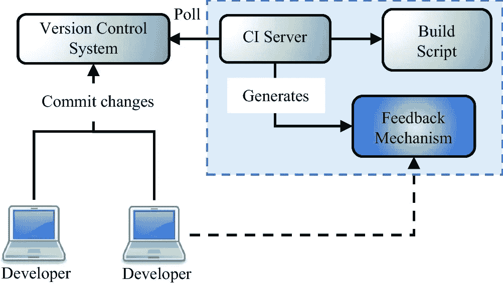

# 如何选择正确的持续集成(CI)系统

> 原文：<https://medium.com/geekculture/how-to-choose-the-right-continuous-integration-ci-system-5d61ded991aa?source=collection_archive---------13----------------------->

## 选择正确的竞争情报系统对每个产品的成功都很重要

CI system Image by SpringerLink

持续集成(CI)系统有三个主要类别。选择正确的 CI 系统对每个产品的成功都很重要。

1.开源竞争情报系统

2.商业供应商产品

3.SaaS 产品

让我从开源开始。有各种各样的开源 CI 系统，如；

建筑机器人，

特拉维斯·CI，

大步走，

GoCD，

詹金斯，

完整性等

但是 CI 开源的事实标准是 Jenkins。你下载软件，自己托管，无论是在本地还是在云中。

第二种选择是使用几家提供托管 CI 系统或在您自己的基础架构中运行的系统的商业供应商之一。

第三种选择是对 CI 使用 SaaS。这些受欢迎的产品是按使用付费或按月付费的 CI 解决方案。许多流行的工具，如 Circle CI 或 Travis CI，在 GitHub 中为公共项目提供了一个免费层或一个单独的私有回购。

您实现哪个系统将取决于您的；

项目，

预算和

组织对风险的偏好。

对于任何刚刚入门的人，我通常建议选择 SaaS 的公司。您可以快速开始使用 CI，而不必担心设置任何基础设施。然而，如果你在一个大的组织中，“我应该使用哪个系统”，这个决定可能已经为你做好了。别担心。请记住，CI 是一种实践，而不是一种工具。不管你用的是什么系统，都是关于实现的。

现在，在使用 CI 系统时，有几个重要的原则和实践需要考虑。

## **从干净的环境开始**

首先，从一个干净的环境开始。每个构建都应该是一张白纸。CI 系统通常使用工作区或容器的概念来维护构建之间的隔离，从而实施保护。在磁盘上维护前一次运行的状态或者写入系统环境变量似乎是一个好主意，但是您可能会想要抵制这种做法。每次我看到这个，它最终都会引起问题。

## **打造通过咖啡测试**

我推荐的另一个实践是，构建通过咖啡测试。从代码提交到收到结果，所花的时间应该相当于一个人喝杯咖啡然后回到办公桌前所花的时间。这就是为什么我总是建议你拍摄五分钟或更少。这将需要团队的承诺，只要测试和构建随着时间的推移变得缓慢，就要花时间来完善它们。

## **确保你首先在本地运行所有的测试**

说到团队，我发现当使用持续集成时，有一些好的指导方针是大多数团队需要同意的。你可能对你的团队有额外的需求，但是这些应该会为你打下一个良好的基础。在提交代码之前，确保在本地运行所有测试。当您提交一些代码时，您的构建通过了，这并不奇怪。CI 系统不能代替在您的开发机器上进行本地测试。

## **永远不要让构建中断**

其次，不要将代码提交到已经损坏的构建中，除非您正在修复问题，否则会使问题复杂化。另一个团队承诺是，永远不要让构建崩溃。这总是适用的，但对于分布式团队更为重要。如果你破坏了构建，你要修复它。在周末离开之前，不要将代码放入系统中，除非确保构建通过，并且您将它部署到产品中。由此得出的结论是，不要删除失败的测试。现在，这应该是不言而喻的，但是我已经见过无数次了，当一个构建被破坏时，测试并没有修复问题，而是被静音了。永远都不会好的。如果一个测试不再有效，那么它应该基于产品功能的改变而被删除，而不是由于它的失败或通过状态。

## **确保构建通知集成到您的聊天工具中**

让我们花点时间来谈谈通知。现在，在设置 CI 时，我们喜欢将关于构建的消息放在我们的聊天工具和监控系统中。在工作中，我们的聊天工具 Slack 中的通知是为生成的；

代码提交，

构建开始，

构建完成，

部署到暂存，以及

部署到生产。

如果代码被取消部署超过一个小时，也会为此发送一个通知。对于大多数这些事件，我们还在我们的监控工具 Datadog 中发出一个事件。这样，我们就可以将错误与代码变更联系起来。大多数 CI 系统都集成了主要的聊天操作平台和监控工具，但是如果有任何理由切换到不同的工具，这可能是一个。