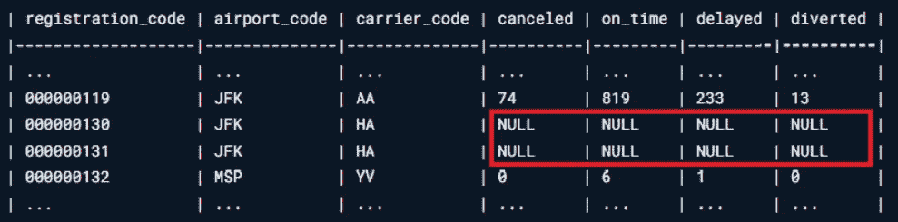
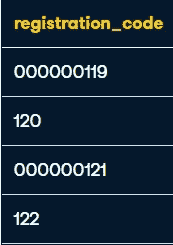
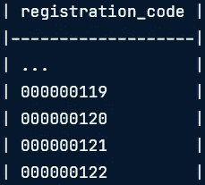

# 如何清理 SQL Server 中的数据

> 原文：<https://medium.com/geekculture/how-to-clean-data-in-sql-server-76a4103010a?source=collection_archive---------8----------------------->



在本周的博客中，我想进一步发展我的 SQL 技能。我想关注的一个话题是如何处理杂乱的数据，以及如何恰当地清理这些数据。维护干净的数据是数据科学过程的重要组成部分。它允许方便地导航和探索数据，以便进一步分析。

为了更多地了解 SQL 中的数据清理，我参加了 DataCamp 的*“清理 SQL Server 数据库中的数据”*课程。在课程中，我学习了如何处理不正确的字符串值、丢失或重复的值、转换数据类型等等。本课程主要使用的数据集基于 2014 年和 2015 年美国航空公司月度航班。

# 清洁琴弦

## 前导零

我必须处理的第一个练习是用前导零填充数字。在提供的数据集中，我们有一个名为`registration_code`的列，它包含不同格式的值。



Sample of registration_code column values

列中的某些值只包含三位数，但正确的格式是九位数。为了修复缺少数字的值，我们需要向缺少零的值添加前导零。我们利用了`REPLICATE()`和`CONCAT()`函数。

```
SELECT 
CONCAT(REPLICATE('0', 9 -LEN(registration_code)), registration_code) AS registration_code
FROM flight_statistics
```

`REPLICATE()`函数将一个字符串重复指定的次数。对于只有三位数的值，我们需要添加六个零。通过使用 `LEN()`获得值的长度，我们可以从 9 中减去该长度，并获得我们需要添加的前导零的数量。然后，我们将该零字符串与原始值连接起来，并且我们已经修复了该列的格式。另一种方法是使用`FORMAT()`功能。

```
SELECT FORMAT(CAST(registration_code AS INT), '000000000') AS registration_code
FROM flight_statistics
```

`FORMAT()`函数将用指定的格式格式化一个值。我们将我们的`registration_code`转换成一个整数，然后重新格式化它，使它由九个数字组成。任何不是九位数字的值都将被格式化为用零来填充缺失的数字。



Fixed format of registration_code column

## 杂乱的琴弦

字符串的一个常见错误是额外的前导和尾随空格。`airport_name`列的一些值有多余的空格。这可以通过使用`TRIM()`函数来解决，该函数从字符串的开头和结尾删除一个指定的字符。在早于 2017 年的 SQL Server 版本中，我们使用`RTRIM()`和`LTRIM()`，其中`RTRIM`删除尾随空格，`LTRIM` 删除前导空格。

```
SELECT airport_code, TRIM(airport_name) AS airport_name, airport_city, airport_state 
FROM airports
```

在某些情况下，我们可能在一个列中使用不同的字符串值来表示相同的值。假设我们想查询数据集，只找到位于芝加哥市的机场。在`airport_city`列中，芝加哥被表示为`‘Chicago’`或缩写，如`‘CH’` 或`‘ch’`。为了便于分析，我们希望找到一种方法将这些情况合并成一个单一值。

假设在前面的例子中，我们只希望拼出城市名。为了替换不正确的值，我们使用了`REPLACE()`函数。`REPLACE()`将用我们指定的另一个子字符串替换一个子字符串的所有实例。我们的第一反应是将所有“CH”替换为“Chicago ”,但这会带来一个问题，因为这会将“Chicago”变成“Chicagoicago”。最好的方法是使用一个`CASE`语句，只替换不是“Chicago”的值。

```
SELECT airport_code, airport_name,
    CASE
        WHEN airport_city <> 'Chicago' THEN REPLACE(airport_city, 'ch', 'Chicago')
        ELSE airport_city
    END AS airport_city,
airport_state
FROM airports
WHERE airport_code IN ('ORD', 'MDW')
```

# 缺失和重复的数据

## 缺失数据

在某些情况下，我们的列中可能会缺少值。发生这种情况有多种原因，例如故意缺少值或输入数据时出现错误。在处理丢失的数据时，您有许多选择。我们可以选择保留缺少值的行，从查询中删除它们，或者使用其他值作为替换值，例如该列的平均值。

如果我们想简单地选择列值没有丢失的所有行，我们需要在查询中添加`WHERE column_name IS NOT NULL`。如果我们想找到该列中缺少值的行，我们可以使用`IS NULL` 。

```
SELECT *
FROM airports
WHERE airport_city IS NOT NULL
```

如果值实际上不为空，但有一个值，如空格或“未知”，该怎么办？在查询的`WHERE`子句中，我们可以使用`<>`或`=`来隔离我们想要的行。如果我们知道空格被用于空值，我们可以选择 airport_city 不是空格的行作为`airport_city <> ‘’`。

```
-- Exclude the rows where airport_city is missing
SELECT *
FROM airports
WHERE airport_city <> ''
```

我们可能不需要排除具有空值的行。然而，为了进一步进行，我们不能在这些列中有`NULL`值。假设我们想使用`‘Unknown’` 作为包含空值的列的占位符值。为了替换这些空值，我们使用`ISNULL()`，并声明要替换的字符串是`‘Unknown’`。

```
SELECT airport_code, airport_name,
ISNULL(airport_city, 'Unknown') AS airport_city,
ISNULL(airport_state, 'Unknown') AS airport_state
FROM airports
```

现在假设我们想要创建一个名为`location`的新列。为了生成该列中的值，我们希望从多个列中提取第一个非空值，首先从`airport_city`中提取，然后从`airport_state`中提取。如果两列中都有空值，我们将返回字符串‘Unknown’作为`location`的值。我们将使用`COALESCE()`，它将返回第一个非空的结果。

```
SELECT airport_code, airport_name, airport_city, airport_state,
COALESCE(airport_city, airport_state, 'Unknown') AS location
FROM airports
```


Sample result from query above. Note how COALESCE works with the null columns.

## 重复数据

重复数据可能以多种形式出现。它可能只是重复的行，其中所有列的值都相同。也可能有这样的行，其中大多数列或只有少数列共享相同的值。为了帮助区分不明显的重复行，我们需要识别重复组。重复组由用于标识实体的唯一实例的列组成。对于此数据集，`airport_code`、`carrier_code`和`registration_date`被视为重复组，因为它们每月仅注册一次。

我们将使用`ROW_NUMBER()`函数来帮助识别重复的行。在`PARTITION BY`子句中，我们指定我们的重复组。的第一个实例的行号为 1，这意味着它是重复组列的特定组合的第一个实例。如果该重复组有多个实例，则它们的行号将根据先前标识的行数依次增加。

```
SELECT *,
ROW_NUMBER() OVER (
    PARTITION BY
        airport_code,
        carrier_code,
        registration_date
            ORDER BY
        airport_code,
        carrier_code,
        registration_date
    ) row_num
FROM flight_statistics
```

如果我们想单独识别非重复行，我们将调用前面的查询，通过只查找`row_num`为 1 的行来排除重复行。

```
WITH cte AS (
    SELECT *,
        ROW_NUMBER() OVER (
            PARTITION BY
                airport_code,
                carrier_code,
                registration_date
            ORDER BY
                airport_code,
                carrier_code,
                registration_date
         ) row_num
    FROM flight_statistics
)
SELECT * FROM cte
-- Exclude duplicates
WHERE row_num = 1;
```

# 转换数据类型

列数据类型对于确定我们可以对它执行什么操作很重要。例如，我们将不能在`VARCHAR`类型的列上执行比较或使用聚合函数。通过使用`CAST()`或`CONVERT()`函数，我们可以指定想要将列转换成什么数据类型。

```
SELECT AVG(CAST(num_ratings AS INT))
FROM series
WHERE CAST(num_ratings AS INT) BETWEEN 0 AND 5000
---------------------------------------------------------SELECT AVG(CONVERT(INT, num_ratings))
FROM series
WHERE CONVERT(INT, num_ratings) BETWEEN 0 AND 5000
```

## 日期格式

根据地点和语言的不同，日期可以有多种不同的格式。月/日/年、日/月/年和年/月/日只是我们可以用来表示日期的一些格式。如果我们希望将日期格式更改为另一种格式，我们将再次需要使用`CAST()`或`CONVERT()`。

```
SELECT CAST(registration_date AS DATE), 101) AS registration_date
FROM flight_statistics
WHERE CONVERT(VARCHAR(10), CAST(registration_date AS DATE), 101)
BETWEEN '01/01/2014' AND '06/30/2014'
----------------------------------------------------------------
SELECT FORMAT(CAST(entry_date AS DATE), 'dd/MM/yyyy') AS entry_date
from pilots
```

对于`CONVERT()`，我们通过对应于特定样式的整数来表示我们希望转换的样式。例如，如果我想将日期列转换成`mm/dd/yyyy`格式，我会使用`101`作为样式。在这个[链接](https://www.w3schools.com/sql/func_sqlserver_convert.asp)中可以找到日期可以转换成的格式列表。对于`FORMAT()`，我们用特定的参数指定我们想要的格式，比如短日期/长日期、天数、月数、年数的实际期望顺序，以及一个可选的语言参数。可用格式列表可在[这里](https://docs.microsoft.com/en-us/sql/t-sql/functions/format-transact-sql?view=sql-server-ver15)找到。

# 不准确的数据

我们在数据集中可能会遇到超出期望值范围的值。如果看到某人的身高被列为 400 英寸，或者某部电影在 10 分制中被评为 11 分，这是不正确的。如果我们知道这些值的预期范围，我们可以查询其中该列的值是范围的上限和下限的行。这同样适用于查找范围之外的行。我们可以使用关键字`BETWEEN` 或者任何比较操作符，比如`>, <, <=, >=`。

```
SELECT * 
FROM series
WHERE num_ratings >= 0 AND num_ratings <= 5000
```

这些是我学习如何在 Microsoft SQL Server 中清理数据的一些方法。这些技术为大多数情况提供了一个合适的起点，但是每种情况都是不同的。可能存在需要更复杂的编码或其他功能的情况。与往常一样，在确定处理脏数据的最佳方法时，使用您的最佳判断是至关重要的。现在，我觉得自己更能熟练地清理 SQL 中的数据，并期待在未来使用我所学到的东西。感谢您的阅读！