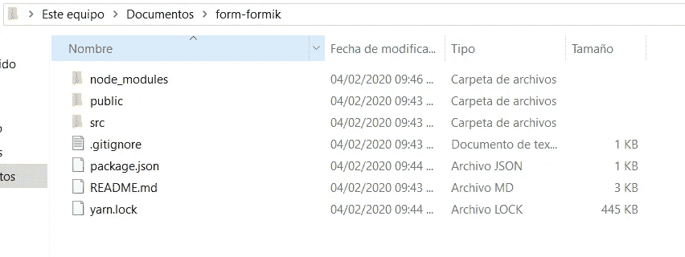
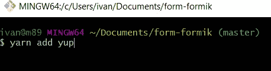
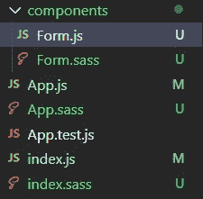
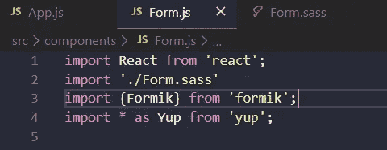
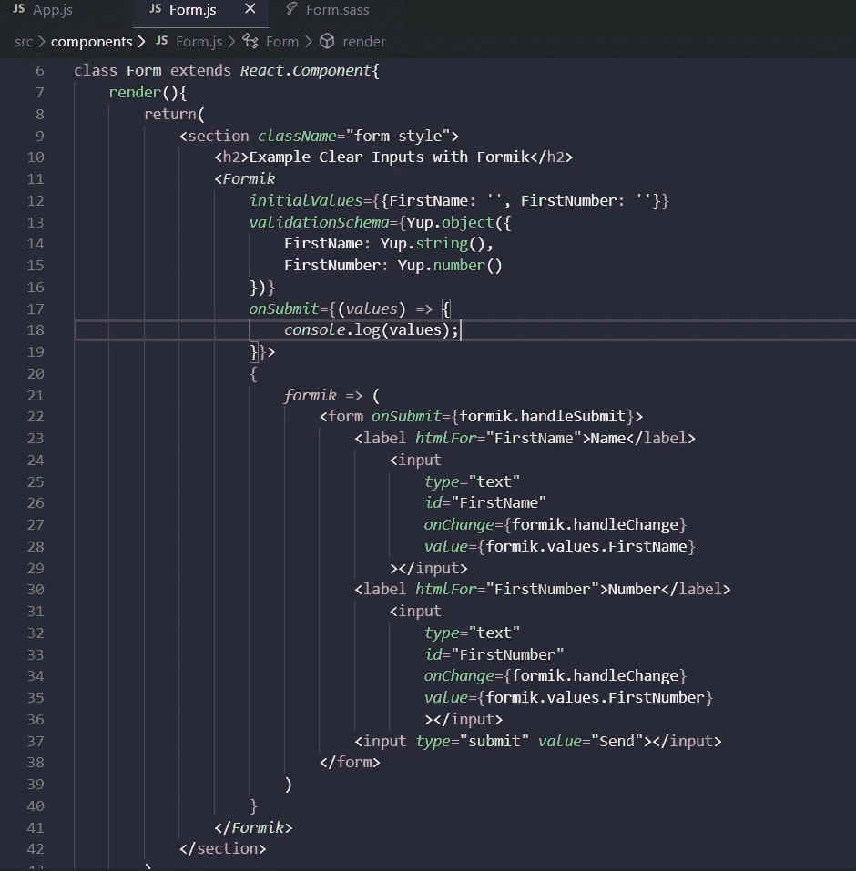
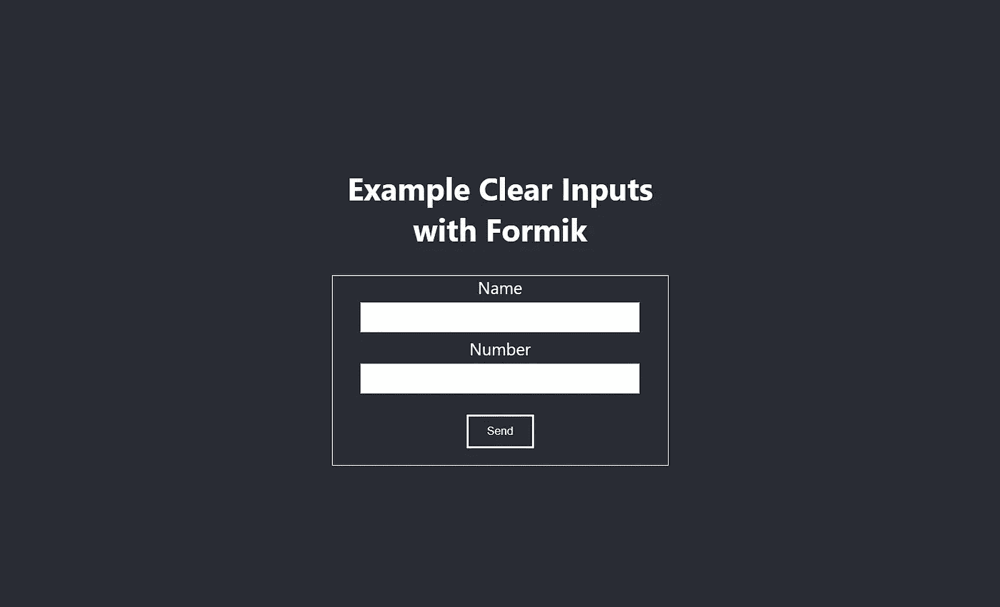
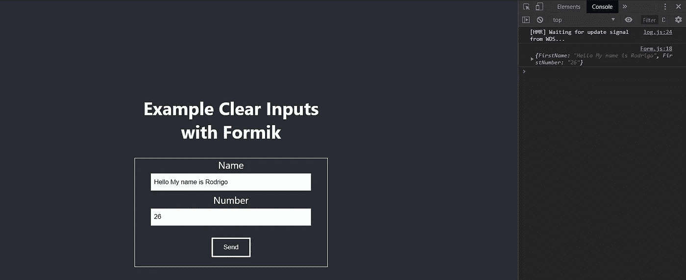
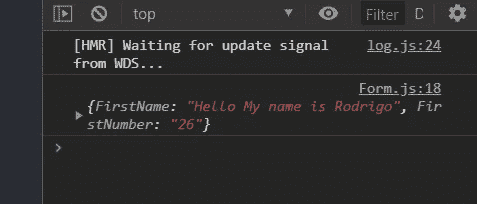
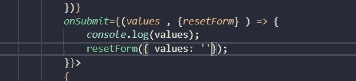
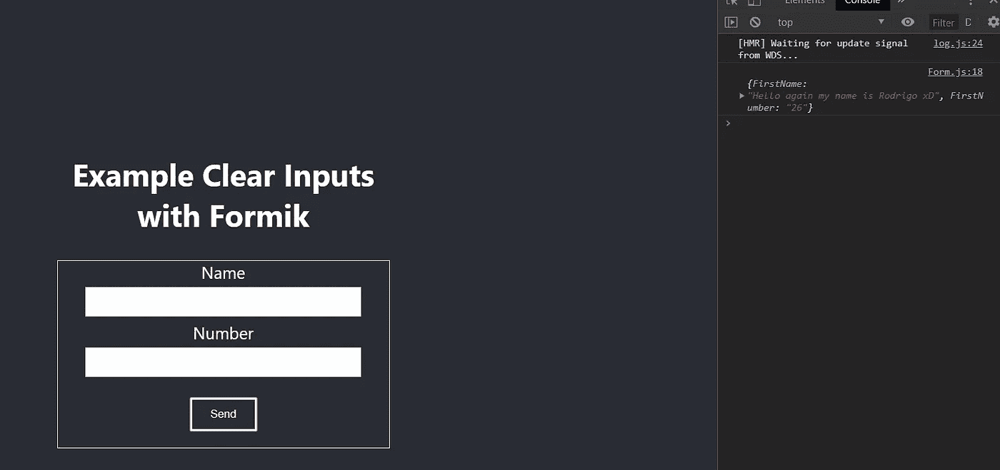

# 如何用 Formik React 清除输入表单或者提交后如何重置表单？Formik 反应

> 原文：<https://medium.com/geekculture/how-to-clear-input-form-with-formik-react-47a6ce27c0d9?source=collection_archive---------0----------------------->


Example clear inputs Formik

当我得到提交按钮时，我试图清除输入，但输入不清楚，我不得不搜索很多东西，最后我得到了它。

1.  -你必须创建自己的 React 应用程序
2.  安装 Formik 和 Yup
3.  创建您的表单
4.  使用 Formik 获取这些值
5.  用 Formik 清除输入

npx 创建-反应-应用程序表单-formik

如果你也看视频，视频里的答案在**分钟 5:00**

Video of how to clear inputs Formik after submit



安装 Formik 和 Yup


Adding formik



Adding yup

创建一个名为 components 的文件夹并创建一个 js 文件



Tree

创建自己的表单并导入 Formik 和 Yup



Importing Formik and yup

创建类或功能组件

```
create your initialValues your ValidationSchema your onSubmit
add your inputs (Id, onchange, Value) and add onsubmit to your form everything is on the documentation on Formik.
```



Code of a little Form in React with Formik

一点 Css



Visual Form in React with Formik

但是输入具有相同的值，并且它们没有被清除，但是我们有值。请靠近一点看控制台。



Output of the submit

再近一点



Output on console log Formik

最后一步是在提交时添加 resetForm 并调用它，将值更改为“”



Clear form with formik example

输入是清楚的



Example clear form


Console log output with the data

【https://jaredpalmer.com/formik/docs/tutorial】T3T5[https://github.com/rodrigofigueroa/clearinputsFormik](https://jaredpalmer.com/formik/docs/tutorial)

视频呢

[https://youtu.be/Ikg8sgvGGWM](https://youtu.be/Ikg8sgvGGWM)