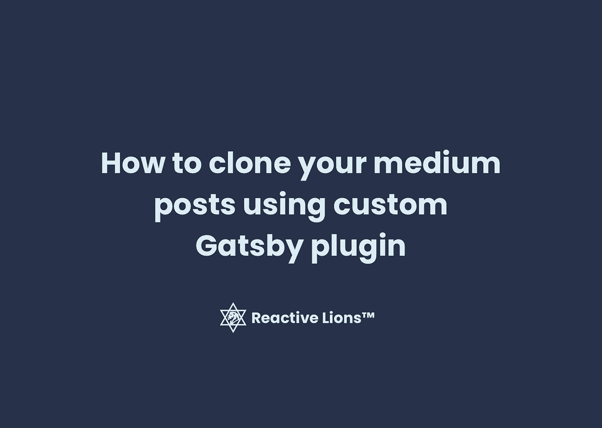
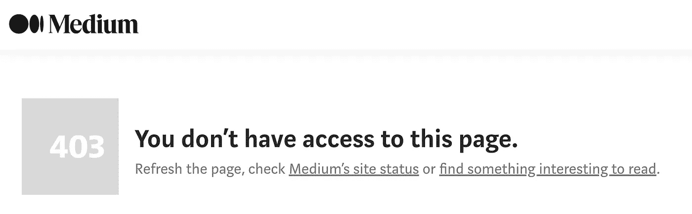
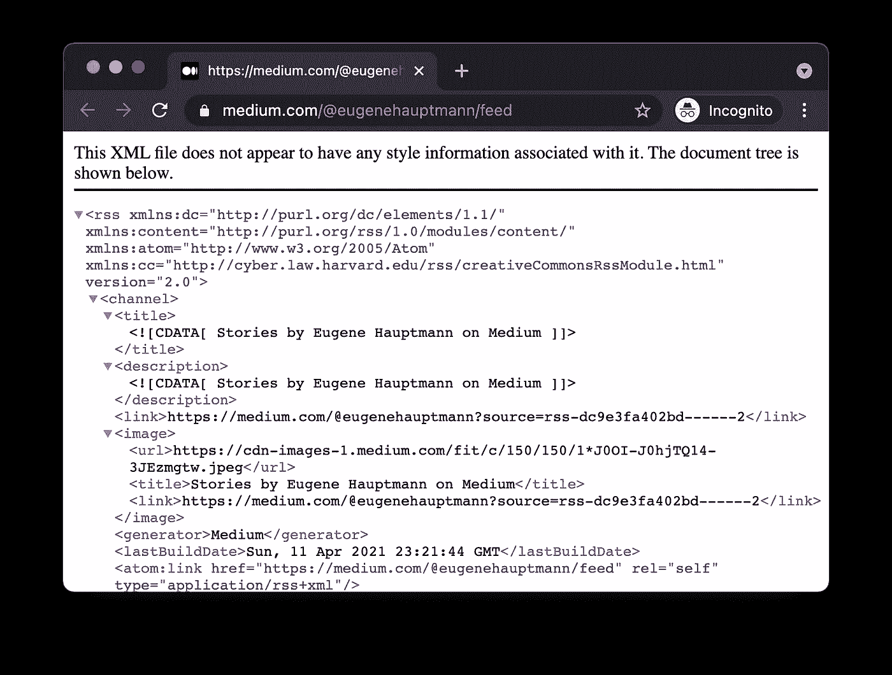
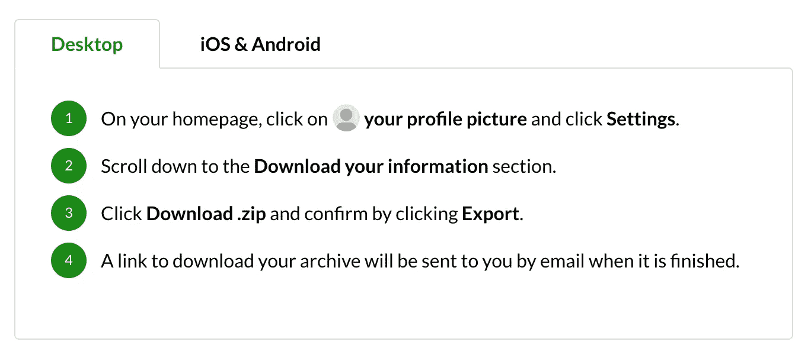
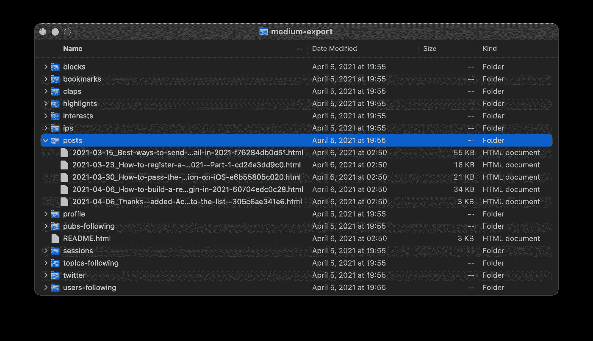
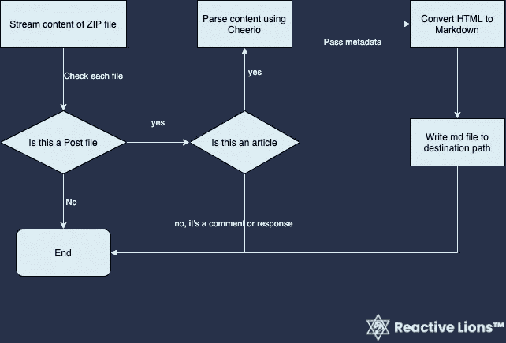
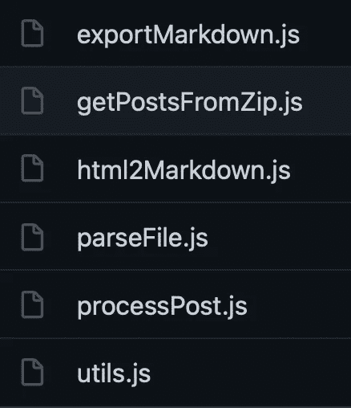
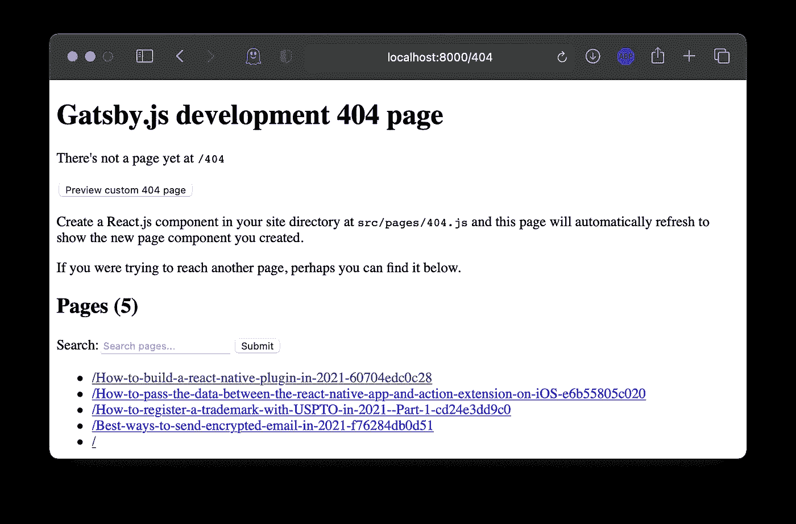
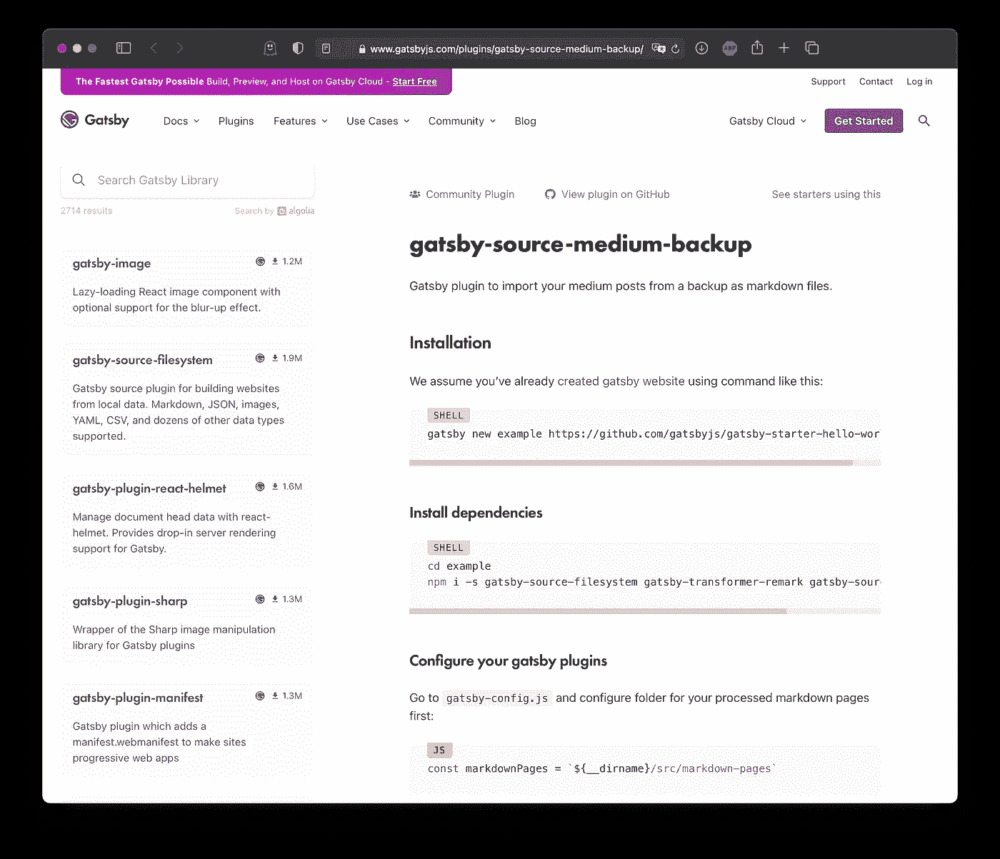

# 如何使用定制的 Gatsby 插件克隆你的中型文章

> 原文：<https://medium.com/geekculture/how-to-clone-your-medium-posts-using-a-custom-gatsby-plugin-81ea26d41096?source=collection_archive---------25----------------------->

## 通过媒体备份导出媒体文章并在你的 Gatsby 网站上重新发布的详细指南。



How to clone your Medium posts using a custom [Gatsby plugin](http://npmjs.com/package/gatsby-source-medium-backup)

## 动机

在[盖茨比的网站](https://www.gatsbyjs.com/)上有一个很好的[插件](https://www.gatsbyjs.com/plugins/)生态系统，其中几个解决了将你的媒体帖子放到你的盖茨比网站上的功能。然而，几乎没有一个允许你从你的媒介账户中复制整个帖子列表。

我们将分析现有的解决方案，并且我们将引入一个[新插件](https://www.gatsbyjs.com/plugins/gatsby-source-medium-backup/?=backup)来有效地做到这一点。



[Medium](https://medium.com/me/applications) stopped developing their API back in [2019](https://stackoverflow.com/questions/54457396/medium-applications-for-api-access-no-longer-available-to-free-users)

## 概述

1.  现有方法
2.  现有插件的优缺点
3.  2021 年媒介 API 及其状态
4.  获得中型帖子备份的解决方法
5.  构建新插件以导入媒体备份
6.  建立一个基本的 Gatsby 网站来导入生成的降价
7.  发布插件
8.  后续步骤

## 现有方法

通常，你会从 [Medium 的开发者门户](https://developers.medium.com)开始获取一些信息。这将引导您进入 [GitHub](https://github.com/Medium/medium-api-docs) 上的 API 文档。

最终，你会发现 Medium 支持 [RSS 提要](https://help.medium.com/hc/en-us/articles/214874118-Using-RSS-feeds-of-profiles-publications-and-topics)。



Example of the author’s feed [https://medium.com/@eugenehauptmann/feed](https://medium.com/@eugenehauptmann/feed)

从上面的页面中，你甚至可以找到一个 Medium 支持的 [WebSub(原 PubSubHubbub)](https://en.wikipedia.org/wiki/WebSub)API——http://medium.superfeedr.com/[。](http://medium.superfeedr.com/)

还有一个非官方的媒介 API—[https://medium.com/@eugenehauptmann?format=json&限制=100](/@eugenehauptmann?format=json&limit=100)

这里有一个[示例](https://gist.github.com/eugenehp/37f4f7a0a086379e0e2188a119746bcb)以 [JSONP](https://en.wikipedia.org/wiki/JSONP) 格式输出。和另一个 Python 实现[https://github.com/enginebai/PyMedium](https://github.com/enginebai/PyMedium)

另一种方法是使用类似于[木偶师](https://developers.google.com/web/tools/puppeteer)的东西来抓取 Medium 作者写的帖子。

最后一个，也是本文的重点— [从介质](https://help.medium.com/hc/en-us/articles/115004745787-Download-your-information)中导出您的所有数据。

**总结一下，现有的方法如下:**

1.  官方媒体 API—[https://github.com/Medium/medium-api-docs](https://github.com/Medium/medium-api-docs)
2.  官方媒体 RSS Feed—[https://help . Medium . com/HC/en-us/articles/214874118-Using-RSS-feeds-of-profiles-publications-and-topics](https://help.medium.com/hc/en-us/articles/214874118-Using-RSS-feeds-of-profiles-publications-and-topics)
3.  官方媒体 web sub API—[http://medium.superfeedr.com/](http://medium.superfeedr.com/)
4.  非官方媒体 JSONP API([https://github.com/enginebai/PyMedium](https://github.com/enginebai/PyMedium))
5.  手动废弃页面
6.  下载您的媒体数据—[https://help . Medium . com/HC/en-us/articles/115004745787—下载您的信息](https://help.medium.com/hc/en-us/articles/115004745787-Download-your-information)

## 现有插件的优缺点

不幸的是，上述大多数方法都有缺陷。原因如下:

1.  官媒的 API 不让你拉`Posts`只能[创建](https://github.com/Medium/medium-api-docs#33-posts)他们。
2.  RSS API 只返回最近的帖子，并且只给你每个帖子的要点，而不是完整的副本。
3.  WebSub API 也给你新添加的帖子的更新，而不是以前发布的。
4.  废弃会与[网络应用防火墙(WAF)](https://en.wikipedia.org/wiki/Web_application_firewall) 遇到同样的障碍。
5.  非官方的 JSONP API 比官方的 API 要广泛得多，但它被放在了 [Cloudflare WAF](https://www.cloudflare.com/waf/) 之后，而废弃 WAF 之后的网站是一件痛苦的事情。
    [Ping 我们](https://www.reactivelions.com/contact/)如果你需要帮助设置你的[云基础设施和 WAFs](https://www.reactivelions.com/services/#Cyber) 。
6.  下载你的介质备份解决了获取所有帖子副本的主要问题，但是这是半手工的。

## 2021 年媒介 API 及其状态

Medium API 团队在 [2015](https://blog.medium.com/the-medium-api-is-now-open-to-everyone-3f4642e5c850) 开了个好头，向所有人开放了他们的第三方应用程序流程。

不幸的是，他们在 2019 年[年初](https://stackoverflow.com/questions/54457396/medium-applications-for-api-access-no-longer-available-to-free-users)停止允许[的新应用](https://medium.com/me/applications)，没有事先宣布。那些幸运地事先注册的人仍然可以继续使用他们的应用程序和官方媒体 API，这些应用程序和 API 只对创建帖子有好处，而不是下载它们。

## 获得媒体帖子备份的解决方法



Medium gives you the ability to [export](https://help.medium.com/hc/en-us/articles/115004745787-Download-your-information) your personal data and posts as HTML files in a .zip archive.



Structure of Medium’s backup.

## 构建新插件以导入媒体备份

> Gatsby 是一个高速网站的现代网络框架。—[https://github.com/gatsbyjs/gatsby](https://github.com/gatsbyjs/gatsby)

在过去的 4 年里，我们一直在我们的[公司](https://www.reactivelions.com/)使用 GatsbyJS，它最终成为我们培训初级工程师的默认框架。

Gatsby 有很棒的文档和非常详细的教程，教你如何从头开始创建一个新的插件。你可以找到我们在 [GitHub](https://github.com/eugenehp/gatsby-source-medium-backup) 上构建的插件的源代码。

大多数业务逻辑调用位于`gatsby-node.js`中，入口点在`[onPreInit](https://www.gatsbyjs.com/docs/reference/config-files/gatsby-node/#onPreInit)`中。Gatsby 的架构允许你在[构建期间](https://www.gatsbyjs.com/docs/conceptual/overview-of-the-gatsby-build-process/)通过各种插件运行所有必要的业务逻辑。

为了让这个插件工作，我们需要一些依赖关系:

*   [解压缩器](https://www.npmjs.com/package/unzipper) —一个流库，用于访问 zip 存档中的文件。
*   [Turndown](https://www.npmjs.com/package/turndown) —一个将 HTML 转换成 [Markdown](https://www.markdownguide.org/) 的工具。
*   Cheerio —一个类似 HTML 选择器和解析器的 JQuery。



Plugin’s architecture and the [source code](https://github.com/eugenehp/gatsby-source-medium-backup/tree/0.0.1/src).

## 构建基本 Gatsby 网站以导入生成的降价

使用任何一个 [Gatsby starter](https://www.gatsbyjs.com/starters/) 来初始化你的网站，插件的配置应该是这样的:

确保使用从 Medium 获得的 zip 存档的绝对路径来定义`source`,并为导出降价帖子的插件定义`destination`。

**注意:** `gatsby-source-medium-backup`应该总是在`gatsby-source-filesystem`和`gatsby-transformer-remark`之前声明。Gatsby 总是串行执行插件逻辑，所以对于其他插件处理 markdown 文件，我们的插件**必须先创建它们。**

在您的启动器中，导航到`gatsby-node.js`并声明`createPages`处理程序，它将定义您的页面如何生成以及使用什么样的[模板](https://github.com/eugenehp/gatsby-source-medium-backup/blob/0.0.1/example/gatsby-node.js#L3)。如果你想改变你的模板，将`blogPostTemplate`指向你自己的[模板](https://github.com/eugenehp/gatsby-source-medium-backup/blob/0.0.1/example/src/templates/blogTemplate.js)。

这里有一个写得很好的教程，教你如何在你的盖茨比启动器中使用减价页面。

如果您想更改帖子的位置，请将此[行](https://github.com/eugenehp/gatsby-source-medium-backup/blob/0.0.1/example/gatsby-node.js#L27)更改为:

```
path: `blog/` + node.frontmatter.slug
```

如果你做得很好，并且插件已经生成了降价文件，你将能够在你的中型文章中看到新文章的列表。

```
cd example && gatsby develop
```



List of newly created posts

## 发布您的插件

Gatsby 有一个关于插件开发的广泛教程，并在这里发布。

如果你已经做了所有的事情，把需要的关键词添加到你的`package.json`中，并且`npm publish`到[把你的插件发布到](https://docs.npmjs.com/cli/v6/commands/npm-publish)NPM 注册表中，Gatsby 的插件库将会在接下来的 12-48 小时内添加你的插件。



Published [gatsby-source-medium-backup](https://www.gatsbyjs.com/plugins/gatsby-source-medium-backup/) plugin

## 后续步骤

我们希望在这里听到你的反馈，并了解你将如何在你的项目中使用这个插件。

我们已经在开发下一个版本，它将帮助自动生成备份，并将导出的 zip 文件提交到 GitHub 存储库中。

# 关于作者


Eugene Hauptmann, CEO of [Reactive Lions](https://www.reactivelions.com/)™

尤金是一个以信仰为中心的技术专家，一个连续的企业家，天使投资人，顾问和导师。

他是 [REACTIVE LIONS INC.](https://www.reactivelions.com/) 的创始人兼首席执行官，在这里，他正在实现自己的愿景，即在科技世界中以信念驱动创业。他目前在美国管理着一个由 40 多名才华横溢的工程师组成的团队。

Eugene 是建立技术团队的专家，也是可扩展软件产品的首席架构师。他在多个行业的经验超越了 B2B 和 B2C，如[网络安全](https://www.reactivelions.com/services/#Cyber)、深度技术、金融科技、媒体、人工智能、人工智能、数据平台、市场、健康、医疗保健、空间、并购等。

[联系我们](https://www.reactivelions.com/contact/)了解我们如何帮助您的企业打造卓越的技术。