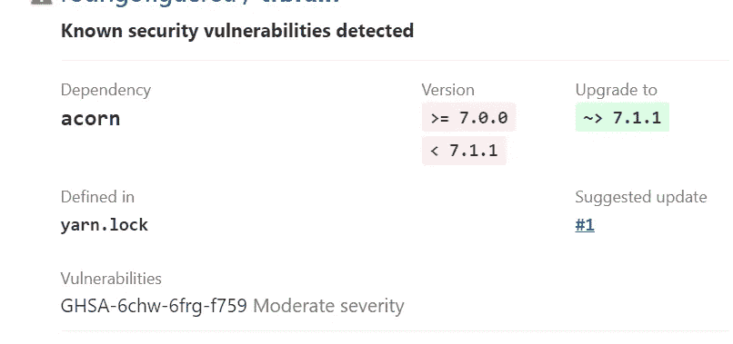

# 如何关闭 GitHub 安全警报

> 原文：<https://medium.com/geekculture/how-to-close-github-security-alerts-in-your-projects-9c533b6704dc?source=collection_archive---------33----------------------->



Security vulnerabilities

我有很多来自 GitHub 的安全警报，他们向我展示了这种安全警报，如 acorn、minimist、lodash 等，我真的需要升级这些警报并关闭这些问题。

对我来说，我需要使用这个命令升级 yarn.lock

```
yarn upgrade
```

对于其他人，您可以使用 npm

```
npm audit fix
```

在那之后，你需要使用 git add，提交修改并推送到你自己的库，问题将被关闭，他们将通过电子邮件向你发送关闭的问题

```
npm audit fix --force
```


Example closed

结论

如果你在这里是出于安全原因，这将有助于你确保所有项目的安全，因为每天都有更多的漏洞，每天我们都需要确保我们的项目的安全，即使面团我们的项目比其他的小。

# 来源

[纱线](https://eriksamuelsson.com/upgrade-all-dependency-versions-in-package-json-with-yarn/)