# 如何结尾？

> 原文：<https://medium.com/geekculture/how-to-coda-3913cf5daf9d?source=collection_archive---------19----------------------->


How To Coda?

如果你——像我一样——没有编码方面的背景，那么 [Coda](https://coda.io/?r=O8dJLrFiTDS_2ttrz-1brA) 提供的选项可能会让你感到不知所措。当然，在开始的时候，你只有一张白纸盯着你。还有表格和公式，很多很多公式。

## 如何利用 Coda？

比起‘什么是[尾声](https://coda.io/?r=O8dJLrFiTDS_2ttrz-1brA)’我更喜欢这个问题我使用 [Coda](https://coda.io/?r=O8dJLrFiTDS_2ttrz-1brA) 来跟踪日常健康相关的测量，写报告，计算投资，介绍团队，组织会议，在朋友家人生日时作为助理，计划周末，管理我的业务库存，通知巴士司机旅行乘坐哪辆巴士，询问乘客的反馈等等。

当我创作 *a d o c* (c o d a)的时候，我用我的笔记本电脑，当我在旅途中查看一些东西的时候，我用我的手机。创建意味着我打开一个文档，给它命名并开始写一些东西，或者我直接创建一个表来输入或排序(复制)数据。建立一个博士学位所需的技能是具体的，尽管与我们在大学里必须经历的相比并不困难。-)

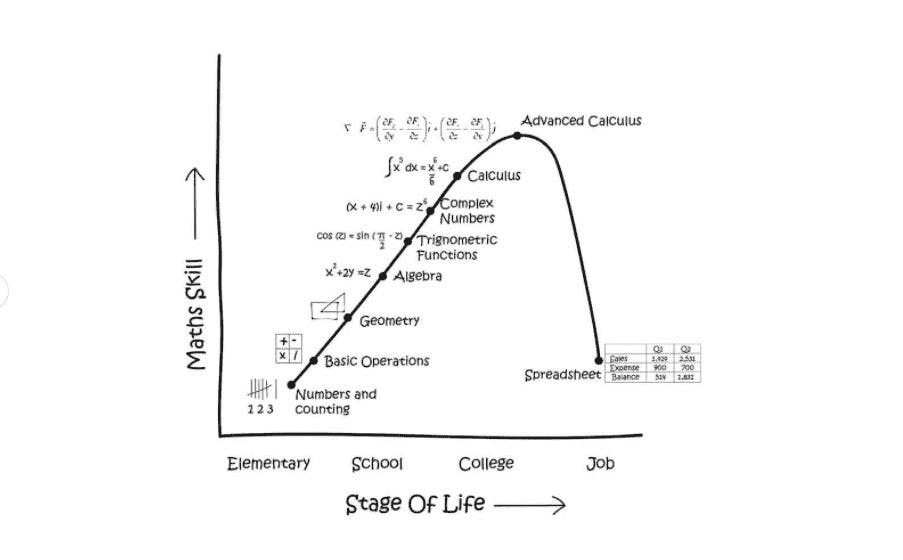

Corporate America, explained

# 数据表格和列表

一旦你属于工人阶级，电子表格对许多人来说似乎太多了。至少从我之前在收件箱里收到的混乱和不可理解的文件来看是这样的。

> 任何电子表格的优点都变成了缺点:易于使用。

不要误会我的意思，尾波医生也可能会搞砸。在 [Coda 社区](https://community.coda.io/t/help-i-am-still-a-coda-newbie-how-do-i-add-values-from-different-tables-and-sort-them-by-date/23932/3?u=christiaan_huizer)中，你看到的请求是通往失望的单程票。主要是由于缺乏对 Coda 表如何操作的理解。

在你读完这篇文章并理解了主要原则之后，你很可能就可以把你的文档整理好了！

# Coda 的 3 个关键原则

这些原则会使结尾更容易。除了图片，我还链接到社区中我认为有价值的帖子。阅读这篇博客只是开始，除非你结束，否则见解不会对你说。我们从最深刻的学习开始:在 Coda 中，它是关于数据列表的。

## 1—数据列表

一切都是清单。如果一个表有 10 行，那么该表中的任何一列在一个列表中都有 10 项。如果一行是空的，它仍然是列表中的一个(空)项。行中的单元格可以包含一个项目(如你的生日)或多个项目(如所有同学在八月份都有 BD)。在任何电子表格中，单元格只能包含一项。Coda 中的一个或多个，我们称之为项。接下来，每个条目在列表中都有一个位置。我们用`Nth()`来点。`CurrentValue`是当前位置列表(本身可以包含多个值)中的一项。哪个位置不是正确的问题，因为它可以是任何位置，取决于公式。当您使用`Last()`时，您位于列表的最后一个位置，因此在一列的所有项目中，`First()`是第一个位置。`Min()`和`Max()`与职位无关，它们与人的年龄、体重或团队成员等价值观有关。简而言之，一个列包含了我们可以用来计算的项目列表。

下面是如果你要求`thisTable`会发生什么。您会在同一个表中看到人名和城市名，这是同一个公式的结果。是显示列造成了差异。显示列包含对该行中所有信息的引用。

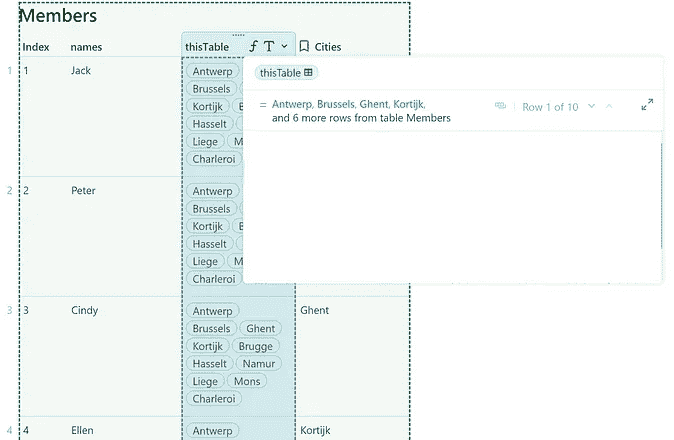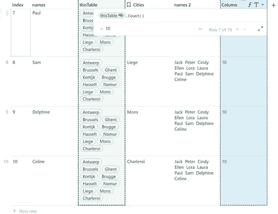

The Display Column at work

最右边的图像也显示了这个表有 10 行。通过`thisTable.Count()`,我们使用 display 列对表中的行进行计数，但没有明确提到它。

`thisTable`公式本身包装了显示列中的所有项目，并创建了一个显示在每一行上的列表。它在列表中显示一个列表，这样显示 10 次。每个单元格中有 10 个项目，因为我们有 10 行。

以下是基于几个步骤的比较结果:

*   我们创建了一个选择列表，并将其链接到表成员
*   我们为每组选择一个或多个成员
*   在列*‘作为列表’*中，我们通过`List()`将它们放在一起，结果是一旦列表的一部分包含多个项目，您就会看到括号中的项目。括号表示列表。

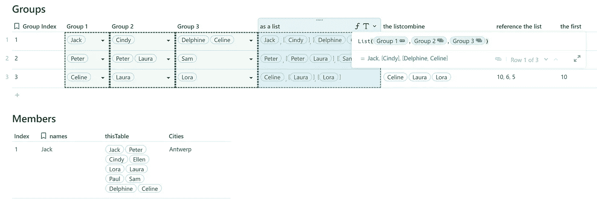

一个单元格中有多个列表，您无法(轻松地)工作。你需要先把它们理顺，然后才能询问相关信息。`List()` 逻辑保持内部列表不变，而`ListCombine()`将所有项目放在一个列表中。

下面您将看到这是如何工作的，以及我们如何通过引用表成员中的索引来获取附加信息。基于这个链接的数据，你会看到第一个 via `First()`，最后一个 using `Last()`，以及我应用`Max()`的 Max。请注意，第 3 行中的数字 10 是第一项(Celine)。10 指的是表格中找到 Celine 的最后一行。

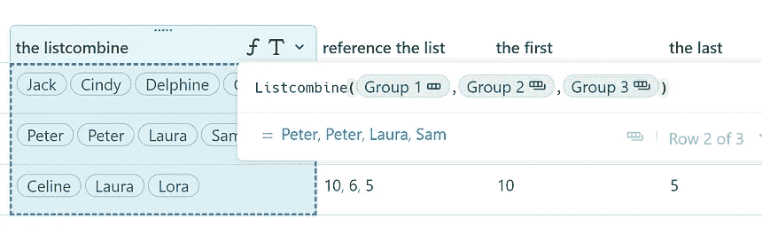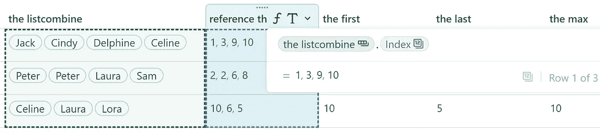

上述类型的列表与您通过`thisTable.Count()`获得的表格中的行数生成的列表不同

当您在公式中写入`thisTable`或表名时，您将得到显示列的值。这是实用的，并允许例如在其他表中`AddOrModifyRows()`相当容易。这是可能的，因为 Coda 为每一行提供了一种虚拟数字，即您可能在任何表中的每一行之前看到的浅灰色数字。

当你想操作一个单元格中的数据时，你没有这样一个虚拟数字。相反，你必须自己生成它。正如你在下面看到的，这主要是通过`Sequence()`完成的。

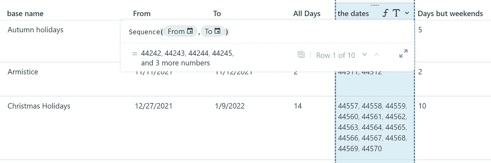

如你所见，数字是有属性的。下面我们结合`Contains()`和`Not()`来统计工作日。我们取所有的日子，排除 1 号(星期日)和 7 号(星期六)。

```
**Sequence**(thisRow.**From**,thisRow.**To**).Filter(CurrentValue.Weekday().
Contains(1,7).Not()).Count()
```

**示例**查看如何应用列表逻辑:

*   获取给定的月份[周数](https://community.coda.io/t/how-to-get-the-corresponding-month-name-from-a-weeknumber/23748/7?u=christiaan_huizer)
*   [拆分单元格中的列表](https://community.coda.io/t/separating-lists-into-new-rows/23446/6)并将其分配到新行

在这篇文章中，我特别关注 Coda 的列表方面。

## 2—这一行对这一表

当我们想检查这一行中的一个条目是否与那个列表(列)中的另一个条目匹配时，我们应用一个过滤器。我们首先通过添加`thisTable`来获取列类别中的所有项目，接下来我们通过`Contains(thisRow).`使用同一列表中的值来过滤该列表

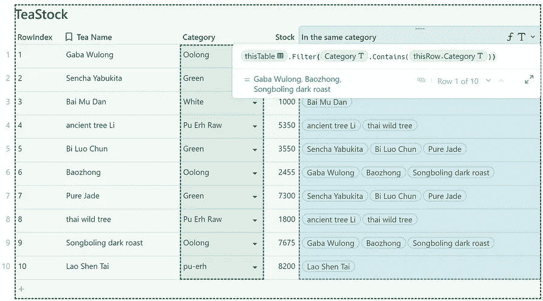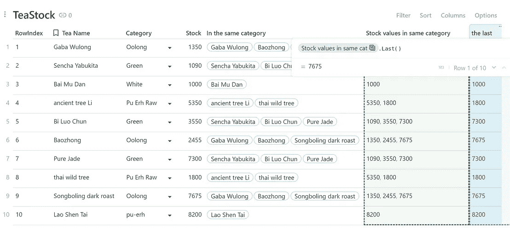

因为每一行都包含与同一行中的其他数据的关系，所以我们可以请求它。

值得检查一下您是在寻找`thisTable`中的值还是在`thisRow`中的特定值。下面是一些**的例子**。这是一个经常在社区中以各种形式出现的话题。

*   从列表中检索出[前 5 个](https://community.coda.io/t/how-to-get-the-corresponding-month-name-from-a-weeknumber/23748/7?u=christiaan_huizer)
*   表中的总计

## 3-链接列

在上一部分中，我提到了链接逻辑，当时我根据查找源表的成员名称选择了 *RowIndex* 。

添加相关数据集(列)的原则是 Coda 的关键，并以各种方式回归。当添加一列时，您可能已经看到它作为菜单的一部分出现在表格中。一旦你点击其中一个建议的选项，后面的公式就会出现。

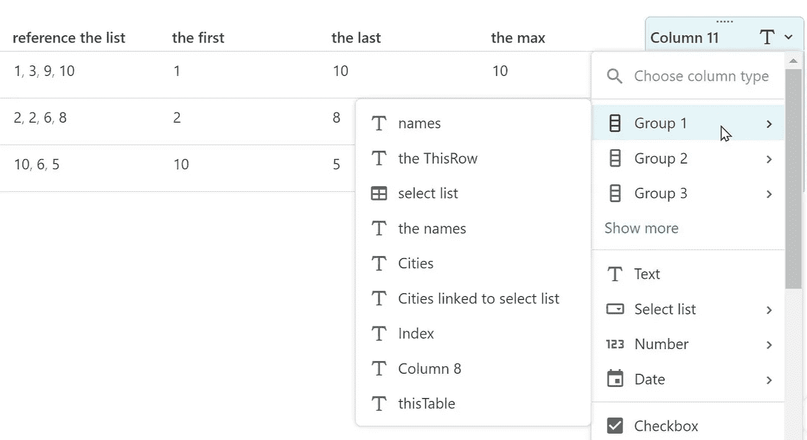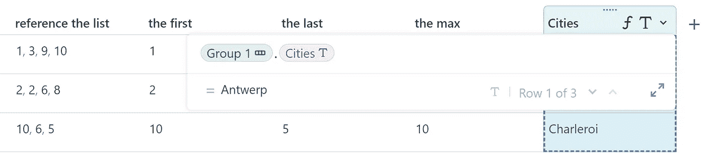

表和表中的数据保持连接，它们是关系型的。如果我把安特卫普换成鹿特丹，到处都会变。

提议的**查找**实际上是基于`thisRow()` 逻辑的过滤器。下面是一个变体，它与我开始使用 Coda 时直接引起我注意的同一个表有关。例如，这是创建团队层级的好方法。

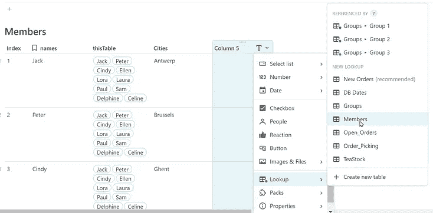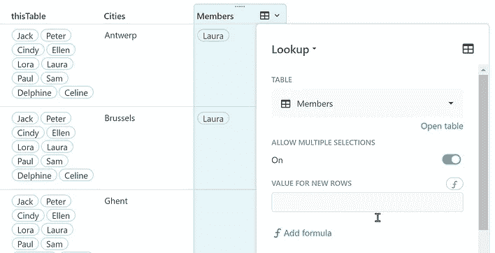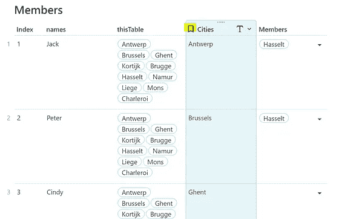

当你实现这样的东西时，有一个微妙的地方你应该留意。当你改变你的显示列时，你的逻辑也随之改变。右图显示 *Laura 变成了 Hasselt* ，这是因为 Hasselt 是与 Laura 关联的城市，而 cities 变成了显示列。

你无法回避这一点。

为了避免混淆，我经常使用 RowIndex 作为显示列。RowIndex 是一个数字列表，从 1 开始，直到表中的行数，基于`thisTable.Find(thisRow)`。更多信息请查看本文。数字对于计算是有用的，而不是那么显而易见的，这使它们成为我链接数据时的一个好选择。

一旦你明白了链接的逻辑，任何人都可以用按钮链接数据。下面是我在社区中注意到的[的一个例子。它将课程拆分成与显示栏中的数字提到的老师相关的行**。所以每个数字代表一个老师，他们中的一些人教授相同的课程。顺便说一下，英语课似乎很受欢迎。数字可以用名字代替。这不会改变功能或公式。**](https://community.coda.io/t/data-structuring-question/23926/5?u=christiaan_huizer)

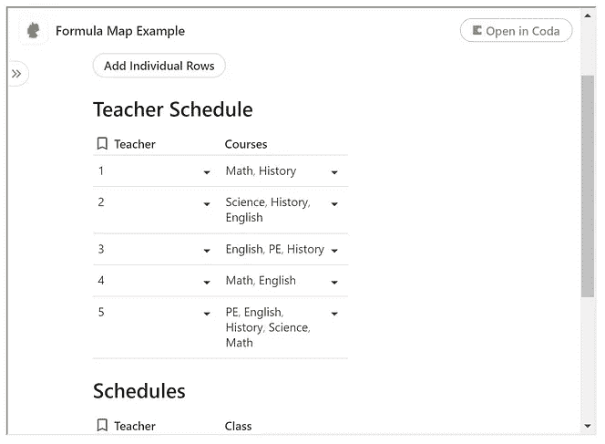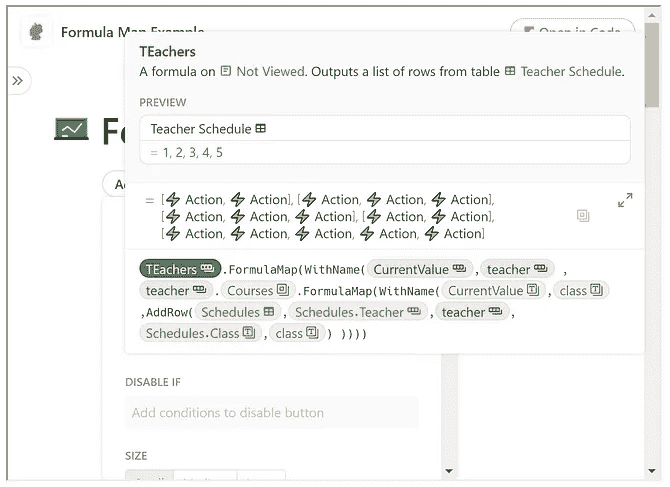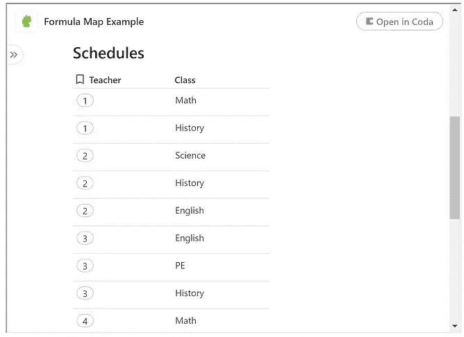

```
I rewrote the above formula a bit to highlight the structure:
```

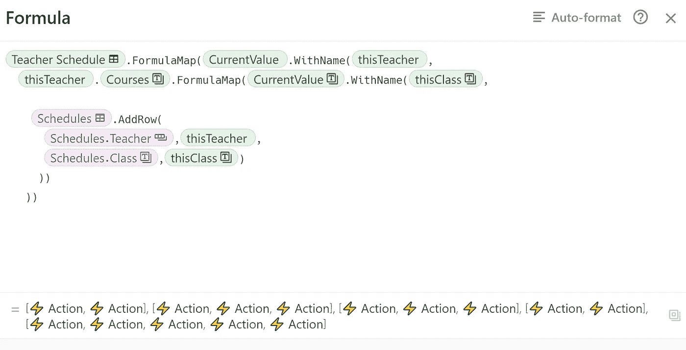

**首先**当你使用表名时，显示列被自动引用。当您公式映射表时，您公式映射显示列。结果我命名为' *thisTeacher'* 所以记住每一行的老师。**其次**我将名为 *thisTeacher* 的每个*当前值*链接到课程列表中的项目。注意，这不是标准列表，这是单元格中的列表。结果是这样的:

*   老师*一个*，带一班，
*   老师*一个*，带 2 班，
*   教师*两个*，带 1 班、
*   二班的老师*两个*，
*   老师*同三班的两个*，
*   等等。

我将结果命名为 *thisClass* 以记住对每一行的引用。当您按下按钮时，每一行都会获得相关的值。

> 除了链接值之外，不需要更多的复杂性。

对于那些想尝试一下的人来说，这是可以复制的公式——粘贴到你的文档中。

```
[Teacher Schedule].FormulaMap(CurrentValue.WithName(thisTeacher,thisTeacher.Courses.FormulaMap(CurrentValue.WithName(thisClass,Schedules.AddRow(Schedules.Teacher,thisTeacher,Schedules.Class,thisClass)))))
```

当您在新行上分布时，链接是简单而高效的。另请参见本文中关于保持库存最新(库存管理)的链接逻辑的应用。

关于链接的这一章不是关于链接函数的，比如:

```
=Orders**.**Filter(Product ='Jacket’)**.**Cost**.**Sum()
```

从右向左阅读是你需要学习的。我又看了一遍我的博客，注意到我认为这种链接是不言而喻的。也许我错了，如果是这样，不要犹豫，给我喊一声！

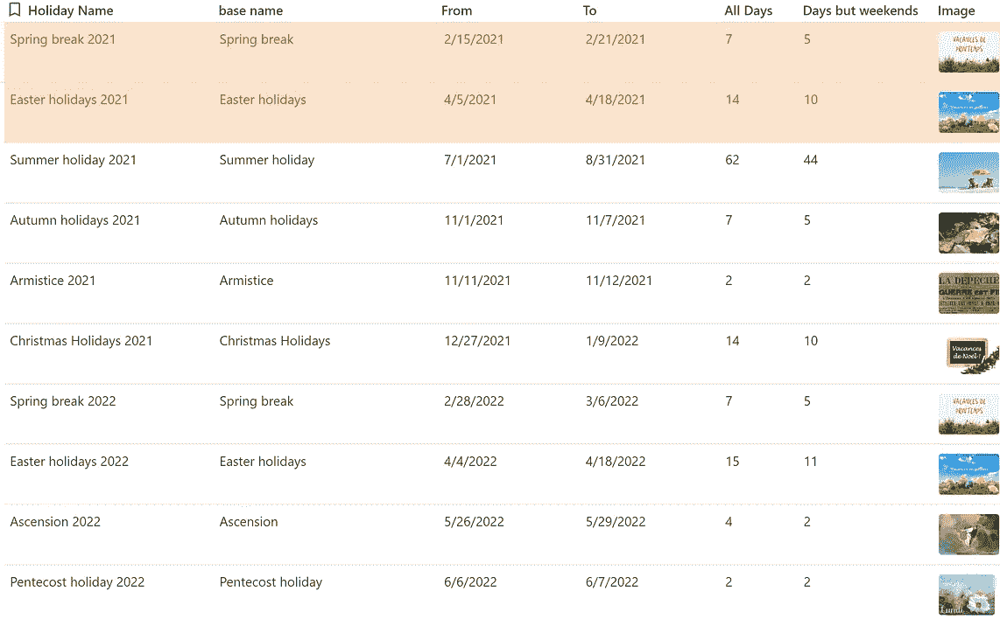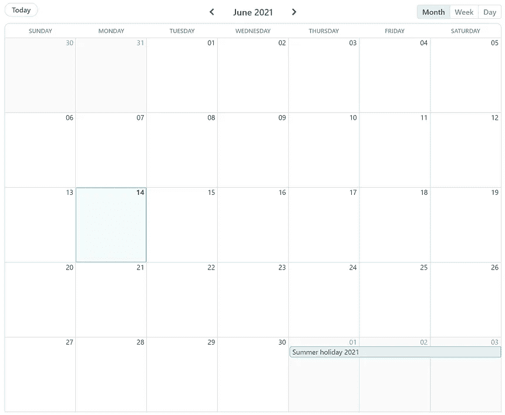

tables are a view of data

## 额外视图

首先你有数据，其次你对数据的看法。饼图是表格中数据集的直观表示。分组、卡片、表单等等都是同一个主题的变体:生活在一个表中的数据视图。因此，当您有一个包含一年中所有日期的表，而您想要第二个只包含每个月第一天的表时，这很可能是带有活动过滤器的同一个表的视图。下面和上面是同一张表的一些视图。


Same table, this time in Card View

## 如何结尾？

让我们回到博客的标题:“如何结尾”？我以积极规范的方式写了这篇文章，暗示建立 doc 有更好和更坏的方法。我希望在阅读并实践了这篇博客中的想法后，你能立刻创造出漂亮而有意义的文档！我相信每个人都会 Coda。与其说是因为我学了，不如说是因为公式语言是这样写的，那很好学。[参见马特·哈德森的这篇文章](https://blog.coda.io/designing-the-coda-formula-language-db7b479dec6a)。

我希望你喜欢这篇文章。如果您有任何问题，请随时联系我们。虽然这篇文章是免费的，但我的工作(包括建议)不会是免费的，但总有聊天的空间，看看可以做些什么。此外，你可以在 [Coda 社区](https://community.coda.io/)和 [Twitter](https://twitter.com/CodaExpert) 上找到我的(免费)贡献

我的名字是克里斯蒂安·许泽，我是许泽自动化公司的所有者。一家专门为 SME 收集数据并保持一致的公司。我主要依靠 [Coda](https://coda.io/?r=O8dJLrFiTDS_2ttrz-1brA) ，Mailjet，za pier&paper form 来完成工作。


Huizer Automation on how to Coda