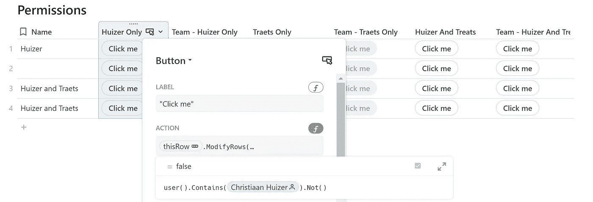
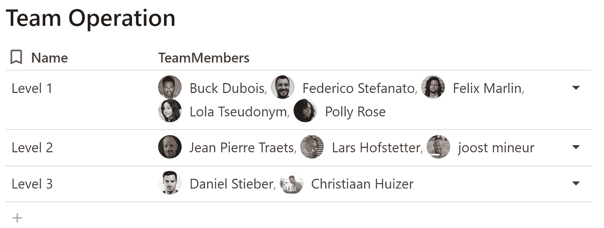
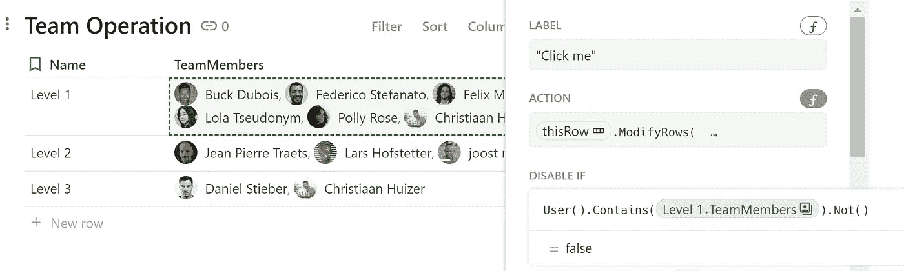
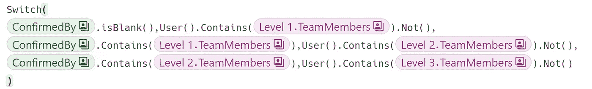
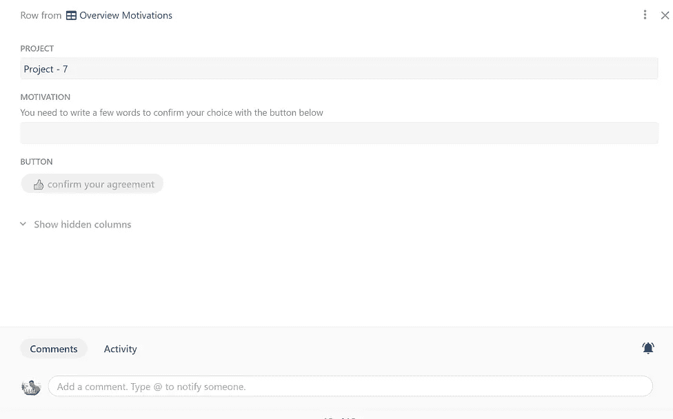
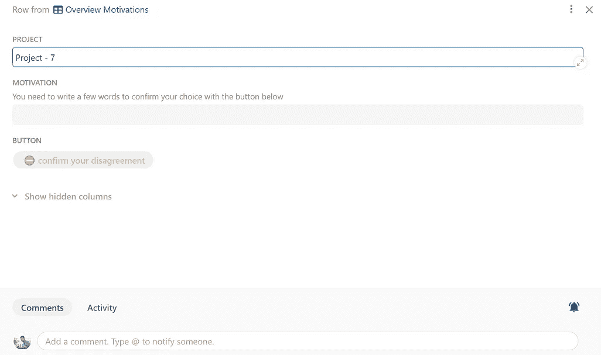

# 如何 Coda 权限？

> 原文：<https://medium.com/geekculture/how-to-coda-permissions-54f6c838bf50?source=collection_archive---------31----------------------->


Permission Management In Coda.io

## 管理您的内部审批流程

在社区里我看到了各种与按钮相关的案例。比如这个[斯科特](https://community.coda.io/t/confirmation-modal-option-for-buttons/24989/4)的。他提供了一个聪明的解决方案，让你三思而后行，而且他还很好地整合了一个颜色公式来强调信息。

```
If(thisRow.[Double Check].IsBlank(),"Delete Rows" ,**_color**("#ff0000","Press again to delete") )
```

[这篇文章](https://community.coda.io/t/locking-add-ability-to-lock-deleting-rows-while-being-able-to-edit-existing-cells/12981/12?u=christiaan_huizer)是关于意外删除的行，我的第一个想法是:为什么不用一个按钮来批准，或者他们批准了，但还是发生了？

> 示例:我们的财务人员必须进入由营销团队维护的“营销协议”表。她的角色只是将协议标记为已支付，并编辑支付日期。她有时会不小心删除行，几周后才意识到这一点(选择整行并按 backspace，因为她误以为焦点在别处)。

在这篇博客中，我将重点介绍如何在审批过程中使用按钮，这意味着用户只能按照一定的顺序投票。

# 灵感

玛利亚[侯爵](/@maria_64387?source=post_page-----727b92edb31e--------------------------------)。分享了一个关于假期准备的很好的[doc](https://blog.coda.io/theres-no-place-like-coda-for-the-holidays-727b92edb31e)2020 年 12 月初。其中一部分包含一个逻辑，允许用户订阅一个群组，然后使用一个按钮再次退出。你可以在我的图库中找到这个版本的变体。我们不需要这种精确的逻辑，但一个按钮可以管理多个任务的想法启发了我。

## 我们需要的解决方案

我们正在寻找一个基于按钮的解决方案，只注册特定的用户在一个特定的顺序。在另一篇博客中，我会解释如何通知或发邮件给下一个用户，以及如何结束这个过程。

在这篇博客中，我们关注:

*   谁被允许按这个按钮
*   如何尊重秩序

```
user().Contains([Christiaan Huizer]).Not()
```



双重否定(Disable & Not)给出肯定的结果。我只能按下*栏中的按钮，*但 Treats 先生不能，我也不能按“他的”按钮。

在下一个名为*Team-Huizer Only*的列中，我应用了一个类似的逻辑，但是这次我引用了包含用户的另一个表。使用*@团队人力资源管理。成员*I 引用特定 cel 的内容。


How to coda a user as part of a column

您可以很容易地看到这种方法的好处。该表中的更改会在其他任何地方被拾取。它可以简化工作流程，当然，在大公司，当有人离开组织时，它可以避免流程中断。这适用于一个用户和一组用户。

我们选择了第三个选项，它包含了每个级别的队伍。在我们的例子中，我们有三个级别。



## 如何尊重秩序？

在本例中，我们的内部规则是第一级 1 应该确认，其次是第二级，最后是第三级。

> 我们已经展示了如何通过使用“@”符号来提取单元格中的值。因此，我们可以创建一个如下所示的函数。



如果具有 1 级状态的人已经确认，则按钮应该为 2 级打开。解决方案可以在禁用功能中找到。



本部分对权限进行排序。如果由确认的*列为空，我们邀请级别 1，如果它包含级别 1，我们打开到级别 2，以此类推。这样做是因为——这就是诀窍——公式`Switch()`按照书写的顺序处理规则。因此，如果不满足规则 1，它不会转到规则 2。*

注意:为了使这个解决方案有效，列*‘确认者’*应该只包含最后一个确认的用户。

对于如此复杂的问题，这难道不是一个绝妙的简单解决方案吗？我花了几天时间来获得这种洞察力，但是一旦你看到了这一点，它就不会被忽视；-)

在下一篇博客中，我将重点关注其背后的通知和电子邮件流程。

最后，对于一个客户来说，知道我开发并应用了上述逻辑甚至更深一层可能是件好事。我们引入了第二个按钮来确保权限不会被错误地授予。为此，我打开另一个表中的一行，每个选项如下所示(同意或不同意)。



我希望你喜欢这篇文章。如果您有任何问题，请随时联系我们。虽然这篇文章是免费的，但我的工作(包括建议)不会是免费的，但总有聊天的空间，看看可以做些什么。此外，你可以在 [Coda 社区](https://community.coda.io/)和 [Twitter](https://twitter.com/CodaExpert) 上找到我的(免费)贡献

我的名字是 Christiaan Huizer，我是 [Huizer 自动化](https://huizer.be/)的所有者。一家专门为 SME 收集数据并保持数据一致的公司。我是 Coda 专家，我主要依靠 [Coda](https://coda.io/?r=O8dJLrFiTDS_2ttrz-1brA) 、Mailjet、Zapier & [Paperform](https://paperform.co/invite/bmv2e3) 来完成工作。


Huizer Automation — Coda Expert on how to to set up a smart permission logic with Coda.io