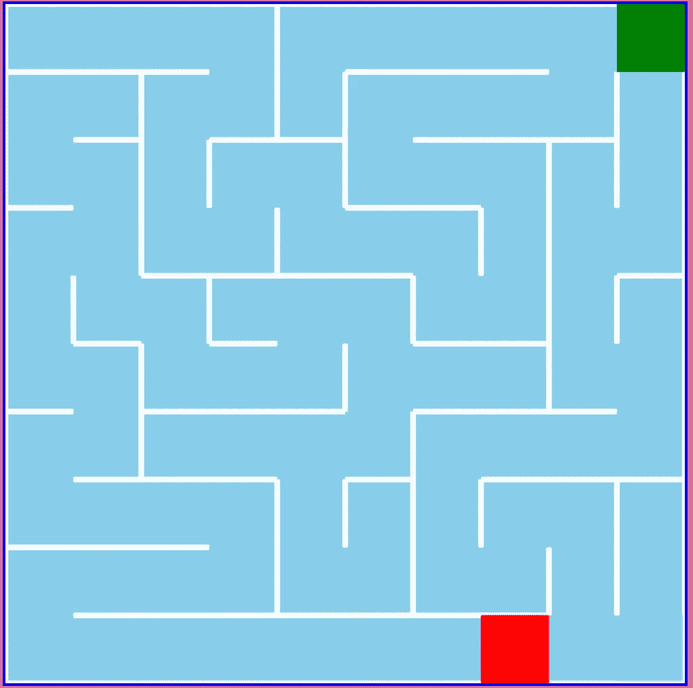

# 如何用 JavaScript 编写迷宫代码

> 原文：<https://medium.com/geekculture/how-to-code-a-maze-in-javascript-70534858f655?source=collection_archive---------9----------------------->

## …使用从 DFS 到 Kruskal 的各种寻路算法的 JavaScript 迷宫生成教程！

Image by author

你有没有想过生成一个迷宫？本教程将教你如何**创建一个迷宫数据结构，** **使用寻路算法**生成一个迷宫，**可视化你的迷宫**！