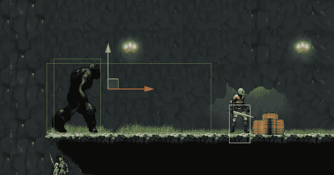

# 如何用碰撞器编码敌人的仇恨

> 原文：<https://medium.com/geekculture/how-to-code-enemy-aggro-with-colliders-b1a089f00798?source=collection_archive---------8----------------------->

**目标**:用碰撞器实现敌人的攻击行为

本教程将是关于“ **aggro** 的实现。Aggro 代表

> 敌人对我们角色的攻击性兴趣。

我要建立的是一个功能，让敌人暂停巡逻，追逐的角色，如果它在视线范围内，并试图接近…