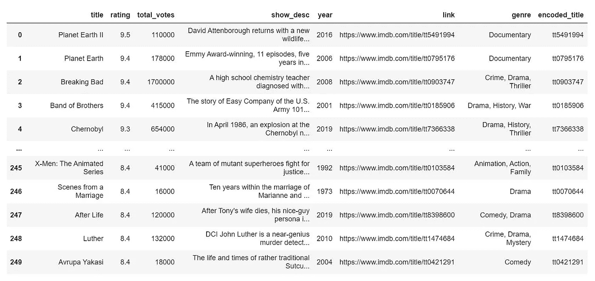

# 如何从 IMDb 收集数据并探索它

> 原文：<https://medium.com/geekculture/how-to-collect-data-from-imdb-explore-it-b669f56b7dfb?source=collection_archive---------7----------------------->

## 使用美丽的汤收集 IMDb 前 250 个电视节目的数据

IMDb(互联网电影数据库)是世界上最大的娱乐数据库。它有不同娱乐内容的数据，如电影、电视节目、视频游戏、家庭视频等。无论何时，人们都需要提供他们对电影或电视节目的意见…