# 如何用 R 编程将一页中的多个情节组合起来

> 原文：<https://medium.com/geekculture/how-to-combine-multiple-plots-in-one-page-f17c21bf930b?source=collection_archive---------3----------------------->


我的一个客户最近告诉我，他提交文章的出版物只接受 6 个情节，他希望我将一些情节合并成一个单一的情节。

经过广泛的研究，我想出了一些关于如何将多个图合并成一个图的想法，我将在这篇文章中与你分享。

我们在这篇文章中需要的两个包是:`tidyverse`和`ggpubr`。

```
library(tidyverse) 
library(ggpubr)
```

我将对用于演示的 diamonds 数据集执行一些探索性分析。

下面我们来创造一些情节；

## 钻石切割频率

```
#diamonds frequency by cut 
diamonds_freq_cut <- diamonds |> 
     ggplot(aes(cut,fill = cut)) + 
     geom_bar() + ylab("Number of Diamonds") + 
     xlab("Diamond Cut") + 
     ggtitle("Frequency of Diamonds by Cut") + 
     coord_flip() diamonds_freq_cut
```

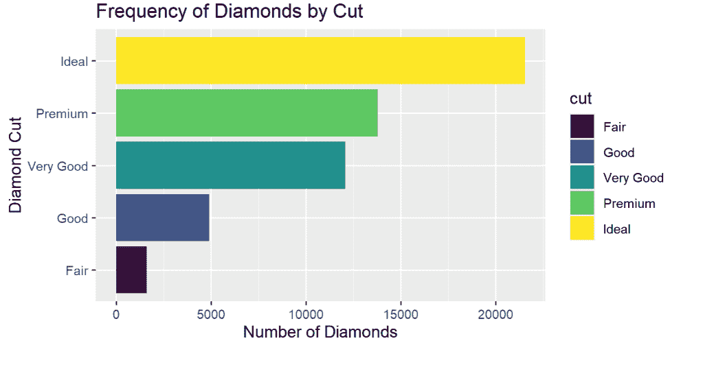

## 钻石价格分布

```
# diamond price distribution price_distr <- diamonds |>            ggplot(aes(price)) + 
     geom_density() + 
     ggtitle("Distribution of Diamond Price") price_distr
```

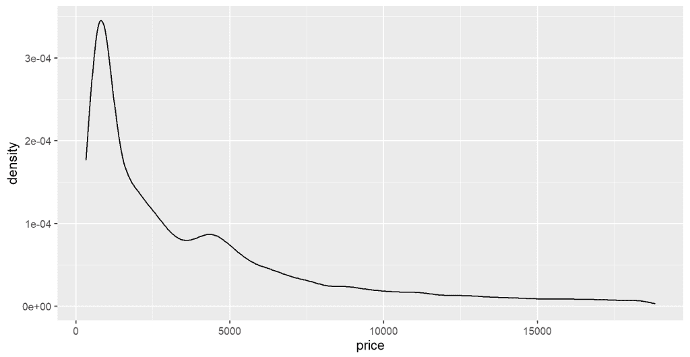

## 钻石切割价格

```
# diamond price by color diamond_cut_price <- diamonds |> ggplot(aes(color,price,color = color)) + 
geom_boxplot() + 
ggtitle("Diamond Price by Color") diamond_cut_price
```

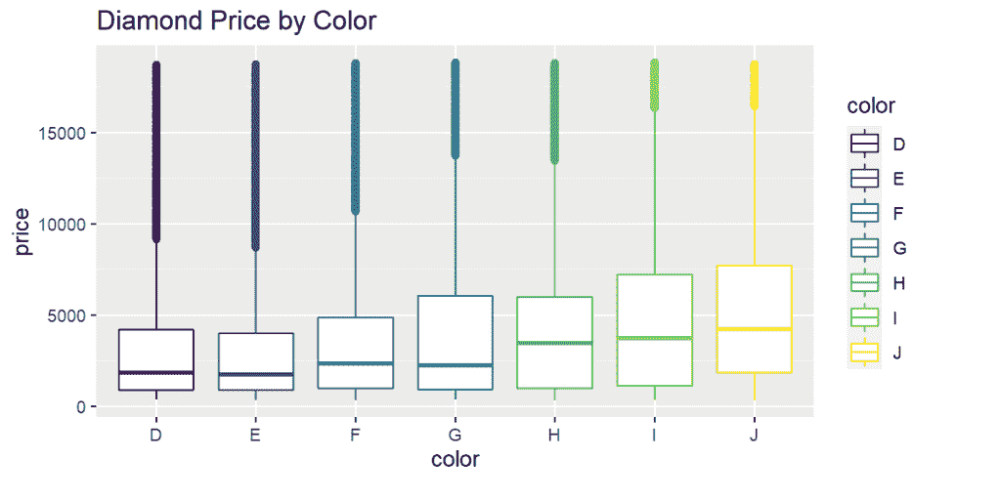

# 在一页上组合多个图

我们将使用`ggarrange()`功能将上面的这些图合并成一个页面。

```
ggarrange(diamonds_freq,price_distr,diamond_cut_price, ncol = 2, nrow = 2)
```

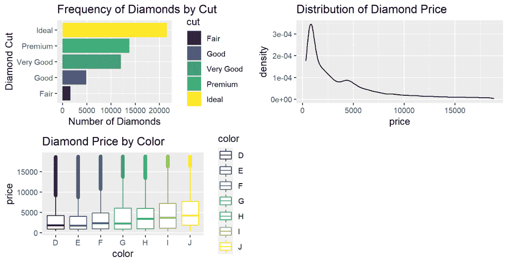

`ggarrange()`函数接受您的图形名称，`nrow`和`ncol`参数允许您分别指定您想要在图形中显示的行数和列数。

还有其他可选的参数，如标签，你可以用它来给你的各种图加标签，但我会建议你像我一样在绘图时单独给你的图加标签，有时`ggarange()`加标签的方法会使标签和图重叠。

在图有相同图例的情况下，您可以设置`common.legend = TRUE`，在页面上只有一个图例，如下所示。

```
#diamonds frequency by color diamonds_freq_color <- diamonds |>    ggplot(aes(color,fill = color)) + 
geom_bar() + 
ylab("Number of Diamonds") + 
xlab("Diamond Color") + 
ggtitle("Frequency of Diamonds by Color") + 
coord_flip() diamonds_freq_color
```

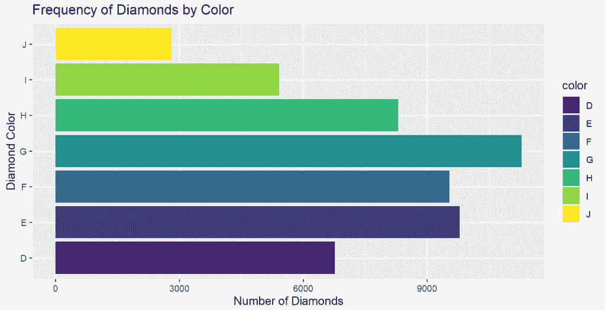

```
ggarrange(diamonds_freq_cut, diamonds_freq_color, common.legend = TRUE, legend = "bottom", ncol = 2)
```

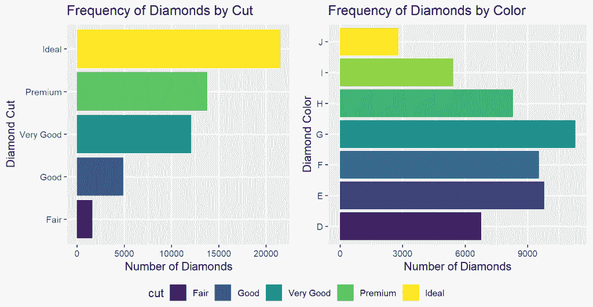

# 结合情节、表格和文本

## 钻石平均切割价格

让我们用一个表格来显示每颗钻石的平均价格。

```
#Average diamond price by cut diamond_price <- diamonds |> group_by(cut) |> 
summarize(price = mean(price))
```

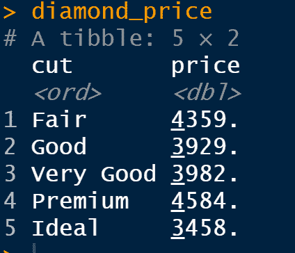

接下来的事情是用`ggtexttable()`将`tibble`转换成绘图表

```
#convert table to plot table table <- ggtexttable(diamond_price, rows = NULL, theme = ttheme("mGreen")) table
```

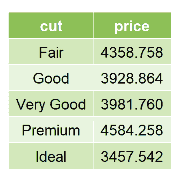

## 文本

```
text = paste("The diamonds dataset is a sample dataset that", "comes pre-installed with the ggplot2 pacakge", "it is a great dataset for demonstrating examples", "and also practice") text
```

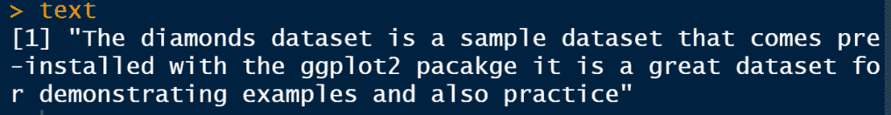

我们还必须用`ggparagrah()`将文本转换成情节文本

```
text_plot <- ggparagraph(text = text, face = "italic", size = 15, color = "black") text_plot
```

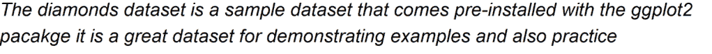

现在让我们用`ggarrange()`将所有这些元素合并到一个页面中

```
ggarrange(diamonds_freq_cut, text_plot, table, nrow = 3, ncol = 2, heights = c(1, 0.5, 0.3))
```

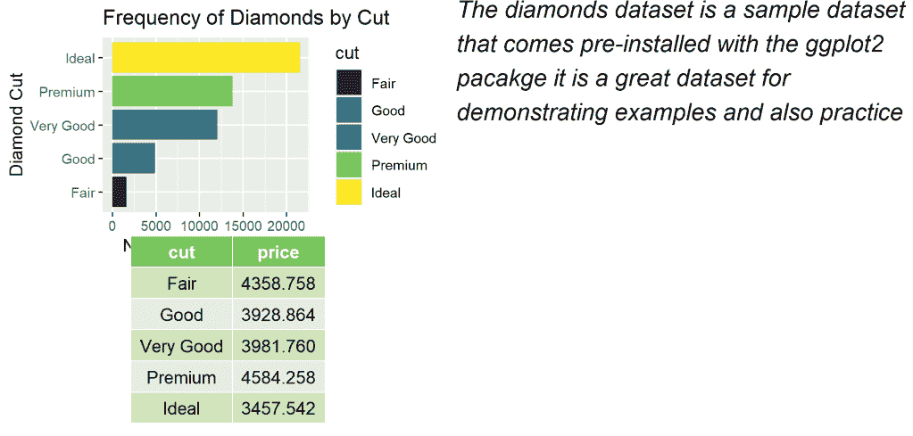

**替代**与`**patchwork**`

您也可以使用 patchwork 包，它允许您使用数学运算符组合绘图。

```
library(patchwork)(text_plot + table)/diamond_cut_price
```

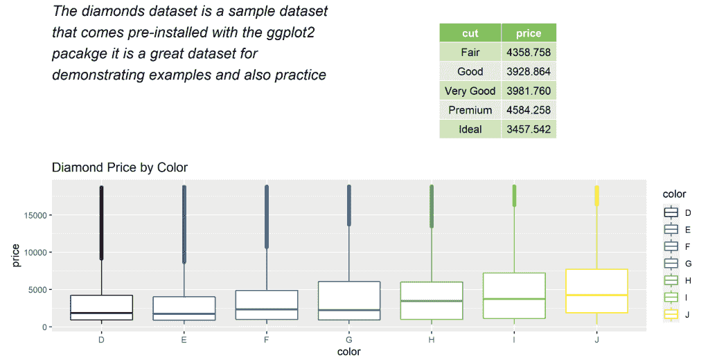

`+` 操作符在同一行上排列图形，而`/` 在同一列上排列图形。

# 结论

在这篇文章中，你学习了如何用`ggpubr::ggarrange()`函数和`patchwork`包将各种图形、文本和表格组合成一个页面。

这样，您可以减少您拥有的地块数量，使共享地块变得更加容易。

*原载于 2022 年 10 月 23 日*[*【http://rblogopedia.wordpress.com】*](https://rblogopedia.wordpress.com/2022/10/23/how-to-combine-multiple-plots-in-one-page/)*。*